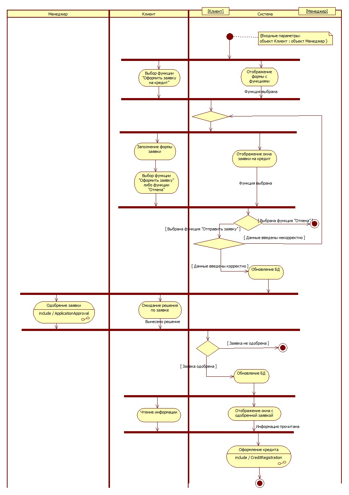

# Activity Diagram — эталон + методичка

## Быстрый маршрут

1. Правила: `../../methodology/algorithms.md`.
2. Рисунки DOCX: P0197, P0209, P0230, P0237, P0267 в `../../methodology/MEDIA_MAP.md`.
3. XML: `applying_for_loan.fragment.xml`.
4. Эталонные JPG: `ApplyingForLoan_Activity_TO_BE.jpg`, `ApplicationApproval_Activity_TO_BE.jpg`, `CreditRegistration_Activity_TO_BE.jpg`, `LoanRepayment_Activity_TO_BE.jpg`.

## XML-эталон

[applying_for_loan.fragment.xml](./applying_for_loan.fragment.xml)

## Размещение

Методичка прямо требует помещать Activity Diagram в `Logical View` [METHOD: P0201].

Для StarUML 5 модель устроена как:

`UMLActivityGraph → TOP/UMLCompositeState → vertices/transitions → UMLActivityDiagram` [METHOD: P0202–P0206].

Именно так организован `lending.uml`.

## ActionState и SubactivityState

`ActionState` — действие/деятельность с понятной реализацией [METHOD: P0191–P0194].

`SubactivityState` — ссылка на деятельность, требующую отдельной реализации; нетривиальная ссылка должна иметь отдельную диаграмму [METHOD: P0193–P0196; P0255].

## Связь с Use Case

Activity Diagram является алгоритмической реализацией Use Case [METHOD: P0219].

Для каждого Use Case основной диаграммы требуется поведенческая диаграмма [METHOD: P0220], а Activity Diagram прямо предписана для каждого варианта первого уровня [METHOD: P0225; P0241–P0245].

## Decision

Не использовать подписи «Да/Нет». На исходящих стрелках задаются реальные guards и при необходимости `else` [METHOD: P0227–P0229].

## Swimlanes

Показывать логическое действие человека, а не мышь/клавиатуру [METHOD: P0234–P0236].

Допускается интегрированная дорожка «Система», если разделение client/server избыточно для текущего уровня [METHOD: P0239].

## Documentation

Узлы и переходы должны быть документированы; переход обосновывает Trigger/Guard/Effect [METHOD: P0251–P0256].
