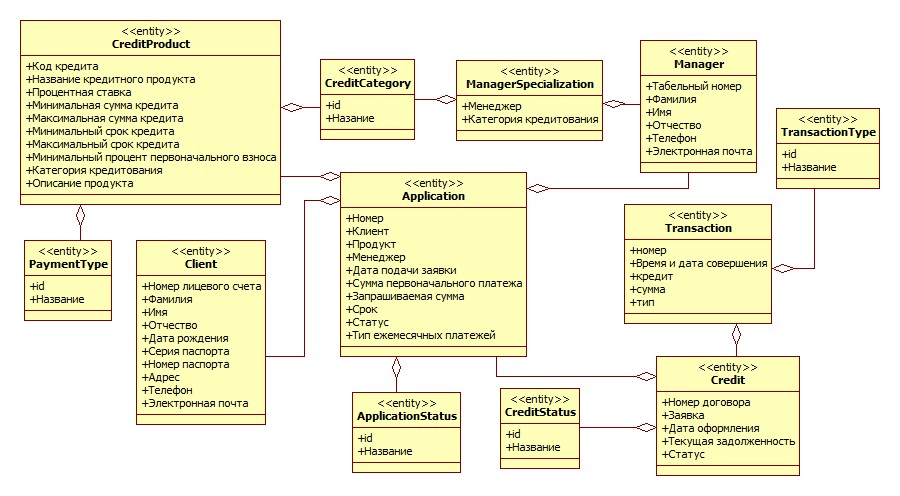

# Class Diagram

## Эталон

XML: [entity_with_relation.fragment.xml](./entity_with_relation.fragment.xml)

Дополнительные изображения:

- `ClassEntityPackeges.jpg`;
- `ClassEntityDetail.jpg`;
- `ControlClass.jpg`;
- `BoundaryClass.jpg`;
- `Data_Full_ClassEntityPackeges_.jpg`.

## Очень важный паттерн lending.uml

Классы показаны не одной схемой. В пакете `Class` присутствуют серии:

- `...Packages`;
- `...DetailClass`;
- `...DetailClassWithRelation`.

Кроме этого отдельно существуют `ControlClass` и `BoundaryClass`.

Это означает, что модель классов у преподавателя рассматривается на нескольких уровнях:

1. пакетная/укрупнённая структура;
2. детальное содержание классов;
3. связи между детализированными классами;
4. классы анализа с ролями boundary/control/entity.

## Характерные типы StarUML

- `UMLClass`;
- `UMLPackage`;
- `UMLAssociation`;
- `UMLGeneralization`;
- `UMLDependency`;
- `UMLAttribute`;
- `UMLOperation`;
- `UMLClassDiagram` и `UMLClassDiagramView`.

## Для urban-development

Не следует просто копировать Python-классы из исходного кода. Курсовая модель должна выражать предметную и проектную структуру системы.

Кандидаты доменной модели: Project, DataSource/DataLayer, Scenario, Run, TerritorySnapshot, RoadNetwork, Block, Parcel, Building, InfrastructureFacility, Metric/ValidationReport, Artifact.

Имена должны быть синхронизированы с Use Case и последующими Component/Sequence моделями.
