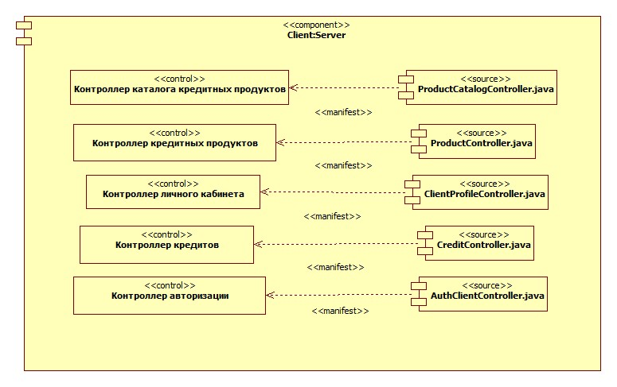

# Component Diagram

## Эталон

XML: [client_server.fragment.xml](./client_server.fragment.xml)

Дополнительные изображения:

- `ClientClient.jpg`;
- `ManagerClient.jpg`;
- `ManagerServer.jpg`;
- `Service.jpg`;
- `Executable.jpg`;
- `artifact.jpg`.

## Структура lending.uml

Содержательные Component Diagram находятся в `Logical View / Component`. При этом стандартный верхний `Component View` содержит только пустую/базовую `Main`.

Это отличие важно сохранить в документации, потому что дерево StarUML может выглядеть не так, как ожидается по названию View.

## Характерные элементы

- `UMLComponent`;
- component instances/views;
- dependencies/associations;
- interfaces;
- artifacts;
- `UMLComponentDiagram` и `UMLComponentDiagramView`.

## Для urban-development

Архитектура реального проекта уже даёт хорошие кандидаты:

- Frontend;
- Backend API;
- Core / algorithmic engine;
- Worker;
- PostgreSQL/PostGIS;
- Redis;
- storage/artifact subsystem.

Диаграмма компонентов не должна превращаться в Deployment Diagram: здесь основной вопрос — **из каких программных компонентов состоит система и как они зависят друг от друга**, а не на каких физических/виртуальных узлах они развернуты.
