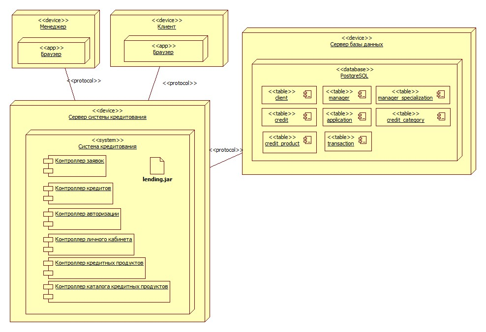

# Deployment Diagram

## Эталон

XML: [lending.fragment.xml](./lending.fragment.xml)

Дополнительные изображения:

- `Architecture.jpg`;
- `deployment.jpg`;
- `rasm_art.jpg`.

## Структура lending.uml

Содержательная Deployment Diagram `Lending` размещена в `Logical View / Arch`. Верхний `Deployment View / Main` существует отдельно как стандартная заготовка.

Характерные элементы:

- `UMLNode` / node instances;
- component/artifact instances;
- communication/dependency links;
- `UMLDeploymentDiagram` и `UMLDeploymentDiagramView`.

## Для urban-development

Deployment Model должна быть согласована с реальной архитектурой Docker Compose:

- браузер/клиент;
- frontend;
- backend API;
- worker;
- PostgreSQL/PostGIS;
- Redis;
- файловое/объектное хранилище при наличии;
- сетевые связи между ними.

Важно не смешивать логический компонент и узел размещения. Один программный компонент может быть артефактом, размещённым на конкретном узле.
