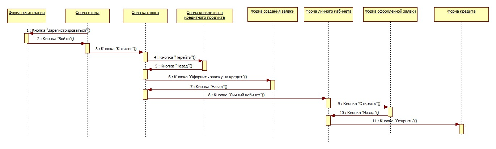

# Sequence Diagram

## Эталон

XML: [sequence.fragment.xml](./sequence.fragment.xml)

Связанное изображение из эталонной курсовой:

## Структура lending.uml

В `lending.uml` найдена одна `UMLSequenceDiagram` — `SequenceDiagram1`. Она находится внутри цепочки Collaboration/Interaction Instance Set в пакете `Interface` (`Logical View`).

Это хороший пример того, почему документация нужна: по одному только дереву проекта Sequence Diagram легко пропустить.

## Для urban-development

Sequence Diagram имеет смысл для сценариев, где важно показать временной порядок сообщений между:

- Пользователем/Frontend;
- Backend API;
- Worker;
- Core;
- PostgreSQL/PostGIS;
- Redis/очередью.

Особенно полезный сценарий — «запустить генерацию и отслеживать выполнение»: он естественно показывает переход от синхронного HTTP-запроса к фоновой задаче и последующему чтению статуса/результатов.
