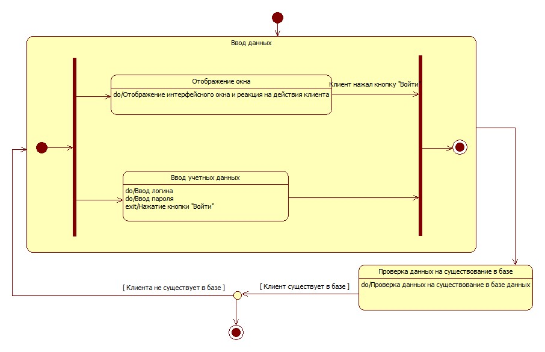

# Statechart / State Machine Diagram

## Эталон

XML: [authorization.fragment.xml](./authorization.fragment.xml)

Дополнительные изображения:

- `AuthorizationStatechartDiagramm.jpg`;
- `ViewCatalogProduct_Statechart_TO_BE.jpg`.

## Структура lending.uml

Statechart находится внутри `UMLStateMachine` в `Logical View`.

Характерные типы:

- `UMLStateMachine`;
- `UMLCompositeState`;
- `UMLSimpleState`;
- `UMLPseudostate`;
- `UMLFinalState`;
- `UMLTransition`;
- `UMLStatechartDiagram` и `UMLStatechartDiagramView`.

## Когда использовать

Statechart отвечает не на вопрос «какие шаги выполняются», а на вопрос «в каких устойчивых состояниях находится объект/процесс и какие события переводят его между состояниями».

Для нашей предметной области естественные кандидаты:

- жизненный цикл Scenario/Run;
- состояние фонового Job;
- состояние загруженного набора данных;
- состояние проекта, если оно действительно имеет содержательный жизненный цикл.

Не создавать Statechart только ради количества диаграмм: должен существовать объект с осмысленными состояниями.
