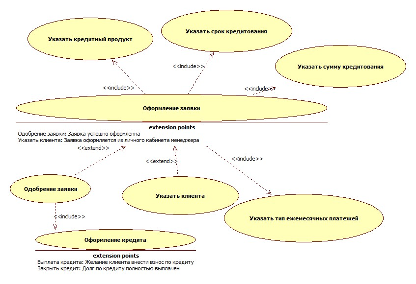

# Use Case Diagram

## Эталон

Основной фрагмент: [applying_for_loan.fragment.xml](./applying_for_loan.fragment.xml)

Изображение:

Дополнительные изображения эталона:

- `Lending_UseCase_TO_BE.jpg` — общая TO BE диаграмма;
- `UseCase_AS_IS.jpg` — исходная AS IS модель;
- `CreditProductManagement_UseCase_TO_BE.jpg`;
- `CreditRegistration_UseCase_TO_BE.jpg`;
- `LoanRepayment_UseCase_TO_BE.jpg`;
- `Login_UseCase_TO_BE.jpg`;
- `ViewingLoan_UseCase_TO_BE.jpg`.

## Структура в lending.uml

Use Case View делится пакетами `AS IS` и `TO BE`.

В TO BE присутствуют отдельные диаграммы для крупных функциональных областей плюс общая диаграмма. Это ключевой шаблон для нашей курсовой: **функциональность моделируется набором взаимосвязанных диаграмм, а не одной огромной схемой**.

Характерные XML-типы:

- `UMLUseCase` — прецедент;
- `UMLActor` или стереотипизированный класс — участник;
- `UMLAssociation` — связь актора и прецедента;
- `UMLInclude` — обязательное включаемое поведение;
- `UMLExtend` — условное/дополнительное поведение;
- `UMLUseCaseDiagram` + `UMLUseCaseDiagramView` — сама диаграмма и её визуальное представление;
- `UMLUseCaseView`, `UMLActorView` и edge views — визуальные элементы.

## Что переносим в urban-development

Рабочий шаблон:

1. одна обзорная диаграмма системы;
2. отдельные диаграммы по крупным функциям;
3. одни и те же Use Case должны иметь одни и те же GUID на всех диаграммах;
4. детализация через include/extend должна иметь осмысленную семантику;
5. название прецедента — действие/цель, а не название экрана или таблицы.

Текущая реализация уже следует этому шаблону: `UrbanDevelopment`, `ProjectCreation`, `DataManagement`, `ScenarioConfiguration`, `ScenarioLaunch`, `GenerationExecution`.
