# 5. Белов В.В., Чистякова В.И. UML-моделирование функциональности  и поведения ПрИС. МУ к лаб. раб. и пр. занятиям. Last

## Страница 1

7468

с доп.

МИНИСТЕРСТВО НАУКИ И ВЫСШЕГО ОБРАЗОВАНИЯ РОССИЙСКОЙ ФЕДЕРАЦИИ

РЯЗАНСКИЙ ГОСУДАРСТВЕННЫЙ РАДИОТЕХНИЧЕСКИЙ УНИВЕРСИТЕТ

имени В.Ф.УТКИНА

МОДЕЛИРОВАНИЕUML

-

ФУНКЦИОНАЛЬНОСТИ И ПОВЕДЕНИЯ

ПРОГРАММНО ИНФОРМАЦИОННЫХ

-

СИСТЕМ

Методические указания

к лабораторным работам

и практическим занятиям

Рязань 2022

## Страница 2

УДК 004.942

функциональности и поведенияUML моделирование программно-

информационных систем методические указания к лабораторным рабо:

/ Рязан. гос.там и практическим занятиям радиотехн. ун т. им.-

В.Ф.Уткина; Сост.:. Рязань, 2022 6В.В. Белов, В.И. Чи 5стякова с..

Излагаются методические рекомендации по выполнению лабора

торных работ и практических заданий по дисциплинам «Проектирова

ние программных систем» и «Проектирование информационных си

Теоретическую платформу указаний образуют объектностем» 

.ориентированная методология проектирования и систематический по

д

ход к проектированию, основанный на использовании каскадной моде

информационной системы, принципали жизненного цикла программно-

ФИСАП и компонентно ориентированного программирования.-

бакалавров всех форм обучения направленийПредназначены для

.03 «Прикладная информатика»09.0 09.0.043 3 «Пр ммная инженеогра

,

» и всех желающих изучить вопросы проектированиярия программно

информационных систем.

Библиогр.: 7 назв.

Жизненный цикл, модель, анализ, проектирование, реализация,

, архитектура, поведение, класс, сценарий, автомат, компонент.UML

кафедра вычислительной и прикладной математикиРецензент:

Рязанского государственного радиотехнического университета (зав.

кафедрой д р техн. наук, проф. Г.В. Овечкин)-

функциональности и поведенияUML моделирование-

информационных системпрограммно-

Составител Белов Владимир Викторовичи

Чистякова Валентина Ивановна

.2022. Усл. печ. л. 3Подписано в печать ХХ ХХ..

1Тираж экз.

Рязанский государственный радиотехнический университет

390005, Рязань, ул. Гагарина, 59/1.

издательский центр РГРТУ.Редакционно-

информационных систем.Белов В.В., Чистякова В.И. Проектирование программно-

Методические указания к лабораторным работам и практическим занятиям

2

## Страница 3

СОДЕРЖАНИЕ

ИЗУЧАЕМАЯ ТЕМА «ДИАГРАММА ПРЕЦЕДЕНТОВ»1 7.............

Ассоциированные понятия1.1 7..............................................................

1.2 10Назначение диаграмм вариантов использования........................

1.3 10Руководящие принципы построения диаграммы прецедентов..

Состав выполняемых работ по изучаемой теме1.4 14

..........................Требования к оформлению основных элементов отчёта1.5 14

............ИЗУЧАЕМАЯ ТЕМА «ДИАГРАММА ДЕЯТЕЛЬНОСТИ»2 20

........Ассоциированные понятия2.1 20

............................................................2.2 22Назначение диаграмм п

оведения..................................................

2.3 23Руководящие принципы построения диаграммы деятельности

Оформление ветвлений2.3.1 23

.........................................................Оформление разделов активности (Activity Partitions) в2.3.2

тации плавательных дорожек (Swimlanes) 24он

......................Состав выполняемых работ по изучаемой теме2.4 26

..........................Требования к оформлению отч2.5 26ёта

................................................ИЗУЧАЕМАЯ ТЕМА «ДИАГРАММА АВТОМАТА»3 29

..................Ассоциированные понятия3.1 29

............................................................3.2 29Руководящие принципы

построения диаграммы автомата........

Общие замечания3.2.1 29

..................................................................Принцип иерархии / декомпозиции в диаграммах автомата3.2.2 29

3.2.3 30Примеры диаграмм автомата...............................................

ИЗУЧАЕМАЯ ТЕМА «ДИАГРАММА КЛАССОВ»4 34......................

Ассоциированные понятия4.1 34............................................................

что о классах: воспоминание незабываемого4.2 34Кое-

......................4.3 36Руководящие принципы построения диаграммы классов

..........Общие замечания. Выделение классов4.3.1 36

...............................4.3.2 40Представления классов

.........................................................Особенности документирования диаграммы классов4.3.3 45

.......ЗУЧАЕМАЯ ТЕМА «ДИАГРАММА

5

ПОСЛЕДОВАТЕЛЬНОСТИ» 46............................................................

Асс5.1 46оциированные понятия............................................................

5.2 47Руководящие принципы построения диаграммы........................

Общие замечания5.2.1 47

..................................................................5.2.2 47Порядок построения диаграмм последовательности

.........5.2.3 49Примеры диаграмм последовательности

............................ПРИЛОЖЕНИЕ А Шаблон титульного листа ОТЧЁТА по теме 52

....

ПРИЛОЖЕНИЕ Б Темы заданий к лабораторным работам и

53пра тическим занятиямк.....................................................................

БИБЛИОГРАФИЧЕСКИЙ СПИСОК 55

...................................................

информационных систем.Белов В.В., Чистякова В.И. Проектирование программно-

Методические указания к лабораторным работам и практическим занятиям

3

## Страница 4

ОБЩИЕ ЗАМЕЧАНИЯ

Как готовиться к занятиям

подготовке к практическому занятию необходимо ознакПри о

миться со списком вопросов по изучаемой теме и самостоятельно на

них ответить, используя конспект лекций и рекомендуемую литературу.

На практических занятиях студент отвечает на эти вопросы на вопросы,

еподавателя, касающиеся теоретического материала, относящегося кпр

данной теме, комментирует полученные в ходе работы результаты. Вы

полнение задания к практическим занятиям используется для допуска к

соответствующим лабораторным работам. Каждая изученная тема

должна быть защищена. Предпочтительной формой защиты является

публичный доклад с демонстрацией элементов отчёта.

Заметим, практические и лабораторные занятия нацелены на под

готовку к выполнению курсового проекта, в рамках которого предстоит

оформить принятые проектные решения в виде системы моделей. Су

щественной частью каждой модели являются диаграммы, но они не яв

ляются самостоятельной формой выражения проектного решения.

Запоминаем: проектное решение выражается моделью, а не диаграммой.

Как оформляются отчёты

создаваемые диаграммы должны быть тщательно документВсе и

рованы. Документированию подлежит сама диаграмма (секция Docu

mentation заполняется при отсутствии выделений элементов диаграммы)

документируются все узлы (геометрические феё элементыи игувсе –

ры) диаграммы и все стрелки.

(в электронномМатериалы документирования представляются

виде) по практическим занятиям. Эти материалы желательнов отчетах

подразделять на структурные части с такими названиями как «Докумен

«Документирование прецедентов», «Документиртирование акторов», о

вание действий и деятельностей», «Документирование состояний»,

«Документирование отношений», «Документирование переходов».

Отчёты по изучаемым темам оформляются в виде doc docxили-

Wordдокументов текстового процессора с титульным листом по прила

гаемому образцу я сведения о проделанной работе:В отчёты включаютс

.1) 2) формулировка задания 3)название изучаемой темы

;; результаты

диаграмм в графические файлы)4построенных; тексты докэкспорта у

)5ментирования диаграмм; описания потоков реализации прецедентов.

Обратим внимание на то, что теоретические сведения и методи

ческие указания в отчётах приводить не следует. Теорию необходимо

знать, а требования, содержащиеся в методических указаниях, необхо

димо выполнять.

информационных систем.Белов В.В., Чистякова В.И. Проектирование программно-

Методические указания к лабораторным работам и практическим занятиям

4

## Страница 5

кие понятия являются наиболее важнымиКа

В рамках изучаемой дисциплины должны быть чётко уяснены

понятия, приведённые в таблице 1 При этом следует иметь в виду, что

.

почти все термины являются многозначными и их смысл определяется

«Процесс» в 90 % примененийконтекстом. Например, термин символи

зирует проблемное начало, т. е. означает название некоторой задачи.

роцесс обученияПримеры: «П «Процесс вычисления площади тре»

,», «Процесс планирования». В других контекстах термин

угольника

б решения проблемы«Процесс» символизирует с, т. е. означает ппосо о

следовательность действий задачи. В этом случае онво время решения

синонимичен терминам «Алгоритм», «Сценарий», «Деятельность».

(Следует понима логический идейный,ть, что существуют семан

тический, смысловой) и физический (материальный) уровни представ

ления понятий. Например, термин «Программа» в зависимости от кон

: 1) алгоритм, представляемый протекста рассмотрения означает грам

2); 3) файл с кодом программы. При этом первыемой; код программы

термина «Программа» соотве логическдва указанных смысла ствуют от

т. е. уровню сознания разработчика, а последний смыслму уровню, –

физическому, т. е. уровню физического носителя информации.

Таблица моделирования функциональности1 Первичные понятия–

формационной системыи поведения программно ин-

Аспект ФормаПроблемное Способ

рассмотрения представленияначало решения

способа решения,процесса проблемы

моделирования делания

Воплощение идейУказание того, Указание того,Суть аспекта

в материальночто какрассмотрения

передаваемые формырешается, делается решатся, делается

Основные Задача = Алгоритм = Схема алгоритма,

термины = Работа = = Сценарии = диаграмма

аспекта = Процесс = Деятельность деятельности

рассмотрения

Модель Модель поведения

Функциональная поведения (уровень физическогоВид модели

(идейныймодель представления)

уровень)

Диаграммы поведения:Диаграмма

Семантика ■ деятельности;Выражение в

вариантов ■ автомата;диаграмм

UML использования

поведения ■последовательности;)( DiagramCaseUse

■коммуникации

информационных систем.Белов В.В., Чистякова В.И. Проектирование программно-

Методические указания к лабораторным работам и практическим занятиям

5

## Страница 6

Выбор предметной области

Для наиболее продуктивного выполнения лабораторных работ

рекомендуется выбрать собственную предметную область объект ав–

бтоматизации. Желательно использовать «живую» предметную о

собственного квалификационного исслтему епрежде всего,ласть, –

или информационно материальную среду реального бизнесадования -–

производственного, торгового, сервисного, строительного и т. д. Реко

мендуется обратиться за помощью к родственникам, близким и знако

к организации и/или управлению работоймым, имеющим отношение

предприятий любого уровня. Помощь могут оказать и рядовые, но не

равнодушные исполнители бизнес процессов на любом предприятии.-

Предметную область можно также заимствовать и из ранее вы

апример, по базам данных.полненного курсового проекта, н

заданий к лабораторным и практическим рабИ наконец, тем оы

ыбра П Бриложетам можно в из списка вть нии

.

Перечень выполняемых работ

0. Инструментальная среда моделирования программно

информационных систем StarUML

.1. Ди

аграмма вариантов использования.

2. Диаграмма деятельности.

3. Диаграмма автомата.

4. Диаграмма классов.

5. Диаграмма последовательности.

6. Диаграмма коммуникации.

7. Диаграмма компонентов.

Диаграмма размещения (развертывания) учебники, в первую8. –

очередь \[1, 3\].

Организационные указания

ля выполнения практических заданийД реализуем следующие

действия.

Устанавливаем пакет StarUML ссылку \[8\]1., используя.

Работы №№ 12. 6 выполняем, используя настоящие указания–

и учебное пособие \[4\]

.Работы №№ 7 выбранной б3. 8 выполняем для предметной о

–

бники из библиографического спискаиспользуя уче, в первуюласти

,очередь \[1, 3\]

.

Дополнительное указание

Учебное пособие ошибки и мет\[ \]4 содержит многочисленные о

содержит две главы с номером 6.дические огрехи. В частности, оно

Поэтому к не следует относиться критически и воспринимать её,му

главным образом, как руководство по интерфейсу пакета StarUML.

информационных систем.Белов В.В., Чистякова В.И. Проектирование программно-

Методические указания к лабораторным работам и практическим занятиям

6

## Страница 7

ИЗУЧАЕМАЯ ТЕМА «ДИАГРАММА ПРЕЦЕДЕНТОВ»1

1.1 Ассоциированные понятия

Case = ПрецедентВариант использования Use это некоторая= –

= Работа = Процесс, реализующий Функцию (ЗадФункция = Задача а

чу, Работу)

это овал с названием Функции (ЗадНа диаграмме прецедент а–

чи, Работы).

Осознаём и запоминаем:

формулировка Функции (Задачи, Работы) одновременно является и

(Задачу, Работу)Процесса, реализующего Функциюназванием

Например, «Решение алгебраического уравнения» еэто одновр–

менно и формулировка задачи, и название процесса решения уравнения.

По этой причине диаграммы вариантов использования можно

называть и функциональными, и процессными (поведенческими). До

полнительным основанием называть диаграммы вариантов использова

ния поведенческими является то, что для прецедентов создаются потоки

() реализации, размещаемые в текстовых файлах,текстовые алгоритмы

прикрепляемых к прецедентам редактором вложений в окне закладки с

Attachmentименем

.) в отечественной практикеВарианты использования ( CaseUse

(в докмоделирования часто для краткости называют прецедентами у

precedentUMLментации по нет, но оно является синонимом слслова о

случай, вариант). Представляется рациональным следующееcaseва –

правило использования терминов «вариант использования» и «преце

дент»:

а) все работы (процессы), представляемые на диаграмме вариан

тов использования в виде овалов, могут называться прецедентами;

б) прецеденты, ассоциированные с акторами потребителями-

функциональности, предпочтительнее называть «вариантами использо

вания», поскольку они реально являются именно вариантами использо

вания системы акторами;

в) прецеденты, дополняющие функциональность вариантов ис

пользования и/или других (базисных) прецедентов, предпочтительнее

просто «прецедентами» или «вспомогательными прецеденазывать н–

тами».

(актёр)Актор сторонняя, т. е. не входящая в моделируемую си–

стему сущность, потребляющая функциональность системы, либо

предоставляющая собственную функциональность в порядке дополне

ния функциональности прецедентов моделируемой системы.

информационных систем.Белов В.В., Чистякова В.И. Проектирование программно-

Методические указания к лабораторным работам и практическим занятиям

7

## Страница 8

это формальные выражения различных связей меОтношения ж–

ду акторами, прецедентами, акторами и прецедентами.

шений на диаграммах вариантов использВозможные виды отно о

вания:

1) только генерализация (обобщение);между акторами –

2) между прецедентами:

) (include, extend);а зависимости

б) генерализация;

3) между акторами и прецедентами только ассоциации:–

а) направленные ассоциации;

б) не равленые ассоциации.нап

Запоминаем:

между прецедентами отношений ассоциации нет!

Объединять отношения include extend в понятие отношений заи

UML моделирования, в докумевисимости принято только нв практике -

об отношениях include extendUMLтации же по говорится как о самои

includeстоятельных видах отношений. По сути дела, отношения eи x

tend являются конкретными воплощениями отношения «часть целое»–

во множестве функциональностей прецедентов. При этом «целым» яв

ляется функциональность базисного прецеден функцта, а «частями» и–

ональности прецедентов, дополняющих эту функциональность ювкл–

чаемых (include) или расширяющих (extend) прецедентов.

include extendГлавное концептуальное различие прецедентови--

состоит в том, что функциональность include прецедента используется-

безусловно в процессе реализации базисного прецедента, а функцио

extend прецедента используется в процессе реализации бнальность а-

зисного прецедента только при выполнении некоторого условия.

В силу обязательности (неизбежности) применения Include

ной () частью базисного прнеотъемлемойпрецедент является подлин е

без него базисный прецедент не является полноценным (is notцедента, –

meaningful). В то же время, в силу применения в частном случае (только

при выполнении некоторого условия) отдельн extendый прецедент яв-

необязательной добавкой к базисному преце Оляется денту. дновремен

необязательных добавок можеточень часто отсутствиено с этим всех

к потере смысла базисного прецоказаться недопустимым приве ести–

дента. Например, базисный вариант использования «Решить уравнение»

может расширяться прецедентами «Аналитическое решение» и «Чис

решение». Любой из прецедентов, представляющих методы ренное ел

смысл базисного прецедента при этом нешения, может отсутствовать –

потеряется, но отсутствие обоих вспомогательных прецедентов полно

стью лишает смысла базисный вариант использования.

информационных систем.Белов В.В., Чистякова В.И. Проектирование программно-

Методические указания к лабораторным работам и практическим занятиям

8

## Страница 9

Пример отношений зависимости приведён на рисунке 1.1. Анало

гичный пример, но уже с конкретной семантикой прецедентов показан

на рисунке 1.2.

Обратим внимание на чередование применения причастий по от

ношению к базисному прецеденту:

extending (расширяющий вспомогательный прецедент)–

extended (расширяемый базисный прецедент)–

vs

included (включаемый вспомогательный прецедент)–

including (включающий базисный прецедент)–

Об base Useратим внимание также на то, что словосочетание «

» рациональнее переводить как «базисный Вариант ИспользовCase а

ния» в силу следующей тонкости семантик слов базовый и базисный в

русском языке: базовый служащий основой, фундаментом чего либо;-–

базисный главный, центральный, важный, используемый для сравне–

ния.

Выше размещён призыв запомнить, что прецедент это некото–

рая функция, реализуемая некоторым процессом (программой). Поэто

му следует осознать и запомнить: название прецедента может быть

названием процесса. Оно не может являться названием видовтолько

информации, таких как Отчёт, Паспортные данные, Результаты поиска.

Оно не может также являться и названием событий или условий, таких

как Заказ оплачен, Данные введены, Произошла ошибка.

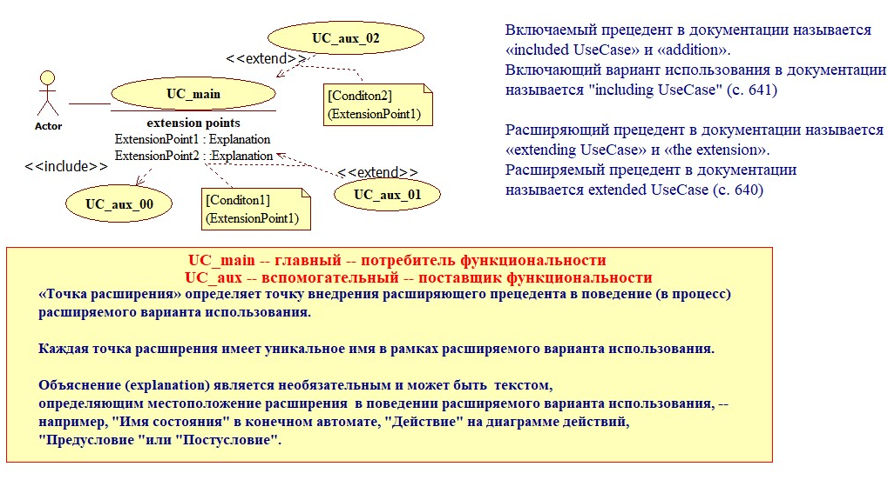

Отношения включения и расширения1.1Рисунок –

на диаграммах вариантов использования

информационных систем.Белов В.В., Чистякова В.И. Проектирование программно-

Методические указания к лабораторным работам и практическим занятиям

9

## Страница 10

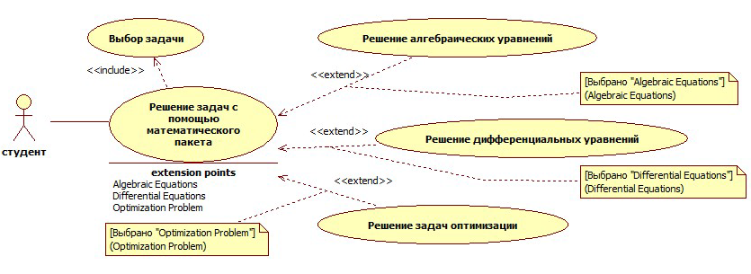

CaseРисунок 1.2 с конкретной семантикойПример диаграммы Use–

прецедентов

1.2 Назначение диаграмм вариантов использования

Диаграммы вариантов использования используются для модели

рования функциональности программно информационной системы,-–

названия прецедентов представляют собой названия функций (задач,

работ), реализуемых самой системой или с её помощью. В то же время,

во многих источниках диаграммы вариантов использования категори

руются как диаграммы поведения, т. е. как описания процессов, по–

следовательностей действий. Следует понимать, что основанием для

этого является только следующее: 1) названия прецедентов это не–

только названия функций, но одновременно и процессовназвания

(например, «Решение уравнения» это одновременно и название зада–

чи, и название процесса); 2) графические составляющие диаграммы ва

риантов использования дополняются описаниями потоков поведения

(потоков состояний), представляющих собой процессы алгоритмы и–

сценарии реализации прецедентов.

Описания потоков поведения в обязательном порядке должны

создаваться

каждого базисного варианта использования,для

основнойпредставленного на диаграмме прецедентов.

Алгоритмы вспомогательных прецедентов оформляются в виде

подпотоков. Тексты этих подпотоков могут не приводятся в тех случа

ях, когда их реализация очевидна и/или исчерпан лимит на объём отчёта

по теме (30 страниц).

1.3 Руководящие принципы построения

диаграммы прецедентов

Диаграмма вариантов использ это, по сути дела, не одна,ования –

диаграмм: одна из них основная, а остальные декомпа о-несколько – –

информационных систем.Белов В.В., Чистякова В.И. Проектирование программно-

Методические указания к лабораторным работам и практическим занятиям

10

## Страница 11

зиционные, структурирующие варианты использования, представлен–

ные на основной диаграмме. Создавая диаграмму прецедентов, следует

дый прецедент диаграммы в последующем будетиметь в виду, что каж

иметь программную реализацию, поэтому детализация прецедентов, т.

е. степень подробности описания того, что подлежит программному

воплощению, должна быть достаточной для этого программного во

площения.

аграмма содержит относительно независимые фунОсновная ди к

ции моделируемой системы варианты её использования. Таких вари–

антов в учебных проектах, как правило, бывает немного от трёх до–

девяти. Например, «Регистрация клиента», «Вход клиента в систему»,

«Поиск и выбор товара», «Оформление продажи», «Учет клиентов, то

варов и продаж». На основной диаграмме не принято осуществлять да

же частичную декомпозицию вариантов использования. При правиль

ном определении вариантов использования ИС на основной диаграмме,

, отсутствуют отношения зависимости между вариантами,как правило

что свидетельствует о независимости этих вариантов. В приведённом

ниже примере описания функциональности системы «Интернет

функционально (алгоритмически)магазин» все варианты использования

информационноОни связаны только «Учет клиентов,независимы. –

данные, порождённые «Регистрациейтоваров и продаж» использует

клиента» и «Оформление продажи». Данные на диаграммах вариантов

использования не отображаются основными изобразительными сред

полезно показать информационную взаимосвязь вствами, но крайне а

Textриантов с помощью средств пояснения аннотациями типа « »,–

» (предпочтительно) и «NoteLink» (для указания к чему относитсяNote«

замечание). Пример информационного дополнения диаграммыNote –

ствами аннотирования приведён на рисунке 1.3.вариантов сред

Следует знать, что для того, чтобы сосредоточить внимание чита

теля на основных элементах функциональности моделируемой про

информационной системы на диаграммах часто не указываютграммно-

вспомогательные прецеденты, в частности, как правило, оказывается

скрытой интерфейсная составляющая функциональности. Например, на

рисунке 1.3 актор Клиент ассоциирован с тремя вариантами использо

вания. Этот факт автоматически предполагает реализацию функции вы

бора варианта, необходимого в конкретный момент времени, но эта

функция не отображена на диаграмме, она «предполагается» по умол

чанию.

Следует помнить, что для каждого пользователя моделируемой

системы должен быть создан сценарий взаимодействия этого пользова

(сценарий использования системы), и желательно в нтеля с системой е-

информационных систем.Белов В.В., Чистякова В.И. Проектирование программно-

Методические указания к лабораторным работам и практическим занятиям

11

## Страница 12

скольких формах в виде текстового описания, ассоциированного с–

диаграммой прецедентов, а в последующем в виде диаграммы дея–

тельности или диаграммы автомата, или диаграммы последовательно

сти, или диаграммы коммуникации.

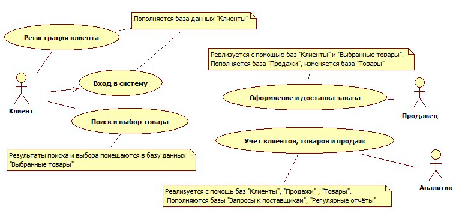

Пример информационного дополненияРисунок 1.3 –

диаграммы вариантов использования средствами аннотирования

должныДекомпозиционные диаграммы содержать декомпозиру

образующий логический центр декомпозиционнойемый прецедент, –

связанный с прочими её прецедентами отношением зависдиаграммы, и

мости. Пример декомпозиции варианта использования показан на ри

сунке 1.4.

Ввод e-mailВвод ФИО

\<\<include\>\> Ввод номера телефона\<\<include\>\> \<\<include\>\>

Регистрация клиента

extension pointsКлиент Нажатие кнопки "Выход" : Спонтанное желание клиента

\<\<extend\>\>

\[Возникло желание прекратить регистрацию\] Прекращение регистрации

(Нажатие кнопки "Выход")

Рисунок 1.4 Декомпозиция варианта использования–

«Регистрация клиента»

\[1\] на рисунке 21 это правило не выпоВ методичке Каюмовой л

основной прецедент «Заказ товаров» на диаграмме отсутствует, внено –

результате чего вспомогательные прецеденты превращены в основные,

поскольку оказались ассоциированными с актором «Покупатель».

информационных систем.Белов В.В., Чистякова В.И. Проектирование программно-

Методические указания к лабораторным работам и практическим занятиям

12

## Страница 13

Следует иметь в виду, что очень часто программночастью 

информационной системы является человек. Обычно, это бывает в сле

дующих ситуациях:

1) на человека возлагается обязанность выполнения некоторой

функции на основе интуиции или плохо формализуемого опыта практи

ческой деятельности; чаще всего это различного рода консультации

пользователей системы, хотя могут иметь место и применения интуи

ции специалистов в задачах прогнозирования, оценки ситуаций, диагно

стики и принятия управленческих решений в тех случаях, когда ис–

сственный интеллект оказывается не достаточно эффективным;ку

2) на человека возлагается обязанность выполнения рутинных

операций, связанных с техническим обслуживанием системы, и ведени

ем баз данных; обычно такого человека называют админом.

емы неотделим от этой системы, он выпоЧеловек элемент сист л-

няет часть её функциональности, а не является сторонней сущностью –

субъектом, объектом или другой системой, потребляющей или помога

ющей выполнить функциональность проектируемой системы. Такие

аются акторами. Сторонние системысторонние сущности назыв 

помощники отличаются от проектируемой системы происхождением

(целью и/или разработчиком и/или местом и/или временем создания),

владельцем и механизмом обслуживания. Человек элемент системы-–

это не актор, он работник (work), действующий внутри системы.er

Для того, чтобы поместить worker на диаграмму вариантов ис

пользования необходимо выполнить следующие действия:

1) ViewCaseUseнавести курсор на элемент;

2) нажать правую клавишу мыши;

3) в появившемся контекстном меню выбрать Add;

4) в новом появившемся контекстном меню выбрать Class; со

зданный класс отобразится в навигаторе модели Model Ex

plorer на уровне диаграмм с именем по умолчанию;

5) Propertiesв окне свойств изменить имя созданного класса на

требуемое, например, Админ, Аналитик, Продавец;

6) and drop созданный класс из навDragперетащить методом и

гатора модели на рабочее поле диаграммы;

7) выделить прямоугольник класса щелчком мыши;

8) Properties worker (послев окне свойств назначить стереотип д

ний в списке стереотипов);

9) выделенном прямоугольнике класса правую клавнажать на и

шу мыши, далее по цепочке из трёх контекстных меню вы

брать: Display IconicStereotypeFormat \> \>; прямоугольник– –

класса изменится на человечка в круге;

информационных систем.Белов В.В., Чистякова В.И. Проектирование программно-

Методические указания к лабораторным работам и практическим занятиям

13

## Страница 14

10) бFormatдалее через контекстное меню можно подавить ото

ение линий атрибутов и операций worker’а по схеме: Foраж r

Attributes OperationsSuppress SuppressFormatmat \> \>и– –

.

Состав выполняемых работ по изучаемой теме1.4

В процессе выполнения задания необходимо выполнить следую

щие работы.

1. Построить диаграмму вариантов использования первого уров

основную диаграмму. Рекомендуемая подрисуночнаяня –

Варианты использования проектируемой системыподпись: « »

2. Построить диаграммы декомпозиции вариантов использова

ния, представленных на диаграмме первого уровня.

Рекомендуемые подрисуночные подписи:

«Декомпозиция варианта использования \<НАЗВАНИЕ ПРЕЦЕДЕНТА\>»

Замечание: конструкция \<НАЗВАНИЕ ПРЕЦЕДЕНТА\> должна

быть заменена на фактическое название декомпозируемого прецедента.

Осуществить документирование всех диаграмм и все3. ех их эл

ментов (см. требования к оформлению отчёта) в секции Doc

umentation диаграммы.

Составить текстовые описания4. просценариев использования

ектируемой системы каждым из акторов.

е этого пункта работ косвенно требует сЗамечание: выполнени о

овых описаний алгоритмов реализации (потоковставления текст

состояний) прецедентов всех диаграмм;всех

5. Прикрепить получаемые текстовые документы редактором

Attachmentвложений в окне закладки с именем к соответ

ствующим акторам.

6. Поместить все документирования и описания алгоритмов реа

лизации в отчёт.

Замечание: если для документирования всех элементов всех диа

требграмм и для описания алгоритмов реализации всех прецедентов у

ется более страниц отчёта, то можно ограничиться нетридцати сколь

могут быть исключены документирования и опис;кими диаграммами а

ния потоков, связанные с некоторыми диаграммами декомпозиции.

Требования к оформлению основных элементов отчёта1.5

1. Все элементы диаграмм и узлы, и стрелки должны иметь по–

Documentation и в тексте отчёта.яснения в секции диаграммы

Пояснение стрелки должно представлять собой обоснования2.

выбранного отношения, представляемого данной стрелкой.

3. Текст пояснений в отчёте желательно подразделять на струк

«Документирование акторов», «Документиртурные части о-–

информационных систем.Белов В.В., Чистякова В.И. Проектирование программно-

Методические указания к лабораторным работам и практическим занятиям

14

## Страница 15

ентов», «Документирование обобщений \| ассоцвание прецед и

аций \| включений \| расширений»

Примерные схемы обоснований:

Для ассоциации между актором и прецедентом:

а) «Отношение ассоциации выбрано направленным от актора

\<название актора\> к прецеденту \<название прецедента\>, потому что

актор является пассивным участником взаимодействия запускает вы–

полнение прецедента, задаёт исходные данные и получает результат».

б) «Отношение ассоциации между актором \<название актора\> и

прецедентом \<название прецедента\> выбрано ненаправленным, потому

что актор является активным участником взаимодействия не только–

запускает выполнение прецедента, задаёт исходные данные и получает

результат, но и участвует в диалоге с программой, реализующей преце

дент».

Для зависимости между прецедентами:

а) «Тип отношение зависимости между прецедентами \<название

го прецедента\> выбран «includeго прецедента\> и \<название 21 », пото--

го прецедента\> функцму что при реализации прецедента \<название 1 и-

беональность прецедента \<название 2 го прецедента\> используется з-

условно.

б) «Тип отношение зависимости между прецедентами \<название

го прецедента\> выбран «extendго прецедента\> и \<название 21 », пото--

го прецедента\> функцму что при реализации прецедента \<название 1 и-

ональность прецедента \<название 2 го прецедента\> используется только-

при выполнении условия \<формулировка условия\>.

: условие \<формулировка условия\> обязательно помЗамечание е

щается в свойство () Condition поясняемой стрелки отношенияproperty

extend« ».

4. должны иметь текстовый алгВсе варианты использования о

ритм реализации (спецификацию потоков поведения) в тек

стовом документе, прикрепляемом редактором вложений в

Attachmentокне закладки с именем

.5. Текстовые описания алгоритмов реализации прецедентов

оформляются в виде таблиц. Примеры различных вариантов

офо \[ \]7рмления текстовых алгоритмов приведены в

.В настоящем пособии в качестве примеров текстовых описаний

алгоритмов реализации прецедентов приведены: таблица 2 йсценари–

; таблица 3использования системы Интернет магазин клиентом сцена-–

таблица 4рий реализации пре Регистрация клиента»; алгоритмцедента « –

вычисления первого замечательного предела.

Основной поток алгоритма представляет собой последователь-

информационных систем.Белов В.В., Чистякова В.И. Проектирование программно-

Методические указания к лабораторным работам и практическим занятиям

15

## Страница 16

ность действий и ссылок на деятельности. Действия и ссылки нумеру

ются натуральными цифрами в порядке их выполнения. При этом ссыл

ки имеют специфический синтаксис: за номером в основном потоке

размещается номер ссылки с префиксом, указывающим на тип ссылки –

дентификаторы, начинающиеся на буквуA AS ИE символизирили у

,,.

ют альтернативные потоки, т. е. потоки, выполняемые при справедливо

дентификаторы, начинающиеся на букву Sсти некоторых условий. И

,

символизируют подпотоки.

Р между альтеразличи нативными потоками и подпотоками зая

ключаются в следующем. Альтернативные потоки это альтернативные–

. Они всегда обветви алг реализации прецедентаоритма унекоторого

Ссылка на Amй k \[ \]cсловлены. альтернативны имеетпоток синтаксис:.,

номер ссылки на альтернативный поток в основном потоке;k mгде – –

cномер альтернативного потока; условие, при котором выполняется–

й йПример ссылки наальтернативны альтернативныпоток поток:.

A2. \[Выбран Выход из системы\]5.

располагаются в одной таблице с осноАльтернативные потоки в

чтобыным потоком, но в отдельной секции, не нарушать читаемость–

основного потока.

Подпотоки это предопределённые алгоритмы по терминологии–

схем алгоритмов. Их тексты располагаются в отдельных, как правило,

таблицах объёме их можно разместить и в одной таб, хотя при малом

. Они использлице с основным потоком и альтернативными потоками у

вспомогательных прецедентов. Ссылкиются для описания реализаций

на них могут обусловливаться, но могут и не иметь условий обращения

к предопределённому алгоритму. Обусловленные ссылки соответствуют

extend зависимостям, а безусловные include зависимостям между пре--–

extendСсылка на подпотокцедентами. реализации зависимого преце-

iСсылка на подпотокSmk \[ \]cдента имеет синтаксис: реализации n.

.clude Smk

зависимого прецедента аналогична, но не содержит условия-.

При\[ \]c декомпозиции вспомогательных прецедентов в их реализации.

будут фигурировать вспомогательные потоки более низкого уровня.

Нумерацию подпотока внутри подпотока предшествующего уровня

Sm1: 2 1mследует осуществлять по схеме, где номер подпотокаm –…

2первого номер подпотока декомпозицииуро m второго уровнявня, и–

4:2:1 4:2 в подпотокеS Sпервый подпоток подпотока. Например,т. д –

4S.

дентификаторы буквуИ Eначинающиеся на символизируют оп

,,токи ошибок,

которые также при справедливости некотвыполняются о

рабочемуусловий, но эти условия не соответствуютрых развитию про

. Это обработчики исключительныхцесса, т. е являются исключениями

информационных систем.Белов В.В., Чистякова В.И. Проектирование программно-

Методические указания к лабораторным работам и практическим занятиям

16

## Страница 17

Текст потока ошибок ся в одной таблице сситуаций. размещает реализу

ошибокСсылка на размещается в тексте дейемым потоком поток ствия,

.

во время выполнения которого возникло исключение, имеет синтаксиси

Заметим, что конструкции() Sm SmAmE \[ \] \[ \] E \[ \]m c c m c использу.,,,

описаний альтернативных, подпотоков и потоковются как заголовки

ошибок в разделах их описаний.

Таблица 2 Сценарий использования системы «Интернет магазин»-–

Сценарий использования системы «ИнтернетНазвание: магазин»-

КлиентДействующие

лица:

Клиент выбирает и реализует необходимую функциюКраткое

Системы. В процессе общения с Системой каждоеописание: интер

фейсное окно предоставляет возможность досрочного за

вершения общения с Системой.

У клиента возникла потребность воспользоваться системойПредусловия:

нного приобретения товаров. Он запустил Систему.удалё

Клиент завершил общение с СистемойПостусловия:

Система отображает окно с возможными вариантамиОсновной поток 1.

(нормальное действий:

 Регистрация клиента //течение): выполняется при первом входе в систе

му

 Вход в систему // выполняется при последующих входах в

систему

Выход из системы // потенциальная возможность поведения клиента

Пользователь выбирает необходимое действие2.

1. \[Выбрана Регистрация клиента\] //3. S подпоток регистрации

. \[Выбран Вход в систему\]4. 2S

. \[Выбран Выход из системы\]S35.

Альтернативные Альтернативных потоков нет.

потоки

(альтернативные

течения):

Потоки ошибок: Потоки не определены

2 описываются отдельными таблицами1 иS SПодпотоки Подпотоки.

\[Выбран Выход из системы\]3.S

1. Выполнение прецедента завершается

Приоритет (Кр Критичнои

тично \| Важно

\| Желательно):

Частота Всегдаисполь

зования (Всегда \|

Часто \| Иногда \|

Редко \| Один

раз):

информационных систем.Белов В.В., Чистякова В.И. Проектирование программно-

Методические указания к лабораторным работам и практическим занятиям

17

## Страница 18

Таблица Сценарий3 Регистрация клиентареализации прецедента « »–

Название: 1.S Реализация прецедента «Регистрация клиента»

КлиентДействующие

лица:

лиент реализует функцию ввода идентификационных даКраткое К н

ных о себе: ФИО, mail, номер телефона. В процессе общописание: e е-

ния с Системой интерфейсное окно предоставляет возмож

ность досрочного завершения общения с Системой.

На начальной стадии общения с Сист выбралемой кПредусловия: лиент

Регистрация клиента« ».вариант использования

функ ввода идентификКлиент завершилПостусловия: выполнение ации

ционных данных о себе.

Система отображает окноОсновной поток 1., содержащее текстовые поля

(нормальное mail, телефонадля ввода ФИО, e номер, кнопку завершенияа-

течение): OK еввода данных и кнопку досрочного выхода из сист« »

×крестик в правом верхнем углу окна« »мы –

//2. S 1:1 Ввод ФИО

//3.:2S 1 mailВвод e-

//4. S1 3 Ввод номера телефона:

5. Пользователь нажимает кнопку завершения ввода дан

//OK Завершение регистрацииных

Альтернативные Альтернативных потоков нет.

потоки

(альтернативные

течения):

Потоки ошибок: 1. \[ \]Нажат крестик «E × в правом верхнем углу окна»

1. Выполнение прецедента завершается

S1:1Подпотоки.

заполняет текстовое поле ФИО ()1. 1Пользователь E

2S 1:.

mail ().1. 1Пользователь Eзаполняет текстовое поле e-

S 1:3.

телеф1. Пользователь заполняет текстовое поле номера о

().1Eна

Приоритет (Кр Критичнои

тично \| Важно

\| Желательно):

Частота испол Всегдаь

зования (Всегда \|

Часто \| Иногда \|

Редко \| Один

раз):

информационных систем.Белов В.В., Чистякова В.И. Проектирование программно-

Методические указания к лабораторным работам и практическим занятиям

18

## Страница 19

Таблица Описание прецедента «Первый замечательный предел»4 –

Название: Решение уравнения

Действующие Пользователь

лица:

Вычисляет формулу первого замечательного пределаКраткое опи

 sin()сание: x

 limy =

 0 x→

x

У пользователя возникла потребность вычислитьПредусловия:

формулу первого замечательного предела. Он запу

стил Систему.

Система отображает решениеПостусловия:

Система отображает предложениеОсновной п 1. ввода аргумео н

ток (нормаль та x

ное течение): ()2. E1Пользователь вводит значение x

0A1. \[ \]3. x =

0A \[ \]4. 2. ≠x

5. Вывод x y,

6. Выполнение прецедента завершается

Альтернати 0A1. \[ \]в x =

11.ные потоки y =

(альтернатив 2. Переход на пункт 6 основного потока

ные течения): 0 \]A. \[2

≠x

sin()x

1. y =

x

2. Переход на пункт 6 основного потока

Ошибка вводаE1. \[ \]Потоки оши

бок: 1. Переход на пункт 1 основного потока

КритичноПриоритет

(Критично \|

Важно \| Жела

тельно):

Частота и Всегдас

пользования

(Всегда \| Часто

\| Иногда \| Ред

ко \| Один раз):

информационных систем.Белов В.В., Чистякова В.И. Проектирование программно-

Методические указания к лабораторным работам и практическим занятиям

19

## Страница 20

ИЗУЧАЕМАЯ ТЕМА «ДИАГРАММА ДЕЯТЕЛЬНОСТИ»2

2.1 Ассоциированные понятия

Поведение (Behavior) ИС совокупность всех процессов, реали–

зуемых в ИС.

Процесс (дискретный) последовательность операций.–

Целенаправленные процессы направленные на достижение не–

которой цели (получение некоторого результата).

()Форм представления процессов еописания алгоритмы и сцы –

раф изображаемые Сически ценаринарии, г диаграммами принятоями

. В п

процессов, в которых участвует человек кеназывать описания ракти.

моделирования ермины сценарии не различалгоритмы« » « »т и имы.

Основные диаграммы, используемые для моделирования поведе

ния (процессов = работ):

State machine Diagram = State chart Diagram =D1. Диаграмма автомата

Activity DiagramD2. = Диаграмма деятельности.

Sequence DiagramD3. = Диаграмма последовательности

Communication Diagram = Collaboration Diagram =D4. Диаграм

()/ кооперации сотрудничествама коммуникации

диаграммы автомата и деятельности имеют общую21D D⊆ –

теоретическую платформу совокупности изобразСети Петри; по и–

тельных средств диаграммы деятельности являются подмножеством

диаграмм автомата.

3 = 4D D диаграммы последовательности и коммуникации ес–

мантически эквивалентны.

Процессы представляют собой цепочки (последовательности)

действий и деятельностей. По определению:

Action семантически простая (элементарная, недДействие = е–

ктуры) краткосрочнаялимая, не имеющая стру операция.непрерываемая

Activity йДеятельность = последовательность депрерываемая–

ствий. Прерывание деятельности возможно при переходе от одного дей

ствия к другому.

StarUML и действия, и деятельности с известными читателюВ

ми реализации в диаграммах изображаются с помощью одналгоритма о

ActionState». Деятельности же с неизвестнго и того же инструмента « ы

ми алгоритмами реализации представляютсяв местах их использования

на деятельности. Ссылки создаются с помощью инструментассылками

ubactivityState». Для каждой такой ссылки необходимо создать оS« т

дельную (дополнительную) диаграмму реализации.

Ссылку на деятельность можно называть обращением к деятель

всё как в программировании: в прности или вызовом деятельности о–

грамме (или подпрограмме более высокого уровня) размещается обра-

информационных систем.Белов В.В., Чистякова В.И. Проектирование программно-

Методические указания к лабораторным работам и практическим занятиям

20

## Страница 21

щение к подпрограмме, называемое также вызовом подпрограммы или

ссылкой на подпрограмму, а в отдельном месте программного кода раз

мещается текст реализации (определение) подпрограммы.

ActionState SubactivityState в диаграммах изображаются в видеи

овалов с названиями представляемых работ и деятельностей, см. рису

SubactivityState имеет специальную пиктограмму (сосискунок 2.1. Овал

или трезубец) в правом нижнем углу.

Действие или Деятельность с известным алгоритмом реализации

Деятельность с неизвестным алгоритмом реализации

Изображение действий, и ссылок наРисунок 2.1 деятельности–

Запоминаем факт:

деятельность может быть конечной или бесконечной во времени.

это ожидание некоторого события,Бесконечная деятельность –

называемого триггером (триггерным событием). Во время ожидания

возможно отображение различного рода инструкций и/или рекламы.

Диаграммы деятельности следует помещать в представление

Logical View.

SubactivityState StarUMLВ контексте применения инструмента в

следует знать следующее. Когда модельер создаёт на уровне представ

ления (Logical View) новую диаграмму деятельности, то фактически в

еятельность, представляющая собой механизм обмодели создаётся д ъ

(интегратор) диаграммы деятельности и её элементов. Услоединения в

но можно изобразить так.

Деятельность = Диаграмма деятельности + Элементы диаграммы

ь эту формулу легче, если осознать, что диаграмма деПонят я

графическоготельности выразитель деятельности, средство преэто д–

рисования графическихставления деятельности механизм надлежащего

,элементов из некоторой совокупности этих элементов.

StarUML версии 5.0.2.1570 эта деятельность по умолчаниюВ

имеет имя ActivityGraph StarUML 3.х ицелое число. В версиях, гдеn n –

4.х она называется просто Activity. На уровне ActivityGraph позициони

руются диаграммы деятельности, используемые для представления ал

итмов реализации варианта использования (некоторой задачи). Вгор

5.0.2.1570 внутри интегратора ActivityGraph создаётся ещёStarUML

, объединяющий элементы всех диTOPодин интегратор с именем а–

грамм, объединяемых интегратором ActivityGraph. В версиях StarUML

информационных систем.Белов В.В., Чистякова В.И. Проектирование программно-

Методические указания к лабораторным работам и практическим занятиям

21

## Страница 22

TOP3.х и 4.х интегратор не используется, и элементы диаграмм пози

ционируются вместе с диаграммами на уровне Activity.

Именование ссылок и детальностей

StarUMLВ отличие от многих языков программирования в ссыл

либо (например, на деятельность или автомат) имеет бка на что со-

имя, а то, на что ссылаются, тоже имеет собственное имя. Вственное

StarUML версии 5.0.2.1570 ссылка выглядит так:

Имя\_Ссылки

include / Имя\_Вызываемой\_Деятельности

StarUML 3.х и 4.х и в стандарте языка ссылки на деВ версиях я

тельность имеют иной вид:

Имя\_Ссылки:Имя\_Вызываемой Деятельности

\_Применение имён ссылок позволяет жеразличать ссылки на одну и ту

(на одну и ту же функциональность) в рамках одного адеятельность л

горитма или нескольких алгоритмов. Например, две следующие ссылки

Выч\_П Под Домом:Выч Пощади Многоугольникаислениелощади

\_ \_ \_ \_Садом:ВычВыч\_П Под Пощади Многоугольникаислениелощади

\_ \_ \_ \_вызывают одну и ту же деятельность «Выч еисл

\_П ощади\_Многоугольника»ние л.

Если потребности в различении разных ссылок на одну и ту же

«Имя\_ссылки» и связанное с нимдеятельность нет, то

мя\_Вызываемой\_Деятельности»«И представля ечасто ют схожими им

нами, например, «регКлиента» и «РегистрацияКлиента», первое слово–

сокращается и начинается со строчной буквы.имени ссылкив

Именование деятельностей и их диаграмм

Имя диаграммы может совпадать с енем деятельности, преим д

ставляемой этой диаграммой или отличаться от него несущественно,

например, префиксом ВычD D\_, как в следующем примере: « еисл

\_», но языковые проблемы инструментов\_Пощади\_Многоугольникание

моделирования обусловливают следующую особенность: именаUML-

диаграмм в деятельностях целесообразно записывать на английском

Calculate\_Polygon\_AreaDязыке по аналогии с « ».

\_

2.2 Назначение диаграмм поведения

Диаграммы поведения используются для моделирования процес

информационной системе, и представляют собой асов в программно л-

горитмические реализации прецедентов, представляемых на диаграмме

вариантов использования.

информационных систем.Белов В.В., Чистякова В.И. Проектирование программно-

Методические указания к лабораторным работам и практическим занятиям

22

## Страница 23

Диаграммы поведения в обязательном порядке должны создаваться

каждого варианта использования,для

основнойпредставленного на диаграмме прецедентов.

Алгоритмы вспомогательных прецедентов приводятся в тех слу

чаях, когда их реализация не очевидна и/или не осуществлялась ранее в

компании разработчика.

Заметим, что термин «алгоритмическая реализация» применяется

«сценарий». Те«алгоритм», ещё чащередко, чаще говорят просто р–

1 означал конкретную траекторию в алгмин «сценарий» в эпоху UML о

ритме прохождение алгоритма по конкретным ветвям, представляемое–

диаграммой последовательности. Поэтому, когда говорили «сценарий»,

подразумевали диаграмму последовательности, а когда говорили «диа

грамма последовательности» подразумевали сценарий.

В настоящее время комбинированные фрагменты (Combined

) превращают диаграммы последовательности в практическиFragment

полноценное средство представления алгоритмов, поэтому термин

«сценарий» стал практически эквивалентным термину «алгоритм».

2.3 Руководящие принципы построения

диаграммы деятельности

каждогоДиаграммы деятельности создаются для варианта ис

основной. Какпользования, представленного на диаграмме прецедентов

и диаграмма вариантов использования, диаграмма деятельности это не–

диаграмм: одна из них основная, а остальные еодна, а днесколько – –

деятельностикомпозиционные, структурирующие, представленные–

на основной диаграмме и других декомпозиционных диаграммах.

Оформление2.3.1 ветвлений

При построении диаграмм деятельности следует избегать ошиб

ки, содержащейся в некоторых методических указаниях, например, в \[ \]4

использования слов «Да» и «Нет» над стреи в интернет источниках л-–

я. Эта практика является вольнымками, исходящими из узла решени

переносом нотации блок UMLсхем алгоритмов в диаграммы, что со-

это бвершенно недопустимо. Дело в том, что в UML узел решения у–

подобных или подобныхCдущий оператор в Паскалеswitch в case--

(в узел решения может входить и из него может исходить любоеязыках

количество стрелок). Над исходящими стрелками следует размещать

условия, при этом над одной из стрелок рекомендуется размещать ан

else По этой стрелке будет осуществлён переход в томглийское слово

. условий над другими стрелками не будет в

случае, если ни одно из ы

полнено. Образно можно считать, что стрелка исчезает из диаграммы во

информационных систем.Белов В.В., Чистякова В.И. Проектирование программно-

Методические указания к лабораторным работам и практическим занятиям

23

## Страница 24

время исполнения алгоритма, если ассоциированное с этой стрелкой

. Если же ассоциированное со стрелкой условиеусловие не выполняется

стрелка сохраняется и передаёт потоквыполняется управления.то,

else набираются в свойствах (Следует знать, что условия и Proper

ties) стрелок, а именно в свойствах «GuardCondition», называемых в не

Condition Guard». НабираUMLкоторых реализациях епросто « » или «

свойствах условия появляются над стрелками автоматически и вмые в

квадратных скобках. Изложенное замечание наглядно иллюстрируется

Рисунок 2.2 иллюстрирует также тот факт, что узел решрисунком 2.2. е

UML является не только средством ветвления, но и средствомния в

слияния стрелок. В блок схемах такого средства нет стрелки соединя-–

ются простым соприкосновением.

\[ Условие \]

\[ Условие \]НетДа \[ else \]

Действие01Действие01 Действие02Действие02

Действие03Действие03

а) не верное б) верное

Изображение ветвления вРисунок 2.2 UML–

Оформление разделов активности (Activity Partitions)2.3.2

Swimlanesплавательных дорожек ()в нотации

При использовании в диаграмме разделов активности в виде пла

вательных дорожек следует иметь в виду следующее.

Для исполнителей деятельностей, являющихся акторами людьми,-

следует учитывать, что человек, работая с любой программой может по

,сути дела (физически) только нажимать на клавиши, пользоваться

мышкой, думать и принимать решения. В то же время, в диаграммах

деятельности принято указывать не «физику» манипуляций человека, а

логическое содержание действий, выполняемых этим человеком –

«Ввод исходных данных», «Ввод критерия поиска», «Переход к разделу

каталога», «Исследование товара», «Помещение товара в корзину» и

п. Однако, при этом, крайне желательно представлять в диаграммет.

зации необходимых демеханизм, используемый человеком для реали й

ствий, например, интерфейсное окно, отображаемое программной си

собой примерстемой, как это показано на рисунке 2.3 представляющим

,

диаграммы деятельности с разделами активности в виде плавательных

дорожек.

информационных систем.Белов В.В., Чистякова В.И. Проектирование программно-

Методические указания к лабораторным работам и практическим занятиям

24

## Страница 25

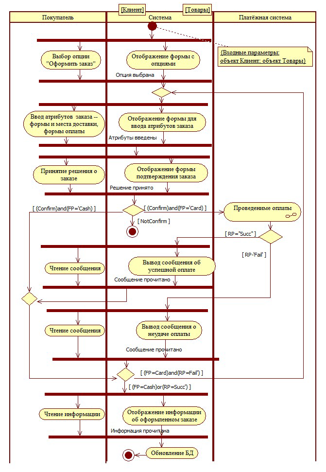

еятельности «Оформление заказа»АлгоритмРисунок 2.3 реализации д–

информационных систем.Белов В.В., Чистякова В.И. Проектирование программно-

Методические указания к лабораторным работам и практическим занятиям

25

## Страница 26

Следует также иметь в виду, что «Система», показанная на ри

сунке 2.3, интегрирует в себе и серверную и клиентскую (в виде браузе

ра) части программно информационной системы. Это позволяет избе-

жать излишней детализации действий клиенткой части приложения, не

приводя такие действия как «Получение данных», «Рендеринг окна» и

п. Такой подход вполне приемлем, если он соответствует текущемут.

контексту моделирования.

Состав выполняемых работ по изучаемой теме2.4

е выполнения задания необходимо выполнить следуВ процесс ю

щие работы.

1. Построить диаграммы деятельности для каждого варианта ис

пользования, представленного на диаграмме первого уровня.

Рекомендуемая подрисуночная подпись для диаграмм:

«Алгоритм реализации варианта использования

\<НАЗВАНИЕ ПРЕЦЕДЕНТА\>»

Замечание: конструкция \<НАЗВАНИЕ ПРЕЦЕДЕНТА\> должна

быть заменена на фактическое название реализуемого прецедента.

2. Построить диаграммы деятельности, реализующих ссылки на

деятельности (узлы SubactivityState), содержащиеся в диа

граммах реализации вариантов использования.

Замечание: по сути дела, первые два пункта состава выполняе

мых работ повторяют пункт 4 состава выполняемых работ темы «Диа

грамма вариантов использования». Отличие состоит только в том, что

х алгоритмов создаются их графические представления.вместо тестовы

Осуществить документирование всех диаграмм и всех их эл3. е

ментов (см. требования к оформлению отчёта) в секции Doc

umentation диаграммы.

4. Поместить все документирования всех диаграмм и их элемен

тов в отчёт.

Требования к оформлению отчёта2.5

1. Все элементы диаграмм и узлы, и стрелки должны иметь– –

Documentationпояснения в секции

.Пояснение узлов должно устранять неполноту (incompleteness2.

\[ɪnkəmˈpliːtnɪs\]) и неоднозначность (ambiguity \[æmbɪˈgjuːɪtɪ\])

действий и деятельностей, представленного всодержания

названии действия / деятельности. Как правило, одно название

йне может полностью и однозначно выразить смысл де

деятельности. Следует стремиться к тому, чтобы поя/ствия с

нения действий и деятельностей, помещаемые Documenta-в

информационных систем.Белов В.В., Чистякова В.И. Проектирование программно-

Методические указания к лабораторным работам и практическим занятиям

26

## Страница 27

tion, обеспечивали представление поясняемых действий и дея

это требование модтельностей в виде программного кода е–

ли поведения на этапе окончательного (рабочего) проектиро

вания. Модель требований может содержать более размытые

(fuzzy \[ˈfʌzɪ\]) формулировки действий и деятельностей, но,

тем не менее, они должны обеспечивать точное представление

«физики» реализации действия / деятельности.

Каждая ссылка (SubactivityState) на деятельность (Activity),3.

для полного представления смысла которой недостаточно тек

стового пояснения, должна иметь собственную диаграмму де

ятельности с алгоритмом реализации деятельности, на кото

рую осуществлена ссылка.

Пояснение стрелки должно представлять собой обоснования4.

выбранного набора надписей над данной стрелкой свойств–

Triggers Guard Condition Effects

,,.Примерные схемы обоснований:

Для ссылок на деятельности:

а) деятельность «Ожидание ввода данных» (см. рисунок 2.4) се

мантически тривиальна, поэтому отдельная диаграмма её реализации не

приводится;

б) деятельность «Ввод исходных данных» (см. рисунок 2.4) пред

полагает реализацию стандартной процедуры «Ввод с клавиатуры» \|

реализацию стандартной процедуры «Ввод из файла» \| реализацию

стандартного процесса заполнения текстовых полей окна пользователь

ского интерфейса и выбора элементов раскрывающихся списков. \[Среди

элементов, перечисленных через знак «\|», следует выбрать что то одно-–

это и будет конкретным проектным решением.\] Данная деятельность

семантически проста, поэтому отдельная диаграмма её реализации не

приводится.

Заметим, что применение к деятельности терминов «тривиальна»,

«проста» должно быть обоснованным подобным приведённым выше–

примерам.

Для стрелки перехода:

а) стрелка перехода от действия «Вывод приглашения к вводу

ИД» к деятельности «Ожидание ввода данных» не содержит никаких

надписей, потому что переход осуществляется по завершению деятель

ности «Вывод приглашения к вводу ИД» и является безальтернативным,

т. е. единственным (см. рисунок 2.4).

б) из деятельности «Ожидание ввода данных» имеется два выхо

да, соответствующих двум триггерным событиям CTRL C«Нажато + »–

и «Нажата информационная клавиша»; соответствующие переходы

информационных систем.Белов В.В., Чистякова В.И. Проектирование программно-

Методические указания к лабораторным работам и практическим занятиям

27

## Страница 28

осуществляются безусловно и без действий на переходах (см. рисунок

2.4)

Вывод приглашения к вводу ИД

Нажато Ctrl+CОжидание ввода данных

Нажата информационная клавиша

Ввод исходных данных Вывод сообщения "Завершение работы

без ввода данных"

Пример выхода из состояния с бесконечнойРисунок 2.4 –

ятельностью по триггерным событиямде

В традиционных схемах алгоритмов блок «Процесс аналог уз» –

(Action)ла «Действие» UML может иметь произвольноев диаграммах –

количество входов и единственный выход. В диаграммах же деятельно

Actionсти узел « » должен иметь один вход и может иметь произвольные

количество выходов. При этом следует помнить следующее: один вход

Action формируется путём слияния стрелок, направленных кв узел « »

данному «Действию» с помощью узла «Решение» (Decision)

.DecisionУзел

может иметь произвольное количество входов и« »

выходов (в том числе и единственный), поэтому он одновременно явля

ется средством реализации и ветвлений, и слияний.

Action» может быть осуществлён либо по завеВыход из узла « р

этим узлом, либо по триггерномушению деятельности, представляемой

событию, возникающему во время выполнения представляемой дея

Action» может существовать единственный выходтельности. Из узла «

только в том случае, если представляемая этим узлом деятельность яв

ляется завершаемой. Если же деятельность теоретически не завершаема,

Action» возможен только по триггерному событию.то выход из узла «

Таких событий может быть несколько, и каждому из них соответствует

свой выход из выполняемой деятельности. Следует следить за гаранти

новения хотя бы одного из событий.триггерныхрованностью возник

информационных систем.Белов В.В., Чистякова В.И. Проектирование программно-

Методические указания к лабораторным работам и практическим занятиям

28

## Страница 29

ИЗУЧАЕМАЯ ТЕМА «ДИАГРАММА АВТОМАТА»3

3.1 Ассоциированные понятия

State Machine Diagram. AbbreviatedАнглоязычное название –

form stm.–

Автомат (state machine) совокупность состояний и переходов–

между ними.

Состояния: простые (simple), составные (composite), ссылочные

(submachine), специальные (pseudo).

Переходы: простые и составные.

Надписи над стрелками: событие перехода (trigger event), сторо

жевое условие (guard condition), действие на переходе (effect).

3.2 Руководящие принципы построения диаграммы автомата

Общие замечания3.2.1

Как и любая другая диаграмма, рассматриваемая диаграмма ав

томата является не самостоятельно значимым элементом проекта, а вы

ражающим некоторое содержательное проектное решение, определя–

ее поведение (алгоритм / сценарий функционирования) некоторойющ

части проектируемой системы в процессе реализации конкретного пре

цедента. Другими словами, диаграмма автомата это альтернативная–

форма представления алгоритмической реализации сценариев.

ние реализуемого алгоритма / сценария следует использНазва о

вать в подрисуночной подписи к диаграмме автомата, как это представ

лено на последующих рисунках.

Разработку диаграмм автомата следует осуществлять поакторно –

сценарий использования проектируемой системывначале реализуется

первым актором, за тем со вторым и т.д.

В рамках реализации сценария реализуются варианты исполь

зования, ассоциированные с соответствующим актором.

Принцип иерархии / декомпозиции3.2.2

в диаграммах автомата

Проявление принципа иерархии / декомпозиции в диаграммах ав

томата полностью аналогична проявлению этого принципа в диаграм

мах прецедентов и деятельности:

1) вначале изображается укрупненная версия сценария исполь

зования системы актором; если на диаграмме вариантов использования

циирован с несколькими вариантами, то сценарий поведенияактор ассо

актора должен включать процесс выбора актором необходимого вари

б-анта использования системы; как правило, указанный процесс не ото

информационных систем.Белов В.В., Чистякова В.И. Проектирование программно-

Методические указания к лабораторным работам и практическим занятиям

29

## Страница 30

ражается на диаграмме в виде самостоятельного прецедента, он под–

мевается, носит чисто «технический» характер и примитивен в свразу о

ей реализации; его отсутствие позволяет сосредоточить внимание чита

теля на ассоциациях актора именно с вариантами использования систе

мы, не отвлекая внимания на технический процесс выбора варианта;

иллюстрирующий пример показан на рисунке 3.1;

2) затем осуществляется алгоритмическая реализация вариантов

использования в виде диаграмм автоматов; при этом вспомогательные

прецеденты могут представляться и виде деятельностей, как это показа

3.2, и в виде состояний, как это показано на рисунках 3.3но на рисунке

и 3.4;

3) далее осуществляется декомпозиция алгоритмическая реа–

лизация вспомогательных прецедентов, если в этом имеется необходи

мость;

подлежат алгоритмической реализации и деятельности сост• о

яний, чьи названия не исчерпывают семантику выполняемых

операций;

для примитивных деятельностей указывается факт отсутствия•

их алгоритмических реализаций по причине их семантической

простоты;

4) процесс декомпозиции может быть остановлен в случае суще

ышения рационального объёма отчётных материалов.ственного прев

3.2.3 Примеры диаграмм автомата

Диаграмма, представленная на рисунке 3.1, пример алгоритми–

ческой реализации сценария работы клиента с проектируемой системой.

Сценарий представлен в виде последовательного составного со

содержащего в себе один автомат. Особенностью этого автстояния о–

мата является то, что названия его состояний совпадают с названиями

деятельностей внутри этих состояний.

Отображение интерфейсного окна и ожНачальное состояние « и

дание выбора клиента» содержит одноименную внутреннюю деятель

ность с потенциально бесконечной длительностью, клиент может мед–

лить с выбором бесконечноварианта использования системы долго

,

поэтому выход из этого состояния возможен только по триггерным со

бытиям. Таких события три по числу возможных вариантов использо–

Сами варианты использования представлены простымисистемывания.

Автоматс одноименными внутренними деятельностямисостояниями.

отображает возможности клиента чередовать варианты использования

через «технические» состояния принятия решений осистемы, переходя

дальнейших действиях с системой.

информационных систем.Белов В.В., Чистякова В.И. Проектирование программно-

Методические указания к лабораторным работам и практическим занятиям

30

## Страница 31

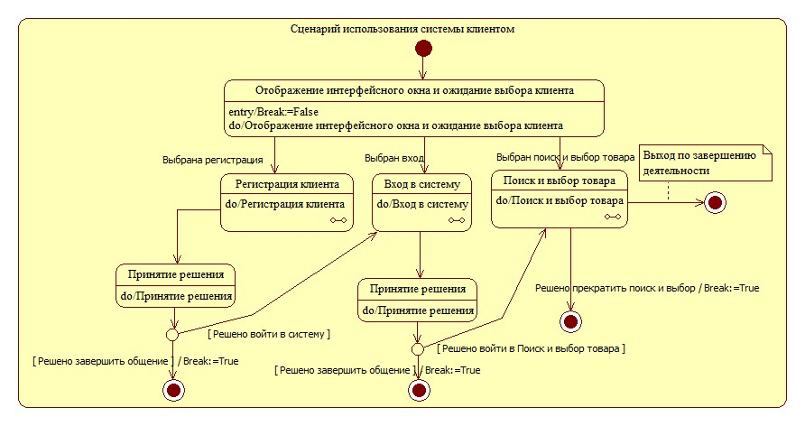

работы кСценарийРисунок 3.1 лиента с проектируемой системой–

3.4 представляют собой альтернативные решения,Рисунки 3.2 –

которые могут быть приняты дизайнером относительно реализации

«Регистрация клиента». Каждый из указанных трёх вариапрецедента н

выбор конкретного из нихтов является дело индивиддопустимым у–

,альных предпочтений проектировщика. Первый вариант реализации

(самый естественный) предполагает, что общение кли с системой вента о

время регистрации осуществляется с помощью одного интерфейсного

Состояние «Отображение окна» реализуется компьютером, состокна. о

яние «Действия клиента», естественно клиентом.–

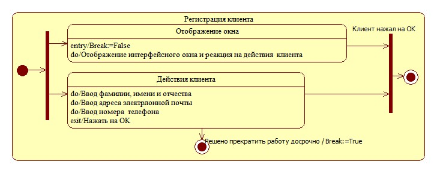

Сценарий реализации прецедента «РегистрацияРисунок 3.2 клиента»–

1. Ввиде составного состояния ариантв

Второй вариант реализации (несколько искусственный) аналоги

чен первому, и отличается от него только тем, что требуется строгая

клиентом сведений о себе.очерёдность ввода

информационных систем.Белов В.В., Чистякова В.И. Проектирование программно-

Методические указания к лабораторным работам и практическим занятиям

31

## Страница 32

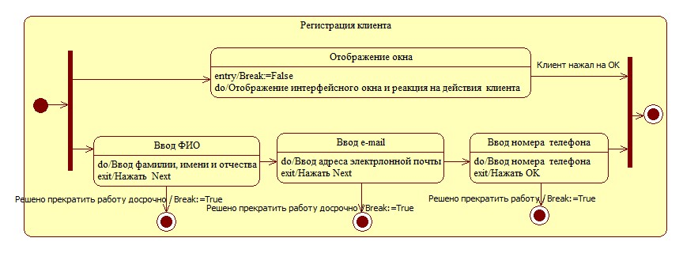

Алгоритм реализации прецедента «Регистрация клиента»Рисунок 3.3 –

2Ввиде составного состояния ариантв.

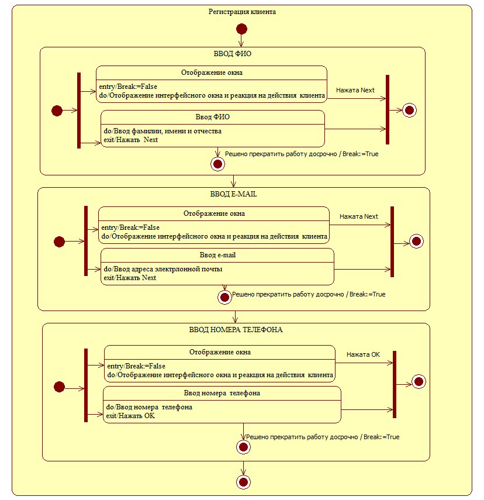

Алгоритм реализации прецедента «Регистрация клиента»Рисунок 3.4 –

3Ввиде составного состояния ариантв.

информационных систем.Белов В.В., Чистякова В.И. Проектирование программно-

Методические указания к лабораторным работам и практическим занятиям

32

## Страница 33

Третий вариант реализации аналогичен второму, в нём также

требуется строгая очерёдность ввода клиентом сведений о себе, но от

личие состоит в том, что ввод каждой группы данных осуществляется с

помощью собственных окон.

Алгоритм на рисунке 3.5 иллюстрирует применение внутренних

Break «Статус», «Оплата». Их следует реализовать какпеременных « »

,атрибуты вспомогательного объекта в текущем потоке управления.

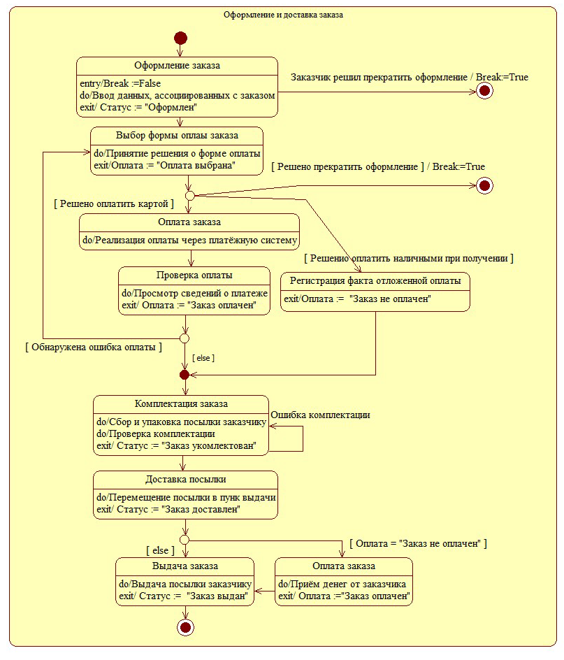

Алгоритм реализации прецедентаРисунок 3.5 –

«Оформление и доставка заказа» в форме автомата

информационных систем.Белов В.В., Чистякова В.И. Проектирование программно-

Методические указания к лабораторным работам и практическим занятиям

33

## Страница 34

ИЗУЧАЕМАЯ ТЕМА «ДИАГРАММА КЛАССОВ»4

Предполагается, что учащиеся знакомы с основными понятиями

объектно ориентрованного программирования.-

4.1 Ассоциированные понятия

Класс. Объект класса. Роль класса. Члены класса: атрибуты, опе

рации и их признаки. Создание класса в проекте. Определение призна

в членов класса.ко

незабываемого4.2 Кое что о классах: воспоминание-

На понятие «классы» в программировании и проектировании

можно посмотреть с разных сторон (представлений, позиций).

С позиции назначения

Класс это относительно самостоятельное программное средство–

для решения задач некоторой тематики.

В первом приближении класс очень похож на модуль (Unit) в

Delphi это некоторое хранилище данных и подпрограмм, которыми–

могут пользоваться другие программы и модули.

elphiКонцептуальным отличием классов от модулей D является

то, что класс является классификатором у него могут существовать–

экземпляры, называемые объектами. Говорят, что класс является типом

данных, определяемым программистом, поскольку он описывает свои

элементы (члены класса) и используется в качестве типа в определении

своих объекто подобных языках иCobjectNameClassNameв: в -

подобных.в ПаскалеobjectName ClassName: -

С позиции организации программного кода

Класс это средство структурирования программ, часть некото–

рой программы.

класса можно представить формулой:Структуру

Класс = Данные + Подпрограммы

Элементы класса еданные и подпрограммы называются его чл–

нами ( of)members class.

Данные классов в разных языках называются по разному: атри-

буты (Smalltalk), переменные ( ++), поля (Delphi). Для#,C C JavaUML

,,конкретности далее данные будем называть

полями.

Подпрограммы почти всегда называются. Исключениеметодами

там они называются операциями. Итак, формула структурыUMLв –

класса приобретает вид:

Класс = Поля + Методы

Или по UML евски:-

Атрибуты ОперацииКласс = +

информационных систем.Белов В.В., Чистякова В.И. Проектирование программно-

Методические указания к лабораторным работам и практическим занятиям

34

## Страница 35

Как видно из формулы, класс это самая обычная программная–

в каждой программе есть данные и подпрограммы. Даконструкция, н–

выражают информационность программы, а подпрограммыные – –

функциональность (процессы = поведение) этой программы.

Особенность классов как средства организации программного

кода

1. Класс изолироватьэто программное средство, позволяющее–

реализацию некоторой функциональности и информационности от про

у функциклиентов от программного кода, использующего этграмм о-–

нальность и информационность. Указанная особенность (изоляция)

инкапсуляцииназывается механизмом программного кода и данных

класса.

реализацию функциональности и иЗачем нужно изолировать н

формационности от её использования прочувствовать немедленно труд

новато, но можно принять на веру, что изоляция позволяет повысить

надёжность ПО.

2. Класс это программное средство, позволяющее реализовать–

частей ПО (классов) в виде дерева, по аналогии с файловойиерархию

системой ОС, структурой учебников, делением систем на подсистемы и

т.д. Есть родитель, а него дети. У детей свои дети и т. д. Наверху иерар

Objectхии у людей Адам, а у классов класс–

.Иерархия классов создаётся с помощью механизма

наследова

дочерние классы получают в наследство от предков их поля иния –

бметоды. Унаследованные члены используются точно так же, как и со

определённые внутри наследника.ственные, –

3. Класс это программное средство, позволяющее по разному-–

реализовывать одни те же методы на разных уровнях иерархии классов.

не абсолютно одинаково и имя метода, и количество фоВсё внеш р–

мальных параметров, и порядок следования типов формальных пара

метров (перечисленное называется сигнатурой метода), и тип возвраща

емого значения (сигнатура вместе с типом возвращаемого значения

ся контрактом метода), а работают засранцы поназывает разному.-

() на уровне точки рисует точку, на уровнеНапример, метод Draw

окружности рисует окружность, на уровне цилиндра рисует цилиндр.

Указанная особенность называется полиморфизмом. Полимор

физм реализуется с. Новаявиртуальных методовпомощью механизма

реализация функциональности методов на некотором уровне иерархии

(override) метода.переопределениемназывается

Следует не путать переопределение (override) метода с его пере

грузкой (overload). Перегруженные методы обязательно отличаются

информационных систем.Белов В.В., Чистякова В.И. Проектирование программно-

Методические указания к лабораторным работам и практическим занятиям

35

## Страница 36

хота бы одним элементом сигнатуры количеством формальных пара–

метров и/или порядком следования типов этих параметров.

Для чего нужен полиморфизм?

Для того чтобы методы, использующие в своей реализации ссыл

етоды, выполняли разную функциональность.ки на перегруженные м

() может таскать по экрану и точку,Например, один и тот же метод Drag

и окружность, и цилиндр, используя одну и ту же цепочку перегружен

ных методов подсветки, гашения и перемещения объекта Show(),–

Hide(), ().MoveTO

4.3 Руководящие принципы построения диаграммы классов

Общие замечания. Выделение классов4.3.1

Классы участвуют в представлении всех основных аспектов рас

смотрения ИС: 1) операции (методы) классов представляют функцио

нальность системы; 2) атрибуты (поля) классов представляют информа

ционность системы; 3) объекты/роли классов, участвующие в диаграм

мах последовательности (коммуникации), отражают поведение ИС;

4) классы, в своей совокупности, участвуя в модели исходного кода на

диаграммах компонентов, описывают структуру системы.

Диаграммы классов целесообразно создавать на основе диаграмм

Diagram (текстовое описповедения. Основные из которых: CaseUse а

ние потоков поведения), Activity Diagram Machine ( Chart)State State

,Diagram Diagram Communication DiSequence

: для отдельныхagramили,

прецедентов, состояний и деятельностей, создаются свои классы, опе

рации (методы) которых и реализуют эти прецеденты, состояния и дея

тельности. Например, рассматривая алгоритм реализации сценария

«Оформление заказа» (рисунок 2.3), можно представить фрагмент си

стемы, участвующей в реализации этого сценария и связанный на диа

обобщёграмме деятельности с дорожкой «Система», в виде одного н–

ного класса с именем «Система». Операции этого класса представляют

собой действия, которые необходимо выполнить, реализуя сценарий

(рисунок 4.1). На диаграмме деятельности действия системы, подлежа

ActionStateщие выполнению, представляются элементами состояния–

ми действий. При переходе к представлению системы в виде обобщён

трансформируются в операции класса.ного класса, состояния действия

Например, действие «Отображение формы с опциями» превратилось в

одноимённую операцию «Отображение формы с опциями()», действие

«Отображение формы для ввода атрибутов заказа» превратилось в од

ноимённую операцию «Отображение формы для ввода атрибутов зака

за()» и т. д.

информационных систем.Белов В.В., Чистякова В.И. Проектирование программно-

Методические указания к лабораторным работам и практическим занятиям

36

## Страница 37

Система

+Отображение формы с опциями()

+Отображение формы для ввода атрибутов заказа()

+Отображение формы подтверждения заказа()

+Вывод сообщения об успешной оплате()

+Отображение информации об оформленном заказе()

+Вывод сообщения о неудаче оплаты()

Рисунок 4.1 Представление системы в виде одного класса–

с основными операциями

Декомпозиция этого обобщенного класса приводит к получению

следующего набора классов:

a) граничные (boundary):

1) форма с опциями;

2) форма ввода атрибутов;

3) форма подтверждения заказа;

4) форма информации о заказе;

5) Успех оплаты;

6) Неудача оплаты;

b) (control)управляющие:

7) Controller;

8) Обновление БД;

c) (entity)сущности:

9) ИнфоЗаказа.

Формы 1 6 реализуют соответствующие диалоги с покупателем,–

могут реализовываться в виде обычных форм системы программирои

вания. Классы 5 и 6 MessageBox, предназначенныеэто классы типа–

для вывода кратких сообщений пользователю.

Класс 7 предназначен для локализации управления последова

главная форма в процессе реализтельностью реализуемых действий а–

ции сценария, может не отображаться в виде окна, но реализовываться в

виде обычной формы. Класс 8 реализует взаимодействие с базой дан

ных, может реализоваться в виде обычной формы, неотображаемой во

время реализации сценария.

структура данных для хранения информации, ассоциКласс 9 и–

рованной с заказом, включая сведения о покупателе, выбранные им то

вары и результаты диалога с покупателем во время оформления заказа.

Может реализоваться в виде обычной формы, неотображаемой во время

реализации сценария.

Графическое представление выделенных классов показано на ри

сунке 4.2.

информационных систем.Белов В.В., Чистякова В.И. Проектирование программно-

Методические указания к лабораторным работам и практическим занятиям

37

## Страница 38

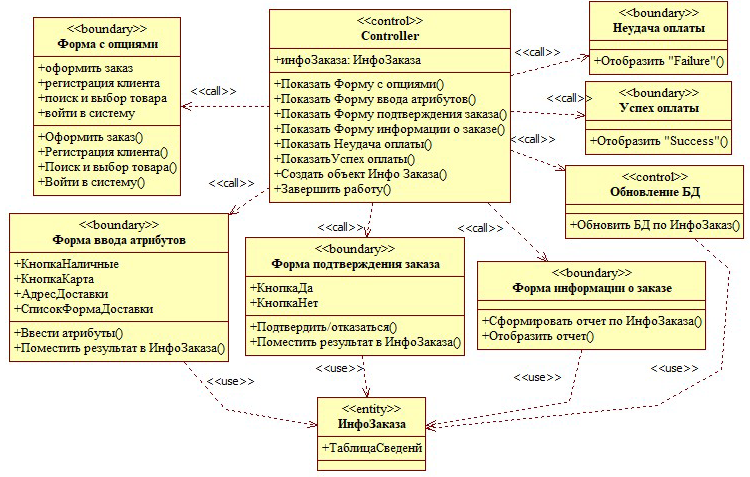

Классы реализации сценария «Оформление заказа»Рисунок 4.2 –

с отношениями

Заметим, что формирование обобщённого класса «Система» но

образом, учебно методический характер это сделано длясит, главным -–

того, чтобы показать трансформацию действий, выполняемых системой

в рамках диаграммы деятельности (рисунок 2.3), в операции (методы)

класса. Учащиеся призваны осознать факт сохранения поведения систе

ы в процессе выделения классов: действия не исчезают, но приобрем

тают форму операций. После уяснения этого факта учащиеся могут вы

делять классы системы по диаграмме деятельности, минуя обобщённый

ставя классы в соответствие действиям, используя ориентиркласс, о–

вочный принцип:

каждому действию (ActionState) свой класс.

The The ClassActionState \>–

.

Однако, это принцип весьма ориентировочен иногда некоторой–

группе действий может оказаться достаточным одного класса. Ситуа

ция, когда для одного действия ( ionState) может потребоваться дваAct

или более классов будет невозможна, если в процессе выявления клас

сов двигаться слитно по содержимому всех диаграмм, включая деком

bSuпозиционные, на которые осуществляется ссылка инструментом–

activityState ActionState, должны представлять собой де. Элементы же й

ствия, алгоритмы реализации которых, читателю известны, и остаётся

только прописать соответствующий программный код.

информационных систем.Белов В.В., Чистякова В.И. Проектирование программно-

Методические указания к лабораторным работам и практическим занятиям

38

## Страница 39

Обратим внимание на то, что термин «Система» на диаграмме

рисунка 2.3 символизирует не всю систему в целом, а её отдельный

фрагмент, участвующий в процессе реализации одного прецедента– –

«Оформление заказа». Очень часто выделение классов целесообразно

начинать со сценария использования системы актором. В общем случае

этот сценарий оперирует с несколькими вариантами использования,

например, как это показано на рисунке 4.3.

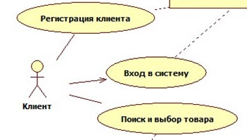

Рисунок 4.3 Варианты использования системы клиентом–

(фрагмент диаграммы прецедентов)

Сценарий использования системы клиентом, согласно предлагае

мой методике, следует представить диаграммами деятельности или ав

томата, и по ним уже выделять классы. При использовании диаграмм

деятельности классы ставятся в соответствие состояниям действия (Ac

tionState), а при использовании диаграмм автомата классы ставятся в

соответствие простым состояниям, представляемым инструментом

() по следующей схеме:State

каждому простому состоянию (State) свой класс.

The The ClassState \>–

.

Автоматное представление алгоритмической реализации фраг

мента, указанного на рисунке 4.3, изложено в теме «Диаграмма автома

та». Там на рисунке 3.1 представлена диаграмма сценария первого

уровня. На ней три простых состояния:

1) отображение интерфейсного окна и ожидание выбора кли

ента;

2) принятие решения о входе;

3) принятие решения о выборе товаров.

И три ссылочных состояния:

1) регистрация клиента;

2) вход в систему;

3) поиск и выбор товара.

информационных систем.Белов В.В., Чистякова В.И. Проектирование программно-

Методические указания к лабораторным работам и практическим занятиям

39

## Страница 40

Согласно изложенному выше правилу, ставим простым состоя

«Отображение интениям классы. При этом только один класс р–

фейсного окна и ожидание выбора клиента» оказывается программно–

«Принятие решения о входе» иреализуемым, а два других класса –

«Принятие решения о выборе товаров» реализуются «условным» клас

клиентом.сом –

Для продолжения процесса выделения классов следует перейти к

реализациям (декомпозиции) ссылочных состояний. Для одного из них

«Регистрация клиента» в теме «Диаграмма автомата» три версии– –

«Отображение интесценария. Версия 1 определяет два класса р–

фейсного окна» и «Действия клиента». Версия 2 определяет четыре

класса, а версия 3 по числу простых состояний.шесть классов– –

Указанные правила следует применять и для выделения классов,

реализующих остальные варианты использования.

Итак, схема выделения классов для реализации вариантов ис

пользования такова:

Разрабатывается диаграмма вариантов использования до1.

очевидной реализацией».уровня прецедентов «с

Осуществляется алгоритмическая реализация прецедентов:2.

либо в виде диаграммы деятельности с декомпозицией до•

уровня состояний действия (алгоритм их реализации счи

тается очевидным, и далее можно осуществлять уже про

ию);граммную реализац

либо в виде диаграммы автомата с декомпозицией до•

уровня простых состояний (алгоритм их реализации так же

считается очевидным).

Каждому состоянию действия / простому состоянию ставится3.

в соответствие свой класс.

4.3.2 Представления классов

я по пакетам: 1) классы сущности (носителиКлассы разделяютс -

информации); 2) граничные классы (формы пользовательского интер

фейса); 3) управляющие классы (решатели прикладных задач, т. е. ис

полнители процессов).

Диаграмму классов следует представлять в трёх видах:

1) диаграмма пакетов с вложенными в пакеты классами; классы в

этих диаграммах можно (хотя и необязательно) представлять кратко –

одним именем;

2) диаграмма детального представления классов; классы в этих

диаграммах следует (обязательно) представлять максимально подробно

помимо имён должны указываться все атрибуты и все операции с ука–

спецификаторов доступа (+ \| \| # \|), типовзанием всех их признаков -–

информационных систем.Белов В.В., Чистякова В.И. Проектирование программно-

Методические указания к лабораторным работам и практическим занятиям

40

## Страница 41

атрибутов, типов параметров операций и типов результатов, возвращае

мых операциями; при построении этой версии диаграммы следует тща

тельно задокументировать все члены класса, указать их назначение и–

обосновать их атрибуты и типы;

3) диаграмма отношений между классами: на этих диаграммах

степень детальности представления классов может быть произвольной и

разной классов, для одних классов можно приводить толдля ьразных –

ко атрибуты, отменив представление методов, для других наоборот –

можно указать только методы; а для третьих можно ограничиться од–

ними именами классов; самое главное для этой версии диаграммы –

детальное документирование стрелок, выражающих отношения между

классами. Примером представления отношений между классами являет

ся рисунок 4.2.

Отображая отношения между классами, следует понимать сле

дующее.

Отношения ассоциации

разновидности: 1) собственноОтношени меюассоциации т трия и

; 2) 3). Их можно назвать отношагрегаци еассоциа композициции и и и

ниями по данным, поскольку все они на диаграммах проявляются спе

цификой атрибутов.

Собственно ассоциация соответствует ситуации связи таблиц ба

использованием внешних ключей в классах имеются ссзы данных с ы–

лочные атрибуты с одинаковым смыслом и одинаковыми значениям,

при этом один из классов может быть категорирован как зависимый, а

другой как независимый: ссылочный атрибут первого класса заполняет

определённым значением ссылочного атрибута второго класса.ся ранее

В диаграммах классов стрелка агрегации направляется от зависимого

класса к независимому. Иногда говорят о навигации имея доступ к–

объекту зависимого класса, можно отыскать объект независимого клас

са. В обратную сторону такая навигация может быть возможной,не –

в объекте независимого класса нет информации оесли ключевом атри

буте бзависимого класса. В диаграммах стрелки ассоциаций целесоо

разно снабжать именами аналогами глагольных фраз (verb phrase) диа–

ERDграмм.

Агрегация и композиция соответствуют отношению «часть

целое», и в диаграммах классов проявляются в том, что типом одного из

атрибутов некоторого класса (представляющего «целое») является дру

гой класс (представляющий «часть»), Во время исполнения (Runtime)

этот атрибут будет содержать ссылку на объект другого класса.

Концептуально агрегация и композиция отличаются временем

жизни «частей»: в случае агрегации «части» продолжают существовать

информационных систем.Белов В.В., Чистякова В.И. Проектирование программно-

Методические указания к лабораторным работам и практическим занятиям

41

## Страница 42

после удаления «целого», а в случае композиции «части» удаляются

вместе с «целым».

Отличия агрегации и композиции в диаграммах заключаются

только в изображении ромбика на конце стрелки отношения, упираю

щейся в класс целое, в случае агрегации он не закрашен, а в случае-–

композиции закрашен. Выбор отношения модельером должен быть

обоснован в документировании стрелки отношения.

На этапе реализации проектируемой системы агрегация и ком

позиция реализуются соответствующим программным кодом де

он либо не включает (в случае агрегации),структоров «целого» –

либо включает (в случае композиции) обращения к деструкторам

«частей».

Отношения зависимости

Весьма часто классы находятся друг с другом в отношении зави

симости (Dependency). Эти отношения отображаются штриховой лини

ей, направленной от зависимого класса (Client в терминологии стандар

) к независимому (Supplier). Стрелка может снабжатьсяUMLта языка

стереотипом или произвольным названием. Набор стандартных стерео

типов зависимости представлен в таблице 9 \[ \]3, 98, содержащей, кс.

сожалению, ошибку в пояснении (instantiateстереотипа созда« »

). Содержится «Указывает, что операции независимоговать экземпляр:

же быть,Должнокласса создают экземпляры зависимого класса».

наоборот: Instantiate is stereotyped dependency\[5\] говорится: usagea«в

classifiers indicating that operations the client instances ofreateamong on c

the supplier Instantiate: « тереотипная зависимостьпо русски это с», или -–

использования между классификаторами, указывающая на то, что опе

а (зависимого класса)рации клиент создают экземпляры поставщика

(независимого класса)»

.З, что в указанной разновидности зависимости

амети вопрос ом

том, кто является поставщиком, а кто клиентом етривиалениногда н.

вод» и «Автомобиль»Например, в отношении классов «Автоза \[5 \], с. 39

,поставщиком (независимым классом)представленном на рисунке 4.4,

является «Автомобиль», а клиентом «Автозавод».–

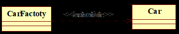

Instantiate \[5 \]Рисунок 4.4, с. 39Пример отношения–

На первый взгляд, кажется, что должно быть наоборот, завод–

важнее автомобиля, он производит автомобили, значит он независим, а

,автомобиль зависит от его произв Но дело в следующем: «А

одителя в.

создаёт «Автомобиль» для получения прибыли, т. е. автомобтозавод» и-

информационных систем.Белов В.В., Чистякова В.И. Проектирование программно-

Методические указания к лабораторным работам и практическим занятиям

42

## Страница 43

ли являются поставщиками прибыли, а заводы являются потребителями

этой прибыли.

В практике проектирования систем часто возникает вопрос о вы

боре вида отношения между классами ассоциация или зависимость?–

этом полезно иметь в виду следующее: 1) ассоциации (все разнПри о

видности) предназначены для отображения связей между классами по

объекты ассоциируемых классов объединяются для того, чтданным о–

бы сформировать информационное пространство, необходимое для ре

шения некоторой задачи; естественно, чаще всего, ассоциируются клас

объекты которых предназначены для хранения инфосы сущности, р-–

мации; 2) зависимости предназначены для отображения:

связей между процедурными классами, объекты которых пре• д

назначены для вызова операций (методов) обработки информации. Если

метод одного (зависимого) класса использует (вызывает) метод другого

(независимого) класса, то эта зависимость изображается со стереотипом

call»;«

связей процедурных классов с классами сущностями. Если ме• -

тод одного (зависимого) класса использует данные (атрибуты) другого

(независимого) класса, то эта зависимость изображается со стереотипом

use« ».

отображОтношения зависимости используются также для ения

ей объектов и классов по происхождению:связ

объект (зависимый элемент модели) являе«instanceOf»• т–

(независимого элемента модели)экземпляр некоторого;ся ом класса

используется при одновременном присутствии на диаграмме и класса, и

его объекта;

instantiate это стереотипная зависимость использов• а« » –

между классификаторам на клиентеи, указывающая, чтония операции

объект зависимого класса создаётздают экземпляры поставщика, т. е.со

объект независимого класса; типично для реальной практики програм

метод клиента создаёт объект поставщика для получениямирования –

доступа к необходимой функциональности. Это отношение зависимости

между классами на диаграммах взаимодействия проявляется наличием

сообщения (), исходящего из активации (фокуса управления =tecrea

спецификации исполнения = Execution Specification) объекта зависимого

класса и входящего в прямоугольник создаваемого объекта независимо

пакет не позволяет отобразить вход сообщения вго класса. Если UML-

ямоугольник создаваемого объекта независимого класса (например, впр

), то следует использовать сообщение со стандартным стереStarUML о

create», отражая тем самым использование статического котипом « н

структора класса. Использование статического деструктора класса мож-

информационных систем.Белов В.В., Чистякова В.И. Проектирование программно-

Методические указания к лабораторным работам и практическим занятиям

43

## Страница 44

но показать сообщением со стандартным стереотипом «destroy».

«instantiate»powertype• полная аналогия, но на« » –

независимый класс создаётся зависимымуровне классов метаклассом;–

зависимый класс уточняет независимый класс;«refine»• –

зависимый класс может быть восстановлен (п«derive»• о–

лучен) из независимого класса.

Create это стереотипная зависимость использования,« » —

означающая, что классификатор клиента создаёт экземпляры классифи

катора поставщика.

InstantiateCreateТекст оригинале для сравнения «:в и «» »

Create is a stereotyped usage dependency denoting that the client classifier creates

instances of the supplier classifier.

Instantiate is a stereotyped usage dependency among classifiers indicating that op

erations on the client create instances of the supplier.

диаграммы классов с несколькими видами отношенийПример

показан на рисунке 4.5.

SqlConnectionMessageBox Form

+CreateCommand()+Show() +SqlConnection(ConfigurationManager.ConnectionStrings\["Config"\].ConnectionString)

formMain \<\<instanceOf\>\>

\<\<create\>\>+conn: SqlConnection conn : SqlConnection

\<\<call\>\> +btnAuthorization\_Click(sender : object, e: EventArgs)

\<\<instantiate\>\>\<\<create\>\> \<\<create\>\>

cmdLogin : SqlCommand cmdPassword : SqlCommand

\<\<instanceOf\>\>\<\<instanceOf\>\>

SqlCommand

+CommandText+Parameters

+ExecuteNonQuery()

Рисунок 4. Пример использования отношений генерализации,5 –

ассоциации и зависимостей использования

Может возникнуть вопрос: могут ли классы енаходиться одновр

и зависимости? Ответ поломенно и в отношении ассоциации житель,

могут. Пример показан на рисунке 4.6.ный –

имеет атрибут, содержащийК ОтдКаФакультетласс ссылку д

. Этот факт отражаетОтделКадровна класс ассоциацию указанров

Причём разновидность ассоциации агрегация еных классов. с множ–

ственностью (кратностью, мощностью, multiplicity) связи многие к од

Кроме того, в процессе работы операции АнализДанныхКаному. н

() класса возможно обращение к конструкторуФакультетдидата

для получения ссылки на объектОтделКадровкласса этого класса.

Следовательно, рассматриваемые классы связаны зависимостью

instantiate.

информационных систем.Белов В.В., Чистякова В.И. Проектирование программно-

Методические указания к лабораторным работам и практическим занятиям

44

## Страница 45

Факультет

+отдКадров: ОтделКадров

+АнализДанныхКандидата(Персона: sting)

1..\*

\<\<call\>\>\<\<instantiate\>\>

1

ОтделКадров

+ОформитьНаДолжность(Персона: sting)

Рисунок 4.6 Пример наличия нескольких отношений между–

двумя классами

Посредством созданного объекта, происходит обращение к мето

stingОформитьНаДолжность(Персона:) следовательно,ду,

ОтдКадровФакультет связаны отношениемклассы зависимостии

callтипа.

Особенности документирования диаграммы классов4.3.3

Диаграмма пакетов

Документирование диаграммы пакетов достаточно компактное,

указываются: 1) количество выделенных пакетов; 2) количества классов

в каждом пакете.

Указанные данные используются в процессе контроля логической

целостности модели: все отображённые в пакетах классы должны быть

в дальнейшем отображены на диаграммах детального представления

классов.

Диаграммы детального представления классов

Диаграммы детального представления классов …

информационных систем.Белов В.В., Чистякова В.И. Проектирование программно-

Методические указания к лабораторным работам и практическим занятиям

45

## Страница 46

ЗУЧАЕМАЯ ТЕМА5

«ДИАГРАММА ПОСЛЕДОВАТЕЛЬНОСТИ»

5.1 Ассоциированные понятия

DiagramSequence Диаграмма последовательности=

Communication Diagram Collaboration Diagram = Диаграмма=

()/ кооперации сотрудничествакоммуникации

43 =D D диаграммы последовательности и коммуникации ес–

мантически эквивалентны.

Combined = комбинированный фрагмент,Fragment средство для–

представления управляющих структур (следования, ветвления, циклов,

параллельностей), контейнер для размещения операндов взаимодей

ствия.

Interaction Operand = операнд взаимодействия место едля разм–

вательностей действий, к которым применяются правилащения последо

управления, определяемые оператором взаимодействия.

InteractionOperator свойство комб= оператор взаимодействия и–

нированного фрагмента, определяющее тип управления для последова

Interaction Operand комбинированного фрательностей, помещаемых в г

мента. Примеры операторов взаимодействия:

a) lt ветвление на произвольное количество направлений,а – –

switchаналог оператора в программировании;

b) выполнение по условию, аналог сокращённой формыopt –

if i thenfоператора;–

c) loop while (цикл с предусловием), условие циклацикл типа– –

Interactionэто условие выполнения тела цикла содержимого–

Operand комбинированного фрагмента; стандарт UML преду

loop forсматривает использование и как оператора, но в

StarUML в нём нет средств для указанияэто не реализуемо –

границ значений счетчика циклов;

d) strict строго последовательно, так выполняются процессы,– –

когда нет никаких комбинированных фрагментов;

e) Interaction Operandпроцессы, размещённые вpar, выполня–

параллельно;ются

f) слабая последовательность (Weak Sequencing) означает,seq –

что последовательности, выполняемые разными объектами,

выполняются параллельно, а последовательности, выполняе

мыми одним объектом, выполняются последовательно друг за

другом в порядке их размещения по вертикали диаграммы.

Линия жизни (lifetime) объекта отображает существование объ–

екта во времени; идёт от прямоугольника объекта по диаграмме сверху

вниз. Если объект создаётся или уничтожается в течение периода вре-

информационных систем.Белов В.В., Чистякова В.И. Проектирование программно-

Методические указания к лабораторным работам и практическим занятиям

46

## Страница 47

мени, показанного на диаграмме, то его линия жизни начинается или

заканчивается в соответствующих точках.

Активация (activation), или фокус управления ( control),focus of

или описание исполнения (ExecutionSpecifications, начиная с

2.5) ого объект выполняетUML показывает период, в течение которv –

\_действие инициированное стимулом (сообщением, сигналом).

5.2 Руководящие принципы построения диаграммы

Общие замечания5.2.1

Диаграмма последовательности одно из альтернативных–

средств графического представления поведения системы. Во еёпервых,-

абсолютным достоинством является строгая структурированность пред

Interaction Operands Combined Fragmentsставляемого сценария всех–

наглядно включают другие управляющие структуры, исключая возмож

ность пересечения структур, т. е. нарушения структурированности мо

делируемых процессов. Во вторых, весьма важно и то, что диаграмма-

последовательности сочетает в себе представление алгоритмичности

процесса с представлением структуры системы: алгоритм представляет

ся последовательностью стимулов (сообщений), а стр объектуктура а–

обработчиками стимулов. Нечто подобное представимо и диаграми м-

если в ней изобразить объекты системы в видемой деятельности, –

названий плавательных дорожек.

5.2.2 Порядок построения диаграмм последовательности

Хотя диаграммы последовательности и являются равноправными

представителями средств моделирования поведения систем, у них есть

всё же важная особенность для их построения целесообразно предва–

рительно выделить классы, реализующие моделируемое поведение. Для

роить либо диаграмму деятельности,выделения классов полезно пост

либо диаграмму автомата. Таким образом, имеет место следующая це

(рисунок 5.1):почка построений

Activity Diagram

Preferred act

Sequence DiagramClass Diagram

Decision-making

Prefered smd State Machine Diagram

Рисунок 5.1 Типовая схема построения диаграмм последовательности–

В то же время, если алгоритм реализации процесса несложен, то

о обратное движение (рисунок 5.2).вполне возможн

информационных систем.Белов В.В., Чистякова В.И. Проектирование программно-

Методические указания к лабораторным работам и практическим занятиям

47

## Страница 48

Sequence Diagram Class Diagram

Рисунок 5.2 Инверсная схема построения–

диаграмм последовательности

При этом на диаграмму последовательности изначально наносят

ся нетипизированные объекты количеством равным ожидаемому коли

пераций. Затем объектам назначаются классы следующими мчеству о а

нипуляциями.

Double click на объекте. // Появляется диалоговое окно:1.

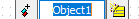

.Нажимается правая пиктограмма. // Появляется диалоговое2.

окно:

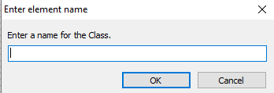

3. OKВводится имя класса. Нажимается кнопка « » на окне.

Класс создаётся в проекте и отображается в инспекторе модели

Logical Viewна уровне

.После чего на диаграмму наносятся стрелки стимулов (сообщ

е

ний), для которых назначаются вызываемые операции следующими ма

нипуляциями.

Double click по стрелке // Появляетс1. я диалоговое окно:

2. Вводится имя операции. Нажимается клавиша Enter.

Введённое имя немедленно становится именем операции клас

са, что и отображается в инспекторе модели на уровне имени класса.

Созданные таким образом классы могут использоваться в любых диа

граммах классов.

Следует строго помнить: надписи над сплошными стрелками –

это вызовы операции (могут быть также сигналами, указаниями со

здания или ликвидации объектов) тех классов, в линию жизни объ

ектов которых втыкается стрелка. Поэтому эти операции обязатель

но должны присутствовать на диаграмме классов.

информационных систем.Белов В.В., Чистякова В.И. Проектирование программно-

Методические указания к лабораторным работам и практическим занятиям

48

## Страница 49

5.2.3 Примеры диаграмм последовательности

Простенький пример диаграммы последовательности показан на

На нём представлен упрощённый фрагмент взаимодействиярисунке 5.3

.объектов двух классов, показанных на рисунке 4.4. Заметим, что имена

объектов и классов на диаграмме отличаются только регистром первой

буквы, что является традиций во многих практиках программирования в

подобных языках. В некоторый момент времени объект «факультет»C-

()».АнализДанныхКандидатаполучает вызов операции «

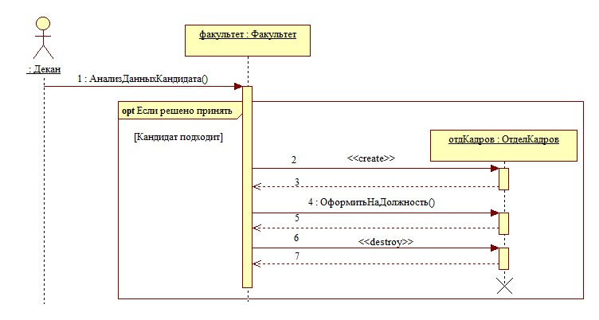

Упрощённый сценарий приёма на работу кандидатаРисунок 5.3 –

на некоторую должность

Предполагается, что объект «факультет», выполняя запрошенную

операцию, представляет декану сведения о некотором кандидате на не

должность. По результатам просмотра сведений деканом мкоторую о

жет быть принято решение о приёме на работу кандидата. Условность

приёма на работу показана с помощью комбинированного фрагмента с

операцией взаимодействия opt», содержащего один операнд взаимо«

я с условием «Кандидат подходит». Всё включённое в указадействи н

ный операнд выполняется только в случае справедливости условия это

го операнда. Заметим, что комбинированный фрагмент с операцией вза

имодействия » концептуально должен иметь единственный операндopt«

заимодействия, содержащий действия, выполняемые только прив –

справедливости условия операнда.

Если декан примет решение об отказе в приёме, то операнд взаи

модействия, размещённый в комбинированном фрагменте « Решеноopt

, не будет выполняться вовсе будто его нет на диаграмме., какпри »нять -

информационных систем.Белов В.В., Чистякова В.И. Проектирование программно-

Методические указания к лабораторным работам и практическим занятиям

49

## Страница 50

Если же декан примет решение принять сотрудника, то операнд

взаимодействия выполняется, и первым действием при этом будет со

здание объекта «факультет» класса «Факультет». Создание осуществля

ется вызовом конструктора метода, вызов которого осуществляется–

через имя класса, а не объекта, поэтому на диаграмме этот вызов заме

нён стимулом (сообщением) со стандартным стереотипом « ». Сcreate о

здаваемый объект размещён не в основной линии объектов, а со смеще

нием вниз в соответствии с прагматическим правилом:

Объекты, создаваемые перед началом реализации сценария, рас

полагаются в горизонтальной линии, размещаемой вверху диаграммы, а

объекты, создаваемые реализации сценария, располагаются сово время

смещением вниз на уровень вызова конструктора.

показан на рисунке 5.3Пример диаграммы последовательности.

Обратим внимание на особый статус объекта класса Controller он:

задаёт порядок выполнения операций, вызываемых через объекты дру

гих классов, т. е. он является формирователем моделируемого сценария,

укладывая в необходимую последовательность операции граничных

Платёжной системы Обновление БДклассов, и класса.

информационных систем.Белов В.В., Чистякова В.И. Проектирование программно-

Методические указания к лабораторным работам и практическим занятиям

50

## Страница 51

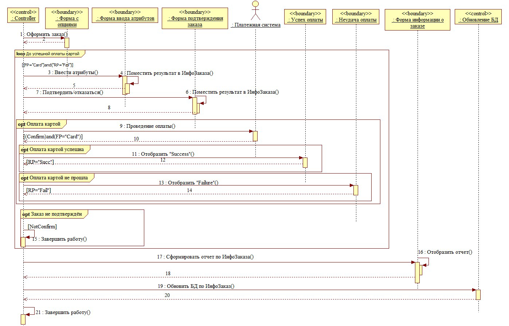

Сценарий «Оформление заказа» в виде диаграммы последовательностиРисунок 5.3 –

51

## Страница 52

РИЛОЖЕНИЕ АП

ОТЧЁТАШАБЛОН ТИТУЛЬНОГО ЛИСТА ПО ТЕМЕ

МИНИСТЕРСТВО НАУКИ И ВЫСШЕГО ОБРАЗОВАНИЯ

РОССИЙСКОЙ ФЕДЕРАЦИИ

ФЕДЕРАЛЬНОЕ ГОСУДАРСТВЕННОЕ БЮДЖЕТНОЕ

ОБРАЗОВАТЕЛЬНОЕ

УЧРЕЖДЕНИЕ ВЫСШЕГО ОБРАЗОВАНИЯ

РЯЗАНСКИЙ ГОСУДАРСТВЕННЫЙ РАДИОТЕХНИЧЕСКИЙ

УНИВЕРСИТЕТ ИМЕНИ В.Ф. УТКИНА

(ФГБОУ ВО "РГРТУ", РГРТУ)

Кафедра вычислительной и прикладной математики

Отчет по теме

ДИАГРАММА ПРЕЦЕДЕНТОВ« »

информационных систем»Проектированиепо дисциплине «

(или «Проектирование программных систем»»

Выполнил: ст. гр. \_\_\_\_\_\_\_\_\_\_

\_\_\_\_\_\_\_\_\_\_\_\_\_\_

Проверил: \_\_\_\_\_\_\_\_\_\_\_\_\_\_\_\_

\_\_\_\_\_\_\_\_\_\_\_\_\_\_\_\_\_\_\_\_\_\_\_\_\_\_

Рязань 202\_\_ г.

52

## Страница 53

ПРИЛОЖЕНИЕ Б

Темы заданий к лабораторным работам и практическим занятиям

бронирования гостиницы.1. Проектирование системы интернет-

2. Проектирование системы реализации готовой продукции.

3. Проектирование системы интернет заказов товаров магазина-

электроники.

4. Проектирование системы предоставления и запроса вакансий

для бюро по трудоустройству.

5. Проектирование системы электронной записи клиентов нота

риальной конторы.

6. Проектирование системы интернет заказов у поставщиков ав-

тозапчастей.

7. Проектирование системы записи и учета прохождения курсов

повышения квалификации.

8. Проектирование электронной системы учета оценок студен

тов.

9. Проектирование электронной системы распределения нагруз

ки преподавателей.

10. Проектирование информационной системы страховой ком

пании.

11. Проектирование системы контроля сроков и обслуживания

клиентов ломбарда.

12. Проектирование электронной системы записи на прием па

нтов частной клиники.цие

13. Проектирование системы учета кадров на предприятии.

14. Проектирование электронной системы заказа книг в библио

теке.

15. Проектирование театральной интернет кассы.-

16. Проектирование системы бронирования для проката автомо

билей.

7. Проектирование системы учета рекламы в эфире телеканала.1

18. Проектирование системы электронного расписания работы

телеканала.

19. Проектирование системы интернет заказов ювелирной ма-

стерской.

20. Проектирование интернет магазина одежды.-

21. Проектирование электронной системы сдачи в аренду торго

вых площадей.

22. Проектирование системы продажи и бронирования билетов

кинотеатра через интернет.

афиши и справки кинотеатра.23. Проектирование интернет-

53

## Страница 54

24. Проектирование системы учета технического обслуживания

станков.

25. Проектирование информационной системы турфирмы.

26. Проектирование системы покупки и бронирования билетов

на поезд.

27. Проектирование информационной системы компании грузо

перевозок.

28. Проектирование системы учета телефонных разговоров со

рудников.т

системы подачи заявок на офор29. Проектирование интернет м-

ление кредита.

кабинета клиента банка.30. Проектирование интернет-

31. Проектирование информационной системы агенства недви

жимости.

32. Проектирование интернет системы записи и учета скидок-

клиентов салона красоты.

33. Проектирование системы регистрации и контроля сообще

форума.ний участников интернет-

34. Проектирование системы доставки товаров из магазина.

35. Проектирование интернет системы заказа и доставки пиццы.-

36. Проектирование информационной системы детского сада.

37. Проектирование системы курсов дистанционного обучения.

38. Проектирование системы футбольных ставок.

39. Проектирование системы бронирования столиков и заказа

блюд меню ресторана по интернету.

. Проектирование системы обслуживания клиентов частной40

почтовой службы.

41. Проектирование системы учета сбыта продукции сельскохо

зяйственного предприятия.

42. Проектирование системы маркетинга предприятия.

43. Проектирование информационной системы компании пря

мых продаж косметики.

44. Проектирование каталога и системы заказов легковых авто

мобилей по интернету.

45. Проектирование системы гарантийного обслуживания элек

тротоваров.

54

## Страница 55

БИБЛИОГРАФИЧЕСКИЙ СПИСОК

Белов В.В., Чистякова В.И. Проектирование информацио1. н

ых систем: учебник: КУРС, 2018. 400 с. 978 906923ISBNМ. 5н ---– –

0 (КУРС) (45 экз. в БФ РГРТУ).53-

Белов В.В., Чистякова В.И. Проектирование информацио2. н

ных систем: учебник для студ. учреждений высш. образования / Под

.: Издательский центр «Академия,2ред. В.В. Белова. Ме изд., стер.-– –

352 с. (Сер. Бакалавриат). ISBN 978 3 (132 экз. в2015. 4468 24405----–

БФ РГРТУ)

Иванов, Денис Юрьевич. Унифицированный язык моделир3. о

вания UML \[Электронный ресурс\]: учебное пособие для вузов по

ный анализ и управление" / Д.Ю.направлению подготовки "Систем

Петербургский государственный полИванов, Ф.А. Новиков; Санкт и-

Электрон. текстовые дан. (1 файл: 1,83 Мб). Санкттехн. ун т.-– –

Петербург, 2011. Загл. с титул. экрана. Электронная версия печат– –

ной публикации. Свободный доступ из сети Интернет (чтение, пе–

чать, копирование). Adobe Acrobat Reader 7.0.Текстовый документ.– –

URL:http://elib.spbstu.ru/dl/2962.pdfДоступно по

,http://elib.spbstu.ru/dl/2962.pdf/download/2962.pdf

Каюмова А.В. Визуальное моделирование систем в StarUML:4.

Учебное пособие/ А.В. Каюм Казанский федеральныйова. Казань. –

университет, 2013. 104 с.–

VersionOMG® Unified Modeling Language® (OMG UML® ).5.

// OMG Document Number formal/2017 Normative URL:2.5.1 12 05: --

.https/www.omg.org/spec/UML/ 796

рр–.

Технологии разрабоОрлов С.А. Программная инженерия.6. т

ки программного обеспечения: Учебник для вузов. е изд. обновл. и5-–

СПб.: Питер, 2016.доп. Стандарт третьего поколения. 640 с. Элек– –

трон. текстовые дан. (1 файл : 37,58 Мб). Текстовый документ.— —

Adobe Acrobat Reader ExplInternet Доступно по URLorer

,.https://www.twirpx.com/file/2378219/.

Оформление текстовых алгоритмов: методические указания7.

к лабораторным работам и практическим занятиям / Рязан. гос. радио

т. им. В.Ф.Уткина; Сост.: В.В. Белов, В.И. Чистякова. Рязань,техн. ун-

Номер в библиотеке РГРТУ\[ \]2022. 24 7466с.:–

https://1drv.ms/u/s!AqzzlvmXwMabzRXUq2X8Qmd2pl1I?e=QNmLFk8.

55
