**МИНИСТЕРСТВО НАУКИ И ВЫСШЕГО ОБРАЗОВАНИЯ**   
**РОССИЙСКОЙ ФЕДЕРАЦИИ**

**ФЕДЕРАЛЬНОЕ ГОСУДАРСТВЕННОЕ БЮДЖЕТНОЕ ОБРАЗОВАТЕЛЬНОЕ**

 **УЧРЕЖДЕНИЕ ВЫСШЕГО ОБРАЗОВАНИЯ**

**«Рязанский государственный радиотехнический университет**  
**имени В. Ф. Уткина»**

(ФГБОУ ВО «Рязанский государственный радиотехнический университет им. В.Ф. Уткина»,

ФГБОУ ВО «РГРТУ», РГРТУ)

**Кафедра вычислительной и прикладной математики**

**Проектирование системы кредитования**

Пояснительная записка к курсовому проекту  
по дисциплине  
«Проектирование информационных систем»

Выполнил(а):    студентка гр.244  
Антипатрова Е.Ю.

Проверил:    д-р техн. наук,  
профессор каф. ВПМ   
Белов В.В.

**РЕЦЕНЗИЯ**   
**на курсовой проект студентки гр.** **244**

**Антипатровой Елизаветы Юрьевны**

**на тему**

**«****П****рое****ктирование системы кредитования****»**  
**по дисциплине**   
**«****Проектирование информационных систем****»**  
**Составляющие оценки**

1. **Полнота выполнения задания (полнота моделей требований, проектирования и реализации) – 5**

1. **Своевременность выполнения задания** **–** **5**

1. **Трудоемкость проекта (количество сущностей предметной области и связей между ними)** **–** **5**

1. **Правильность моделей требований, проектирования и реализации** **–** **5**

1. **Знания** **теоретических основ проектирования программных систем** **–** **5**

1. **Качество оформления пояснительной записки (в том числе соблюдение стандартов) – 5**

1. **Качество изложения (в том числе орфографические, грамматические и семантические ошибки) – 5**

**Итоговая оценка:** **отлично** 

**Профессор кафедры ВПМ РГРТУ**  
**проф., д-р техн. наук**                                                                                                          **В. В. Белов**

Рязань 2025

ЗАДАНИЕ

на выполнение курсового проекта по дисциплине

**«****Проектирование информационных систем****»**

ст. гр. 244\_\_\_\_\_\_\_\_\_\_\_\_Антипатрова Елизавета Юрьевна\_\_\_\_\_\_\_\_\_\_\_\_\_\_

**ФИО**

**Тема проекта:**

**Проектирование системы кредитования**

**Замечания:**

1. предметная область, объект и предмет автоматизации выбираются самостоятельно (в качестве основы для выбора следует использовать тему квалификационного исследования, может использоваться и задание на ранее выполненные курсовые проекты, например, по дисциплине «Базы данных», можно использовать и задания из методички Каюмовой); 

1. при автоматизации информационных процессов реализуемая система должна реализовывать типичные CRUD-операции с базами данных (Create – ввод, Read – чтение, Update – изменение, Delete – удаление) и решать конкретные прикладные задачи; 

1. при реализации относительно самостоятельных аналитических и/или игровых процессов рекомендуется реализовать инфраструктурное информационное обеспечение, например, в виде системы учёта пользователей программы; 

1. при реализации относительно самостоятельных технических процессов следует тщательно обосновать целесообразность нового программного решения и осуществить тщательное тестирование созданной программы;

1. методология проектирования функционально-ориентированная или объектно-ориентированная выбирается самостоятельно.

Задание выдано «\_\_\_»\_\_\_\_\_\_\_\_\_\_\_\_\_\_\_ 2025  г.    Профессор. Белов В.В.

**Содержание**

[ВВЕДЕНИЕ    5](<#_Toc220317113>)

[1 ФОРМИРОВАНИЕ ТРЕБОВАНИЙ К ПРОЕКТИРОВАНИЮ ИНФОРМАЦИОННОЙ СИСТЕМЫ    8](<#_Toc220317114>)

[1.1    Модель предметной области AS IS    8](<#_Toc220317115>)

[1.1.1 Функциональный аспект    8](<#_Toc220317116>)

[1.1.1.1 Алгоритмическая реализации прецедента «Подать заявку на кредит»    12](<#_Toc220317117>)

[1.1.1.2 Алгоритмическая реализации прецедента «Получить консультацию по кредитным продуктам»    12](<#_Toc220317118>)

[1.1.2 Информационный аспект    13](<#_Toc220317119>)

[1.1.3 Структурно-архитектурный аспект    15](<#_Toc220317120>)

[1.1.4     Аспект поведения    15](<#_Toc220317121>)

[Алгоритм «Рассмотреть заявку»    16](<#_Toc220317122>)

[1.2 Обоснование необходимости создания ИС    19](<#_Toc220317123>)

[1.3 Модель требований к проектируемой системе    20](<#_Toc220317124>)

[1.3.1 Модель TO BE    20](<#_Toc220317125>)

[1.3.2 Функциональные требования    20](<#_Toc220317126>)

[1.3.3 Требования к информационности    36](<#_Toc220317127>)

[1.3.4 Архитектурные требования    37](<#_Toc220317128>)

[1.3.5 Требования к поведению    38](<#_Toc220317129>)

[2. ПРОЕКТИРОВАНИЕ СИСТЕМЫ    56](<#_Toc220317130>)

[2.1    Архитектура данных и процессов    56](<#_Toc220317131>)

[2.2 Модель поведения    64](<#_Toc220317132>)

[2.3 Модель реализации    64](<#_Toc220317133>)

[2.3.1 Модель исходного кода    64](<#_Toc220317134>)

[2.3.2 Модель исполняемого кода    69](<#_Toc220317135>)

[2.3.4 Модель поставляемых артефактов    70](<#_Toc220317136>)

[2.3.4 Модель размещения артефактов    71](<#_Toc220317137>)

[2. 3.5 Интерфейс пользователя    72](<#_Toc220317138>)

[3 РЕАЛИЗАЦИЯ ПРИС    74](<#_Toc220317139>)

[3.1 Реализация бизнес-логики    74](<#_Toc220317140>)

[3.2 Реализация пользовательского интерфейса    74](<#_Toc220317141>)

[3.3 Реализация базы данных    87](<#_Toc220317142>)

[3.4 Реализация средств доступа к базе данных    92](<#_Toc220317143>)

[4. ТЕСТИРОВАНИЕ ПРИС    94](<#_Toc220317144>)

[5 СОСТАВ ПРОЕКТА    96](<#_Toc220317145>)

[6 КОМПИЛЯЦИЯ И СБОРКА СИСТЕМЫ    96](<#_Toc220317146>)

[7 ДОКУМЕНТАЦИЯ    97](<#_Toc220317147>)

[ЗАКЛЮЧЕНИЕ    98](<#_Toc220317148>)

ВВЕДЕНИЕ

Современная банковская деятельность характеризуется высокой конкуренцией, строгими регуляторными требованиями и ожиданием клиентов получать цифровые услуги с прозрачными условиями и предсказуемыми сроками. В этих условиях критически важной становится автоматизация ключевых процессов кредитования — от приема и маршрутизации заявок до ведения жизненного цикла кредитов, учета транзакций и предоставления клиентам полной финансовой информации. 

Предметной областью выступает подразделение банка, осуществляющее кредитование, в рамках которого взаимодействуют клиенты, менеджеры по кредитам, а также внешние сервисы кадрового учета и платежей. Клиенты формируют спрос на кредитные продукты и потребляют информацию о статусах заявок, условиях кредитов, начислениях и совершенных транзакциях. Менеджеры, специализирующиеся по категориям кредитных продуктов и имеющие одну или несколько специализаций, рассматривают заявки, принимают решения об одобрении или отказе, подтверждают кредиты после очной проверки документов, ведут свои портфели и управляют параметрами кредитных продуктов в пределах своих категорий. Отдельное значение имеют внешние информационные источники: кадровая система регистрирует и актуализирует данные о менеджерах и их специализациях, а платежный сервис поставляет сведения о фактически совершенных клиентских платежах. Внутри предметной области основными объектами учета являются кредитные продукты с их параметрами (категории, ставки, сроки, лимиты сумм, типы платежей и требования к первоначальному взносу ), заявки на кредит (с указанными клиентом условиями, статусами и историей решений), кредиты (с остатком долга, графиком, статусами «неподтвержден», «подтвержден», «просрочен», «закрыт»), транзакции по кредиту (начисления процентов, штрафы, платежи и досрочные погашения), а также связанные документы — кредитный договор, график платежей и выписка.

Информационные потоки организованы следующим образом. Клиент регистрируется и входит в систему, просматривает каталог кредитных продуктов, формирует и подает заявку, указывая срок, сумму, тип платежей, продукт и размер начального взноса при необходимости, затем наблюдает за статусом рассмотрения. Заявка сначала проходит автоматическую проверку на соответствие параметрам выбранного продукта; при несоблюдении ограничений она отклоняется без участия менеджера. Если заявка корректна, система распределяет ее случайным образом между менеджерами, специализирующимися на соответствующей категории; исключение составляют случаи оформления заявки самим менеджером в отделении, когда заявка закрепляется за ним непосредственно. Менеджер изучает материалы, выносит решение об одобрении или отказе, при одобрении формируется «неподтвержденный» кредит, с которым могут ознакомиться и клиент, и менеджер, а также доступен проект кредитного договора. После очного предъявления клиентом документов и подписания договора менеджер подтверждает кредит; из основной суммы долга списывается первоначальный взнос, если он предусмотрен. Далее система производит регулярные начисления процентов, контролирует наступление просрочки при превышении допустимого интервала со времени последнего платежа, отражает штрафные начисления и учитывает информацию о фактических платежах, поступающую из интегрированного внешнего сервиса. Платежи как таковые система не обрабатывает, ограничиваясь достоверным учетом состоявшихся транзакций. Полное погашение приводит к закрытию кредита.

Цель проекта заключается в измеримом повышении эффективности и качества процессов кредитования. Ожидается сокращение среднего времени от подачи заявки до принятия решения с двух рабочих дней до четырех часов за счет автоматической проверкой данных и организованной маршрутизации; снижение доли формальных отказов и ошибок ввода не менее чем на восемьдесят процентов за счет проверок на этапе подачи; увеличение пропускной способности одного менеджера благодаря устранению рутинных операций; обеспечение полной прозрачности для клиента, включая доступность онлайн-договоров, графиков и выписок для всех подтвержденных кредитов; достижение надежности хранения и доступности данных.

Пути достижения этих целей опираются на разработку специализированной программно-информационной системы, в основу которой заложены модель бизнес-правил, механизм маршрутизации заявок между менеджерами по специализациям, ролевая модель доступа, подсистема расчетов с регулярным начислением процентов и штрафов и детальной транзакционной историей, а также интеграционные интерфейсы со смежными системами кадров и платежей. Система должна формировать и предоставлять регламентные документы, поддерживать мониторинг состояния кредитов и оповещать участников о ключевых событиях жизненного цикла.

Анализ современного состояния показывает, что существуют базовые механизмы учета заявок, однако нуждаются в значительных доработках, когда речь идет о специфических правилах кредитных продуктов, автоматическом отклонении по параметрам, разделении ответственности по специализациям менеджеров и ведении детальной транзакционной выписки при отсутствии собственного платежного контура. Небольшие организации нередко используют электронные таблицы и переписку по электронной почте, что порождает высокие риски ошибок, неконтролируемые задержки и отсутствие сквозной истории изменений и версионности документов. Наконец, отраслевые банковские платформы, рассчитанные на полный цикл с собственными системами учета и платежами, оказываются избыточными для поставленной задачи: сложность внедрения и стоимость владения не соответствуют границам ответственности, определенным для данной системы. Эти обстоятельства обосновывают целесообразность разработки специализированной системы.

Исходными данными для проектирования являются каталог кредитных продуктов с параметрами и правилами автоматического отклонения, справочники статусов, ролей и специализаций, набор бизнес-правил по распределению заявок и регламентам одобрения и подтверждения, алгоритмы расчетов для аннуитетных и дифференцированных платежей, критерии определения просрочки и начисления штрафов, спецификации интеграций с кадровым сервисом и поставщиком информации о платежах, а также нефункциональные требования к доступности, производительности, безопасности.

Для реализации проекта целесообразно применить широко поддерживаемые инструментальные средства. На уровне архитектурного и процессного моделирования подойдет UML. В качестве серверной платформы разумно использовать Java с фреймворком Spring Boot, что обеспечивает построение устойчивых REST API, реализацию валидаторов, интеграций и задач по расписанию. Данные целесообразно хранить в PostgreSQL, которая гарантирует транзакционность и богатые возможности для работы со структурированными и полуструктурированными данными; эволюцию схемы удобно вести с помощью Liquibase. Веб-интерфейсы для клиентов и менеджеров реализуются с помощью библиотеки Thymeleaf. Контейнеризация с использованием Docker, система контроля версий Git. 

1 ФОРМИРОВАНИЕ ТРЕБОВАНИЙ К ПРОЕКТИРОВАНИЮ ИНФОРМАЦИОННОЙ СИСТЕМЫ

1.1    Модель предметной области AS IS

Модель «Как есть» (или «AS IS) системы кредитования описывает следующие аспекты данной системы: функциональный аспект, информационный, структурно-архитектурный и аспект поведения. Для того, чтобы понять, как работает система, необходимо провести анализ вышеперечисленных аспектов.

1.1.1 Функциональный аспект

 Функциональный аспект отражает деятельность предприятия – бизнес-процессы или задачи, которое оно выполняет. Графическое представление системы кредитования в виде диаграмм бизнес-прецедентов представлено на рисунке 1.

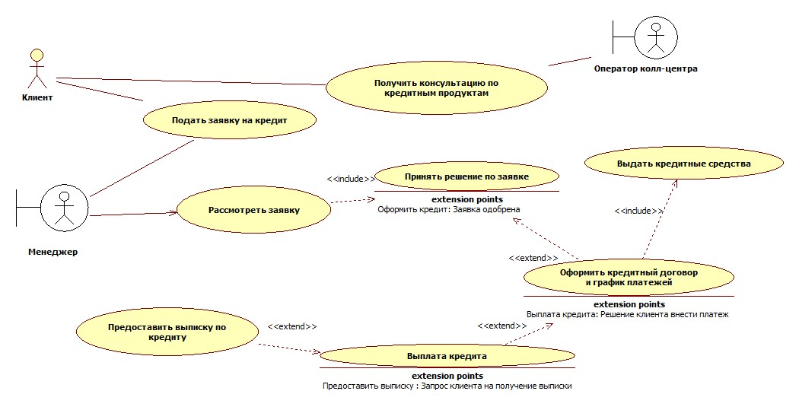

Рисунок 1 – Процессы системы кредитования

    Документирование акторов представлено в таблице 1.

|   |   |
| --- | --- |
| Таблица 1 – Документирование акторов |   |
| **Актор** | **Документирование** |
| Клиент | Частное лицо, заинтересованное в получении кредита. Клиенты могут быть новыми или уже имеющими кредиты в банке. Может взаимодействовать с системой как самостоятельно, так и с помощью менеджера при посещении банка. |
| Менеджер | Сотрудник банка, являющийся частью системы кредитования, ответственный за взаимодействие с клиентами, обработку кредитных заявок и управление кредитными продуктами. |
| Оператор колл-центра | Сотрудник банка,  принимает звонки, консультирует клиента |

Документирование прецедентов представлено в таблице 2.

|   |   |
| --- | --- |
| Таблица 2 – Документирование прецедентов |   |
| **Прецедент** | **Описание** |
| Подать заявку на кредит | Клиент заполняет бумажный бланк заявки на кредит, указывая персональные и финансовые данные и желаемые параметры кредита, после чего передает бланк менеджеру. Менеджер проверяет корректность и полноту, при необходимости помогает клиенту, затем регистрирует заявку в бумажном журнале или Excel. |
| Получить консультацию по кредитным продуктам | Клиент по телефону через оператора колл-центра получает первичную консультацию о доступных кредитных продуктах: условия, ставки, требования, перечень необходимых документов. Консультация направлена на выбор подходящего продукта и подготовку клиента к подаче заявки. |
| Рассмотреть заявку | Менеджер инициирует рассмотрение заявки, проверяет полноту и корректность досье, запрашивает сведения у внешних источников и анализирует платежеспособности, фиксирует результаты и формирует заключение для принятия решения. |
| Принять решение по заявке | На основании заключения по заявке менеджер присваивает статус «Одобрено» или «Отказано». Решение фиксируется в журнале/Excel, клиент уведомляется по телефону или при визите. |
| Выдать кредитные средства | Менеджер оформляет распоряжение на выдачу средств, печатает ордер/квитанцию, а факт выдачи фиксируется в журнале/Excel. |
| Оформить кредитный договор и график платежей | После одобрения заявки менеджер подготавливает договор в редакторе (Word) и график платежей (Excel), при необходимости передает на юридическую проверку, затем распечатывает документы и организует подписание сторонами, параллельно открывая ссудный счет и формируя кредитное дело. |
| Предоставить выписку по кредиту | По запросу клиента менеджер извлекает сведения о начислениях и платежах из журналов/Excel, формирует выписку за нужный период и выдает распечатку клиенту для информирования о состоянии кредита и остатке задолженности. |
| Выплата кредита | Клиент вносит плановые или досрочные платежи в кассе или через доступные каналы; кассир принимает средства, печатает квитанцию и обновляет журнал/Excel, уменьшая остаток задолженности в соответствии с графиком. |

Документирование отношений между акторами и их прецедентами представлено в таблице 3.

 Таблица 3 – Документирование отношений между акторами и их прецедентами

|   |   |   |
| --- | --- | --- |
| **Актор** | **Прецедент** | **Документирование** |
| Оператор колл-центра | Получить консультацию по кредитным | Ассоциация Оператор колл-центра – «Получить консультацию по кредитным продуктам» ненаправленная, оператор ведет беседу, уточняет данные и дает ответы.  |
| Клиент | Подать заявку на кредит | Ассоциация Клиент – «Подать заявку на кредит» ненаправленная, клиент заполняет и передает бланк, менеджер помогает и проверяет. |
|   | Получить консультацию по кредитным продуктам | Ассоциация Клиент – «Получить консультацию по кредитным продуктам» ненаправленная, так как клиент активно участвует в диалоге с оператором колл-центра |
| Менеджер | Рассмотреть заявку | Ассоциация Менеджер — «Рассмотреть заявку» направленная от менеджера, он организует проверки и формирует заключение. |
|   | Подать заявку на кредит | Ассоциация Менеджер — «Подать заявку на кредит» ненаправленная от менеджера к прецеденту, менеджер помогает с оформлением, инициирует регистрацию и фиксирует результат. |

Документирование зависимостей между прецедентами представлено в таблице 4.

Таблица 4 – Документирование зависимостей между прецедентами

|   |   |   |
| --- | --- | --- |
| **Прецедент** | **Прецедент** | **Документирование** |
| Рассмотреть заявку | Принять решение по заявке | Тип отношения зависимости между прецедентами «Рассмотреть заявку» и «Принять решение по заявке» выбран «include», потому что при реализации прецедента функциональность прецедента используется безусловно |
| Оформить кредитный договор и график платежей | Принять решение по заявке | Тип отношение зависимости между прецедентами «Оформить кредитный договор и график платежей» и «Принять решение по заявке» выбран «extend», потому что при реализации прецедента функциональность прецедента используется только при выполнении условия: одобрение заявки. |
|   | Выдать кредитные средства | Тип отношения зависимости между прецедентами «Оформить кредитный договор и график платежей» и «Выдать кредитные средства» выбран «include», потому что при реализации прецедента функциональность прецедента используется безусловно |
|   | Выплата кредита | Тип отношение зависимости между прецедентами «Оформить кредитный договор и график платежей» и «Выплата кредита» выбран «extend», потому что при реализации прецедента функциональность прецедента используется только при выполнении условия: решение клиента внести взнос по кредиту. |
| Выплата кредита | Предоставить выписку по кредиту | Тип отношение зависимости между прецедентами «Предоставить выписку по кредиту» и «Выплата кредита» выбран «extend», потому что при реализации прецедента функциональность прецедента используется только при выполнении условия: клиент запросил выписку. |

1.1.1.1 Алгоритмическая реализации прецедента «Подать заявку на кредит»

|   |   |
| --- | --- |
| Название: | S1. Реализация прецедента «Подать заявку на кредит» |
| Действующие лица: | Клиент, Менеджер |
| Краткое описание: | Клиент заполняет бумажный бланк заявки. Менеджер проверяет полноту и корректность, при необходимости помогает, затем регистрирует заявку в журнале/Excel. |
| Предусловия: | Клиент пришел в банк, ознакомился с условиями и получил бланк заявки. |
| Постусловие: | Заявка принята и зарегистрирована (сделана запись в журнале/Excel). |
| Основной поток (нормальное течение): | 1. Менеджер выдает клиенту краткую инструкцию по заполнению.   1. Клиент заполняет данные.  1. Менеджер проверяет полноту и читаемость полей  1. A1 Обнаружены недочеты в заполнении   1. Менеджер регистрирует заявку в журнале/Excel и присваивает регистрационный номер. |
| Альтернативные потоки ( альтернативные течения): | A1 \[Обнаружены недочеты в заполнении\]  1. Менеджер указывает на ошибки  1. Клиент исправляет и возвращается к пункту 3 основного потока |
| Приоритет (Критично \| Важно \| Желательно): | Критично |
| Частота использования (Всегда \| Часто \| Иногда \| Редко \| Один раз) | Часто |

1.1.1.2 Алгоритмическая реализации прецедента «Получить консультацию по кредитным продуктам»

|   |   |
| --- | --- |
| Название: | S1. Реализация прецедента «Получить консультацию по кредитным продуктам» |
| Действующие лица: | Клиент, Оператор колл-центра |
| Краткое описание: | Клиент по телефону через оператора колл-центра получает первичную консультацию о доступных кредитных продуктах: условия, ставки, требования, перечень необходимых документов. Консультация направлена на выбор подходящего продукта и подготовку клиента к подаче заявки. |
| Предусловия: | Клиент позвонил в банк |
| Постусловие: | Клиент проинформирован о продуктах и требованиях |
| Основной поток (нормальное течение): | 1. Клиент обращается к банку   1. Сотрудник банка уточняет цель обращения.   1. Определить потребность клиента (тип кредита, сумма, срок)   1. Сообщить условия доступных продуктов и требования к заемщику  1. Передать перечень необходимых документов. |
| Приоритет (Критично \| Важно \| Желательно): | Важно |
| Частота использования (Всегда \| Часто \| Иногда \| Редко \| Один раз) | Всегда |
| Название: | S1. Реализация прецедента «Подать заявку на кредит» |
| Действующие лица: | Клиент, Менеджер |
| Краткое описание: | Клиент заполняет бумажный бланк заявки. Менеджер проверяет полноту и корректность, при необходимости помогает, затем регистрирует заявку в журнале/Excel. |
| Предусловия: | Клиент пришел в банк, ознакомился с условиями и получил бланк заявки. |
| Постусловие: | Заявка принята и зарегистрирована (сделана запись в журнале/Excel). |
| Основной поток (нормальное течение): | 1. Менеджер выдает клиенту краткую инструкцию по заполнению.   1. Клиент заполняет данные.  1. Менеджер проверяет полноту и читаемость полей  1. A1 Обнаружены недочеты в заполнении   1. Менеджер регистрирует заявку в журнале/Excel и присваивает регистрационный номер. |
| Альтернативные потоки ( альтернативные течения): | A1 \[Обнаружены недочеты в заполнении\]  1. Менеджер указывает на ошибки  1. Клиент исправляет и возвращается к пункту 3 основного потока |
| Приоритет (Критично \| Важно \| Желательно): | Критично |
| Частота использования (Всегда \| Часто \| Иногда \| Редко \| Один раз) | Часто |

1.1.2 Информационный аспект

Информационный аспект модели деятельности предприятия отражается перечислением и характеристикой всех видов информации и носителей, используемых в процессе реализации бизнес-процессов, включая следующие виды информации:

- управляющую – приказы, распоряжения, правила как внешнего, так и внутреннего происхождения;

- входную, – используемую как исходные данные для решения задач, подлежащую регистрации и хранению;

- выходную, – выдаваемую пользователям системы;

- внутреннюю, – создаваемую внутри системы, имеющую характер важных промежуточных результатов.

Перечисления видов информации целесообразно оформлять в виде таблиц со столбцами: «Название»; «Класс» (Упр., Вход, Выход, Внутр.); «Носитель» (Бумаж., doc-файл, xl-файл); «Место хранения» (Бух. Папка, Бух. Комп и т. п.)

Информационный аспект отражен в таблице 5.

Таблица 5 – Информационный аспект

|   |   |   |   |
| --- | --- | --- | --- |
| Название | Класс | Носитель | Место хранения |
| Тарифы и ставки по кредитным продуктам | Упр. | doc-файл | Локальная сеть отдела кредитования |
| Шаблоны договоров и бланков | Упр. | doc-файл | Локальная сеть отдела кредитования |
| Поручение/распоряжение на выдачу средств | Упр. | Бумаж. | Кредитный отдел |
| Заявление на кредит | Вход | Бумаж.  xl-файл | Кредитный отдел |
| Копии документов клиентов | Вход | Бумаж. | Кредитный отдел |
| Контактные данные клиента | Вход | xl-файл | Компьютер менеджера |
| Кредитный договор (подписанный) | Выход | Бумаж. | Юридический отдел  |
| График платежей для клиента | Выход | Бумаж. | Кредитный отдел |
| Выписка по кредиту | Выход | Бумаж | Кредитный отдел |
| Справка об остатке/закрытии кредита | Выход | Бумаж | Кредитный отдел |
| Памятка заемщика (условия платежей) | Выход | Бумаж | Кредитный отдел |

1.1.3 Структурно-архитектурный аспект

Кредитная система в данный момент имеет следующие роли для участников бизнес-процессов:

1. Клиент – частное лицо, заинтересованное в получении кредита. Имеет доступ к информации по своим кредитам и заявкам в банке.

1. Оператор колл-центра – сотрудник банка, консультирующий клиента по телефону. Имеет доступ к основной информации для консультации клиентов.

1. Менеджер – пользователь системы, имеющий права доступа к информации о доставках. Имеет доступ к информации о клиентах, которых он ведет, к их заявкам и кредита, а также может заключать кредитные договора и предоставлять дополнительные документы по кредиту.

Архитектурная модель предметной области представлена на рисунке 2.

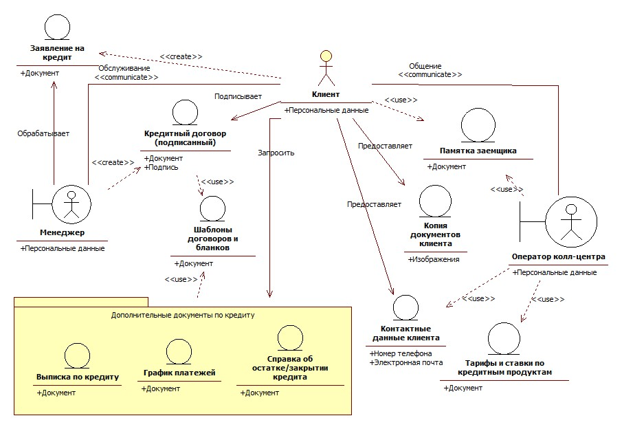

Рисунок  2  – Архитектурная модель предметной области

1.1.4     Аспект поведения

**Алгоритм «Подать заявку на кредит»**

1. Клиент получает бумажный бланк заявки на кредит (либо от менеджера, либо из доступных форм в офисе).

1. Клиент заполняет бланк, указывая персональные данные (ФИО, адрес, контактные данные, паспортные данные) и желаемые параметры кредита (сумма, срок, цель кредита).

1. Клиент передает заполненный бланк менеджеру банка.

1. Менеджер проверяет бланк на корректность (отсутствие ошибок, логическая последовательность данных) и полноту (все поля заполнены).

1. Если обнаружены ошибки или пробелы, менеджер помогает клиенту внести исправления или дополнения на месте.

1. После успешной проверки менеджер регистрирует заявку в электронной таблице Excel, присваивая уникальный идентификатор (номер заявки).

1. Заявка считается поданной; клиент получает подтверждение (например, копию бланка или устное уведомление о регистрации).

1. Процесс завершается, и заявка передается на следующий этап (рассмотрение).

**Алгоритм «****Получить консультацию по кредитным продуктам****»**

1. Клиент звонит в колл-центр банка и соединяется с оператором.

1. Оператор подтверждает личность клиента (если нужно, запрашивает базовые данные, такие как ФИО или номер телефона).

1. Клиент формулирует запрос на консультацию.

1. Оператор предоставляет первичную информацию о доступных кредитных продуктах: описывает условия (минимальная/максимальная сумма, сроки), процентные ставки, требования к заемщику (возраст, доход, кредитная история) и перечень необходимых документов (паспорт, справка о доходах и т.д.).

1. Оператор помогает клиенту сравнить продукты, отвечая на вопросы и рекомендуя варианты на основе описанных нужд клиента.

1. Консультация направлена на подготовку: оператор объясняет шаги подачи заявки и возможные риски.

1. Если клиент готов, оператор может записать его на визит в офис.

1. Звонок завершается.

Алгоритм «Рассмотреть заявку»

1. Менеджер получает зарегистрированную заявку (из Excel) и инициирует рассмотрение (отмечает статус "В рассмотрении").

1. Менеджер проверяет полноту и корректность досье: сравнивает данные в бланке с предоставленными документами (паспорт, справки о доходах и т.д.), выявляя несоответствия.

1. Если досье неполное, менеджер запрашивает у клиента дополнительные документы.

1. Менеджер запрашивает сведения из внешних источников: кредитная история из бюро кредитных историй, данные о доходах из налоговой или работодателя.

1. На основе собранных данных менеджер анализирует платежеспособность: рассчитывает соотношение доходов и расходов, оценивает риски (возраст, история платежей), использует внутренние формулы или шаблоны в Excel для расчета.

1. Результаты анализа фиксируются в отчете (в Excel): указываются сильные/слабые стороны, рекомендации.

1. Менеджер формирует заключение: положительное (рекомендуется одобрить) или отрицательное (рекомендуется отказать), с обоснованием.

1. Заключение прикрепляется к досье; процесс завершается, и заявка передается на этап принятия решения.

**Алгоритм «****Принять решение по заявке****»**

1. Менеджер получает заключение по заявке из предыдущего этапа.

1. Менеджер оценивает заключение: проверяет логику анализа, при необходимости консультируется с руководителем или юридическим отделом.

1. На основании заключения менеджер присваивает статус: "Одобрено" или "Отказано".

1. Решение фиксируется в Excel: обновляется запись заявки с новым статусом, датой и обоснованием.

1. Менеджер уведомляет клиента: по телефону (сообщает статус и следующие шаги) или при личном визите в офис.

1. Если одобрено, менеджер объясняет условия и приглашает на оформление.

1. Если отказано, менеджер предоставляет причины и возможные альтернативы.

1. Процесс завершается; одобренные заявки переходят к выдаче кредита.

**Алгоритм «****Выдать кредитные средства****»**

1. Менеджер подтверждает одобрение заявки и наличие подписанного договора (из предыдущих этапов).

1. Менеджер оформляет распоряжение на выдачу средств: указывает сумму, счет клиента и источник (касса банка или перевод).

1. Распоряжение печатается в виде ордера или квитанции (с подписью менеджера).

1. Клиент получает средства: в кассе банка (наличными) или путем перевода на счет (если указано в заявке).

1. Факт выдачи фиксируется в Excel: обновляется запись с датой, суммой и подтверждением получения (подпись клиента).

1. Менеджер проверяет, что выдача соответствует параметрам кредита (сумма не превышает одобренную).

1. Если возникают задержки (например, технические), менеджер информирует клиента и корректирует.

1. Процесс завершается; клиент получает подтверждение (квитанцию) и может использовать средства.

**Алгоритм «****Оформить кредитный договор и график платежей****»**

1. После одобрения заявки менеджер подготавливает текст договора в редакторе (например, Word), используя шаблон с данными клиента и параметрами кредита.

1. Менеджер создает график платежей в Excel: рассчитывает ежемесячные суммы, проценты, даты платежей на основе суммы, ставки и срока.

1. Документы передаются на юридическую проверку (если требуется): юрист проверяет соответствие законам и отсутствие ошибок.

1. После проверки менеджер распечатывает договор и график в нескольких экземплярах.

1. Менеджер организует подписание: клиент и представитель банка подписывают документы в офисе (с проверкой личностей).

1. Формируется кредитное дело: все документы (заявка, договор, график, справки) собираются в папку или цифровой файл.

1. Клиенту выдаются кредитные средства

1. Процесс завершается; копии документов выдаются клиенту, и кредит считается оформленным.

**Алгоритм «****Предоставить выписку по кредиту****»**

1. Клиент подает запрос на выписку (лично в офисе, по телефону или письменно), указывая период (например, последние 6 месяцев).

1. Менеджер подтверждает личность клиента и находит кредитное дело в журнале или Excel.

1. Менеджер извлекает сведения: начисления процентов, поступившие платежи, остаток задолженности из журналов или таблиц.

1. На основе данных формируется выписка: в Excel или Word создается таблица с датами, суммами платежей, начислениями и балансом.

1. Выписка распечатывается (или формируется в цифровом виде, если возможно).

1. Менеджер выдает выписку клиенту, объясняя ключевые моменты (текущий остаток, просрочки, если есть).

1. Если запрос на исторические данные, менеджер проверяет архивы для полноты.

1. Процесс завершается; выписка фиксируется в журнале для учета запросов.

**Алгоритм «****Получить консультацию по кредитным продуктам****»**

1. Клиент выбирает канал внесения платежа: в кассе банка, через терминал, онлайн или другие доступные методы.

1. Клиент вносит сумму (плановую по графику или досрочную для погашения).

1. Платежная система принимает средства: проверяет сумму, соответствие счету и отсутствие ошибок.

1. Кредитная организация фиксирует пополнение счета, менеджер фиксирует остаток задолженности.

1. Процесс повторяется для каждого платежа; при полном погашении статус кредита меняется на "Закрыт".

1.2 Обоснование необходимости создания ИС

Внедрение и усовершенствование информационной системы для кредитной системы банка является ключевым фактором, способствующим повышению эффективности работы, улучшению обслуживания клиентов и оптимизации внутренних процессов. В этой ИС планируется внедрить автоматизированную подачу и рассмотрение заявок на кредит и интеграцию с внешними источниками данных (например, платежные системы). Эти изменения направлены на достижение экономических, технологических и социально-эргономических эффектов, заменяя текущие бумажные и ручные процессы (на основе журналов, Excel и Word) на цифровые аналоги.

**Экономическая окупаемость**

Увеличение количества кредитных заявок и выдач: внедрение автоматизированной подачи заявок онлайн и цифрового рассмотрения улучшат пользовательский опыт, позволяя клиентам быстро подавать заявки без визита в офис. Это приведет к росту числа заявок, ускорению одобрений и увеличению объема выданных кредитов. Довольные клиенты с большей вероятностью будут возвращаться за новыми продуктами и рекомендовать банк другим, что повысит доходы от кредитования.

Снижение операционных затрат: автоматизация процессов, таких как проверка данных, формирование договоров и графиков платежей, сократит затраты на бумажную документацию, печать и ручную обработку. Уменьшится количество ошибок, связанных с ручным вводом в Excel или журналах, что снизит риски штрафов и переработок. В результате операционные расходы на обработку заявок уменьшатся, а прибыль банка возрастет за счет оптимизации ресурсов.

**Технологическая окупаемость**

Повышение эффективности управления: внедрение ИС позволит централизованно управлять данными о клиентах, заявках и платежах. Это улучшит контроль за процессами, мониторинг статусов заявок и принятие обоснованных решений, заменяя разрозненные журналы и файлы на единую базу данных.

Увеличение количества решаемых задач: новая система сможет обрабатывать большее количество заявок одновременно, включая консультации по телефону, и автоматизировать выдачу выписок. Это повысит пропускную способность банка, позволяя обслуживать больше клиентов без дополнительных ресурсов.

Сокращение времени решения задач: автоматизация рассмотрения заявок, принятия решений и оформления договоров сократит время на каждый процесс от подачи заявки до выдачи средств. Например, интеграция с внешними базами данных устранит ручные запросы, а цифровые шаблоны ускорят генерацию документов, повышая скорость обслуживания.

**Социально-эргономическая окупаемость**

Улучшение условий труда сотрудников: снижение нагрузки на сотрудников банка за счет автоматизации рутинных операций (например, расчет графиков в Excel) позволит им сосредоточиться на консультациях и анализе. Это повысит мотивацию и улучшит удовлетворенность работой, способствуя удержанию персонала и росту производительности.

Внедрение и усовершенствование информационной системы для кредитной системы банка, включающее автоматизированную подачу и рассмотрение заявок, цифровое хранение документов и интеграцию с внешними источниками, приведёт к значительным экономическим, технологическим и социально-эргономическим эффектам. Эти изменения не только окупятся за счёт затрат на разработку, но и обеспечат долгосрочное улучшение всех аспектов деятельности банка, делая его более конкурентоспособным в цифровую эпоху.

1.3 Модель требований к проектируемой системе 

1.3.1 Модель TO BE

Модель TO BE представляет собой описание новой – требуемой организации бизнес-процессов. Здесь излагаются изменения бизнес процессов, которые необходимо выполнить при создании информационной системы. Принципиально модель TO BE отличается от модели AS IS тем, что в предметной области появляется проектируемая система, и актуальные процессы предметной области реализуются с помощью этой системы. 

1.3.2 Функциональные требования

Приведем системные диаграммы вариантов использования в нотации UML, отличающиеся использованием создаваемой системы в бизнес-процессах предприятия.

Общая функциональность системы представлена на рисунке 3.

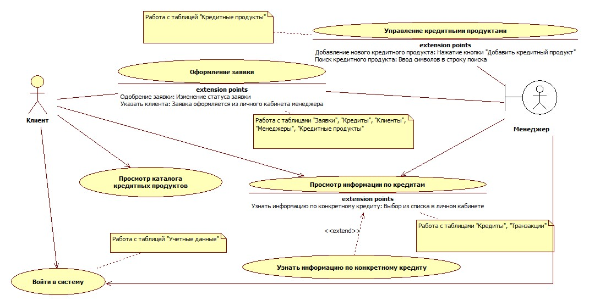

Рисунок 3  Процессы системы кредитования

Документирование акторов представлено в таблице 6.

|   |   |
| --- | --- |
| Таблица 6 – Документирование акторов |   |
| **Актор** | **Документирование** |
| Клиент | Частное лицо, заинтересованное в получении кредита. Клиенты могут быть новыми или уже имеющими кредиты в банке. Может взаимодействовать с системой как самостоятельно, так и с помощью менеджера при посещении банка. |
| Менеджер | Сотрудник банка, являющийся частью системы кредитования, ответственный за взаимодействие с клиентами, обработку кредитных заявок и управление кредитными продуктами. |

Документирование прецедентов представлено в таблице 7.

|   |   |
| --- | --- |
| Таблица 7 – Документирование прецедентов |   |
| **Прецедент** | **Описание** |
| Оформление заявки | Актор реализует функцию ввода данных для оформления заявки на кредит. После ввода данных, заявка отправляется на рассмотрение. |
| Войти в систему | Актор реализует функцию ввода учетных данных своего аккаунта: логин, пароль, после чего имеет доступ к своему личному кабинету и основным функциям |
| Просмотр каталога кредитных продуктов | Актор может просматривать список всех кредитных продуктов, найти конкретный кредитный продукт, просматривать информацию о нем. |
| Просмотр информации по кредитам | Актор может просматривать список всех кредитов, найти конкретный кредит, просматривать информацию о нем. |
| Узнать информацию по конкретному кредиту | Актор выбирает кредит из списка. Система предоставляет полную информацию о кредите, включая сумму, процентную ставку, график платежей и статус погашения. |
| Управление кредитными продуктами | Актор может просматривать список всех кредитных продуктов, найти конкретный кредитный продукт, просматривать и удалять и изменять информацию о нем. Удаление и изменение информации может выполнять актор "Менеджер" при условии что он мпециализируется на категории кредитования, к которой принадлежит данный продукт. |

Документирование отношений между акторами и их прецедентами представлено в таблице 8.

 Таблица 8 – Документирование отношений между акторами и их прецедентами

|   |   |   |
| --- | --- | --- |
| **Актор** | **Прецедент** | **Документирование** |
| Клиент | Войти в систему | Отношение ассоциации выбрано направленным от актора Клиент к прецеденту «Войти в систему», потому что актор является пассивным участником взаимодействия – запускает выполнение прецедента, задаёт логин и пароль и получает результат – успешный вход в систему. |
|   | Просмотр информации по кредитам | Отношение ассоциации выбрано направленным от актора Клиент к прецеденту «Просмотр информации по кредитам», потому что актор является пассивным участником взаимодействия – запускает выполнение прецедента и получает результат – информация о кредите краткая или полная для конкретного кредита. |
|   | Оформление заявки | Отношение ассоциации между актором Клиент и прецедентом «Оформление заявки» выбрано ненаправленным, потому что актор является активным участником взаимодействия – не только запускает выполнение прецедента, задаёт исходные данные и получает результат, но и участвует в диалоге с программой, реализующей прецедент. |
|   | Просмотр каталога кредитных продуктов | Отношение ассоциации выбрано направленным от актора Клиент к прецеденту «Просмотр каталога кредитных продуктов», потому что актор является пассивным участником взаимодействия – запускает выполнение прецедента и получает результат – информация о кредитных продуктах краткая или полная для конкретного кредита. |
| Менеджер | Войти в систему | Отношение ассоциации выбрано направленным от актора Менеджер к прецеденту «Войти в систему», потому что актор является пассивным участником взаимодействия – запускает выполнение прецедента, задаёт логин и пароль и получает результат – успешный вход в систему. |
|   | Просмотр информации по кредитам | Отношение ассоциации выбрано направленным от актора Менеджер к прецеденту «Просмотр информации по кредитам», потому что актор является пассивным участником взаимодействия – запускает выполнение прецедента и получает результат – информация о кредите краткая или полная для конкретного кредита. |
|   | Оформление заявки | Отношение ассоциации между актором Менеджер и прецедентом «Оформление заявки» выбрано ненаправленным, потому что актор является активным участником взаимодействия – не только запускает выполнение прецедента, задаёт исходные данные и получает результат, но и участвует в диалоге с программой, реализующей прецедент. |
|   | Управление кредитными продуктами | Отношение ассоциации между актором Менеджер и прецедентом «Управление кредитными продуктами» выбрано ненаправленным, потому что актор является активным участником взаимодействия – не только запускает выполнение прецедента, задаёт исходные данные и получает результат, но и участвует в диалоге с программой, реализующей прецедент. |

Документирование зависимостей между прецедентами представлено в таблице 9.

Таблица 9 – Документирование зависимостей между прецедентами

|   |   |   |
| --- | --- | --- |
| **Прецедент** | **Прецедент** | **Документирование** |
| Просмотр информации по кредитам | Узнать информацию по конкретному кредиту | Тип отношение зависимости между прецедентами «Просмотр информации по кредитам» и «Узнать информацию по конкретному кредиту» выбран «extend», потому что при реализации прецедента функциональность прецедента используется только при выполнении условия: Выбор из списка в личном кабинете. |

Декомпозиция варианта использования «Войти в систему» представлена на рисунке 4.

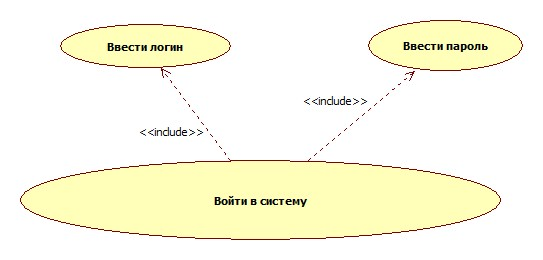

Рисунок 4  Декомпозиция процесса Войти в систему

Документирование прецедентов представлено в таблице 10.

|   |   |
| --- | --- |
| Таблица 10 – Документирование прецедентов |   |
| **Прецедент** | **Описание** |
| Войти в систему | Актор реализует функцию ввода учетных данных своего аккаунта: логин, пароль, после чего имеет доступ к своему личному кабинету и основным функциям |
| Ввести логин | Актор вводит логин от своего аккаунта  в текстовое поле интерфейса входа в систему. |
| Ввести пароль | Актор вводит пароль от своего аккаунта  в текстовое поле интерфейса входа в систему |

Документирование зависимостей между прецедентами представлено в таблице 11.

Таблица 11 – Документирование зависимостей между прецедентами

|   |   |   |
| --- | --- | --- |
| **Прецедент** | **Прецедент** | **Документирование** |
| Войти в систему | Ввести логин | Тип отношения зависимости между прецедентами «Войти в систему» и «Ввести логин» выбран «include», потому что при реализации прецедента функциональность прецедента используется безусловно |
|   | Ввести пароль | Тип отношения зависимости между прецедентами «Войти в систему» и «Ввести логин» выбран «include», потому что при реализации прецедента функциональность прецедента используется безусловно |

Декомпозиция варианта использования «Оформление заявки» представлена на рисунке 5.

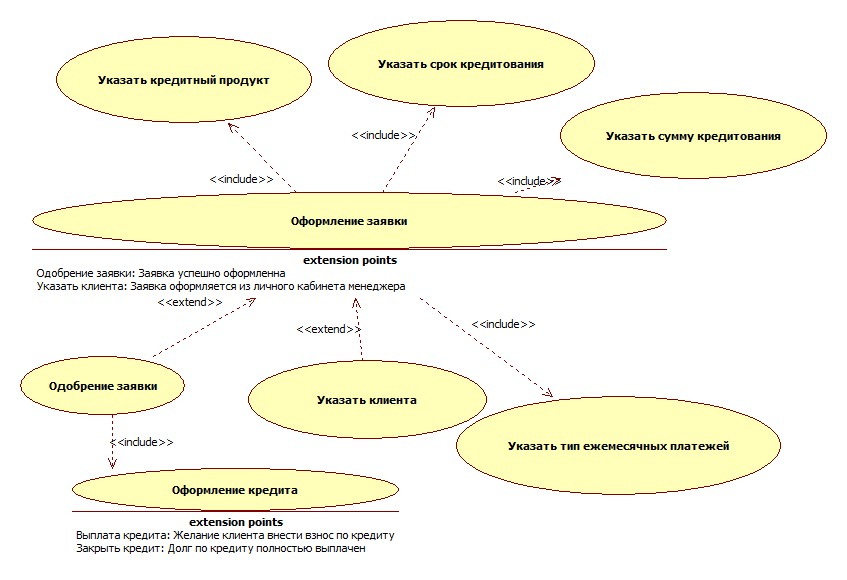

Рисунок 5  Декомпозиция процесса Оформление заявки

Документирование прецедентов представлено в таблице 12.

|   |   |
| --- | --- |
| Таблица 12 – Документирование прецедентов |   |
| **Прецедент** | **Описание** |
| Оформление заявки | Актор реализует функцию ввода данных для оформления заявки на кредит. После ввода данных, заявка отправляется на рассмотрение. |
| Указать тип ежемесячных платежей | Актор выбирает из предложенных вариантов тип ежемесячных платежей (например, аннуитетные или дифференцированные). Выбор влияет на расчет графика платежей по кредиту. |
| Указать кредитный продукт | Актор выбирает кредитный продукт из списка предложенных. |
| Указать срок кредитования | Актор указывает срок, на который хочет оформить кредит. Перед отправкой заявки, это поле будет проверено на диапазон срока кредитования, конкретного кредитного продукта. |
| Указать сумму кредитования | Актор вводит желаемую сумму кредита. Перед отправкой заявки, эта сумма проверяется на соответствие минимальным и максимальным значениям, установленным для выбранного кредитного продукта. |
| Указать клиента | Актор «Менеджер» вводит или выбирает из базы данных информацию о клиенте, для которого оформляется кредит.  |
| Одобрение заявки | После проверки всех введенных данных и проведения необходимых расчетов, заявка на кредит проходит процесс одобрения, включающий в себя оценку кредитоспособности клиента и соответствие заявленным специфическим условиям кредитного продукта. |
| Оформление кредита | После одобрения заявки происходит заключение кредитного договора. Актор подписывает необходимые документы и получает информацию о графике платежей и условиях кредита. |

Документирование зависимостей между прецедентами представлено в таблице 13.

Таблица 13 – Документирование зависимостей между прецедентами

|   |   |   |
| --- | --- | --- |
| **Прецедент** | **Прецедент** | **Документирование** |
| Оформление заявки | Указать тип ежемесячных платежей | Тип отношения зависимости между прецедентами «Оформление заявки» и «Указать тип ежемесячных платежей» выбран «include», потому что при реализации прецедента функциональность прецедента используется безусловно |
|   | Указать кредитный продукт | Тип отношения зависимости между прецедентами «Оформление заявки» и «Указать кредитный продукт» выбран «include», потому что при реализации прецедента функциональность прецедента используется безусловно |
|   | Указать срок кредитования | Тип отношения зависимости между прецедентами «Оформление заявки» и «Указать срок кредитования» выбран «include», потому что при реализации прецедента функциональность прецедента используется безусловно |
|   | Указать сумму кредитования | Тип отношения зависимости между прецедентами «Оформление заявки» и «Указать сумму кредитования» выбран «include», потому что при реализации прецедента функциональность прецедента используется безусловно |
|   | Указать клиента | Тип отношение зависимости между прецедентами «Оформление заявки» и «Указать клиента» выбран «extend», потому что при реализации прецедента функциональность прецедента используется только при выполнении условия: заявка оформляется из личного кабинета менеджера. |
|   | Одобрение заявки | Тип отношение зависимости между прецедентами «Оформление заявки» и «Одобрение заявки» выбран «extend», потому что при реализации прецедента функциональность прецедента используется только при выполнении условия: заявка успешно оформлена |
| Одобрение заявки | Оформление кредита | Тип отношения зависимости между прецедентами «Одобрение заявки» и «Оформление кредита» выбран «include», потому что при реализации прецедента функциональность прецедента используется безусловно |

Декомпозиция варианта использования «Оформление кредита» представлена на рисунке 6.

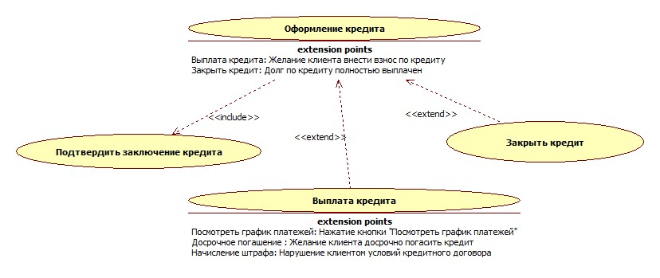

Рисунок 6  Декомпозиция процесса Оформление кредита

Документирование прецедентов представлено в таблице 14.

|   |   |
| --- | --- |
| Таблица 14 – Документирование прецедентов |   |
| **Прецедент** | **Описание** |
| Оформление кредита | После одобрения заявки происходит заключение кредитного договора. Актор подписывает необходимые документы и получает информацию о графике платежей и условиях кредита. |
| Подтвердить заключение кредита | Актор подписывает необходимые документы в банке с менеджером. Менеджер подтверждает заключение кредита из своего личного кабинета |
| Выплата кредита | Актор вносит ежемесячные платежи в соответствии с графиком, установленным в кредитном договоре. Платежи могут осуществляться через различные каналы, такие как банковский перевод, оплата через интернет-банкинг или в отделении банка. Каждый платеж уменьшает оставшуюся сумму задолженности и фиксируется в системе. |
| Закрыть кредит | После полной выплаты кредита, включая основной долг и начисленные проценты, кредит считается закрытым. Система проверяет, что все обязательства по кредиту выполнены, и выдает подтверждение об окончании кредитных обязательств. |

Документирование зависимостей между прецедентами представлено в таблице 15.

Таблица 15 – Документирование зависимостей между прецедентами

|   |   |   |
| --- | --- | --- |
| **Прецедент** | **Прецедент** | **Документирование** |
| Оформление кредита | Выплата кредита | Тип отношение зависимости между прецедентами «Оформление кредита» и «Выплата кредита» выбран «extend», потому что при реализации прецедента функциональность прецедента используется только при выполнении условия: желание клиента внести взнос по кредиту. |
|   | Подтвердить заключение кредита | Тип отношения зависимости между прецедентами «Оформление кредита» и «Подтвердить заключение кредита» выбран «include», потому что при реализации прецедента функциональность прецедента используется безусловно |
|   | Закрыть кредит | Тип отношение зависимости между прецедентами «Оформление кредита» и «Закрыть кредит» выбран «extend», потому что при реализации прецедента функциональность прецедента используется только при выполнении условия: долг по кредиту полностью выплачен. |

Декомпозиция варианта использования «Выплата кредита» представлена на рисунке 7.

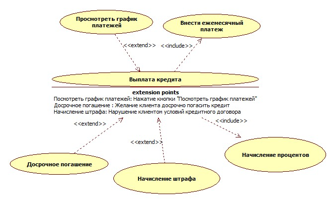

Рисунок 7  Декомпозиция процесса Выплата кредита

Документирование прецедентов представлено в таблице 16.

|   |   |
| --- | --- |
| Таблица 16 – Документирование прецедентов |   |
| **Прецедент** | **Описание** |
| Выплата кредита | Актор вносит ежемесячные платежи в соответствии с графиком, установленным в кредитном договоре. Платежи могут осуществляться через различные каналы, такие как банковский перевод, оплата через интернет-банкинг или в отделении банка. Каждый платеж уменьшает оставшуюся сумму задолженности и фиксируется в системе. |
| Просмотреть график платежей | Актор получает доступ к графику платежей, который включает информацию о суммах и датах предстоящих и прошедших платежей. Эта информация позволяет клиенту планировать свои финансы и следить за выполнением обязательств по кредиту. |
| Внести ежемесячный платеж | Актор осуществляет оплату очередного ежемесячного платежа в соответствии с установленным графиком. После внесения платежа система фиксирует транзакцию и обновляет информацию о состоянии задолженности. |
| Досрочное погашение | Актор принимает решение погасить кредит полностью или частично до истечения срока его действия. Система пересчитывает остаток задолженности, учитывая досрочный платеж. Досрочное погашение может привести к уменьшению общей суммы переплаты по кредиту. |
| Начисление штрафа | Система рассчитывает проценты по кредиту на основании остатка основного долга. Начисленные проценты увеличивают общую задолженность заемщика. Расчет производится автоматически с первого дня задержки выплаты. |
| Начисление процентов | Система выполняет расчет и начисление процентов на текущую сумму задолженности в соответствии с условиями договора и установленной процентной ставкой. Начисленные проценты добавляются к сумме долга и учитываются при формировании обязательств по оплате. Операция выполняется автоматически с заданной периодичностью. |

Документирование зависимостей между прецедентами представлено в таблице 17.

Таблица 17 – Документирование зависимостей между прецедентами

|   |   |   |
| --- | --- | --- |
| **Прецедент** | **Прецедент** | **Документирование** |
| Выплата кредита | Просмотреть график платежей | Тип отношение зависимости между прецедентами «Выплата кредита» и «Просмотреть график платежей» выбран «extend», потому что при реализации прецедента функциональность прецедента используется только при выполнении условия: нажатие кнопки "Посмотреть график платежей". |
|   | Внести ежемесячный платеж | Тип отношения зависимости между прецедентами «Выплата кредита» и «Внести ежемесячный платеж» выбран «include», потому что при реализации прецедента функциональность прецедента используется безусловно |
|   | Досрочное погашение | Тип отношение зависимости между прецедентами «Выплата кредита» и «Досрочное погашение» выбран «extend», потому что при реализации прецедента функциональность прецедента используется только при выполнении условия: желание клиента внести взнос по кредиту. |
|   | Начисление штрафа | Тип отношения зависимости между прецедентами «Выплата кредита» и «Начисление штрафа» выбран «extend», потому что при реализации прецедента «Выплата кредита» функциональность прецедента «Начисление штрафа» используется только при выполнении условия: нарушение клиентом условий кредитного договора (например, просрочка платежа). В этом случае система дополнительно начисляет штрафные санкции. |
|   | Начисление процентов | Тип отношения зависимости между прецедентами «Выплата кредита» и «Начисление процентов» выбран «include», потому что при реализации прецедента «Выплата кредита» функциональность прецедента «Начисление процентов» используется безусловно. Перед выполнением выплаты система обязана рассчитать и учесть начисленные проценты для корректного определения суммы задолженности. |

Декомпозиция варианта использования «Управление кредитными продуктами» представлена на рисунке 8.

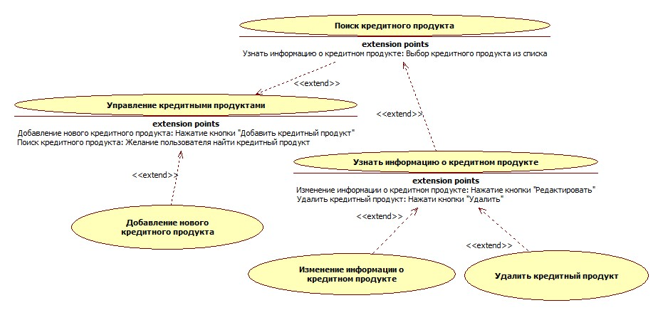

Рисунок 8  Декомпозиция процесса Управление кредитными продуктами

Документирование прецедентов представлено в таблице 18.

|   |   |
| --- | --- |
| Таблица 18 – Документирование прецедентов |   |
| **Прецедент** | **Описание** |
| Управление кредитными продуктами | Актор может просматривать список всех кредитных продуктов, найти конкретный кредитный продукт, просматривать и удалять и изменять информацию о нем. Удаление и изменение информации может выполнять актор "Менеджер" при условии что он мпециализируется на категории кредитования, к которой принадлежит данный продукт. |
| Поиск кредитного продукта | Система отображает список кредитных продуктов с основной информацией о кредитных продуктах. Актор имеет возможность просмотреть краткую информацию в списке, не выбирая конкретный и выбрать конкретный кредитный продукт для просмотра детальной информации и возможностью редактировать и удалить продукт. |
| Узнать информацию о кредитном продукте | Актор выбирает кредитный продукт из списка. Система предоставляет подробную информацию о продукте, включая условия кредитования, процентные ставки и требования к заемщикам. |
| Добавление нового кредитного продукта | Актор вводит данные нового кредитного продукта, включая название, процентную ставку, минимальную и максимальную сумму кредитования, а также условия погашения. Система проверяет введенные параметры и добавляет новый продукт в каталог доступных кредитов. |
| Изменение информации о кредитном продукте | Актор выбирает кредитный продукт и вносит изменения в его параметры, такие как обновление процентной ставки или условий погашения. Система проверяет права актора, новые параметры на соответствие внутренним политикам банка и сохраняет изменения. |
| Удалить кредитный продукт | Актор выбирает кредитный продукт нажимает кнопку "Удалить". Система проверяет права актора и удаляет продукт. |

Документирование зависимостей между прецедентами представлено в таблице 19.

Таблица 19 – Документирование зависимостей между прецедентами

|   |   |   |
| --- | --- | --- |
| **Прецедент** | **Прецедент** | **Документирование** |
| Управление кредитными продуктами | Поиск кредитного продукта | Тип отношение зависимости между прецедентами «Управление кредитными продуктами» и «Поиск кредитного продукта» выбран «extend», потому что при реализации прецедента функциональность прецедента используется только при выполнении условия: желание пользователя найти кредитный продукт |
|   | Добавление нового кредитного продукта | Тип отношение зависимости между прецедентами «Управление кредитными продуктами» и «Добавление нового кредитного продукта» выбран «extend», потому что при реализации прецедента функциональность прецедента используется только при выполнении условия: Нажатие кнопки "Добавить кредитный продукт". |
| Поиск кредитного продукта | Узнать информацию о кредитном продукте | Тип отношение зависимости между прецедентами «Поиск кредитного продукта» и «Узнать информацию о кредитном продукте» выбран «extend», потому что при реализации прецедента функциональность прецедента используется только при выполнении условия: Выбор кредитного продукта из списка |
| Узнать информацию о кредитном продукте | Удалить кредитный продукт | Тип отношение зависимости между прецедентами «Узнать информацию о кредитном продукте» и «Удалить кредитный продукт» выбран «extend», потому что при реализации прецедента функциональность прецедента используется только при выполнении условия: Нажатие кнопки "Удалить" |
|   | Изменение информации о кредитном продукте | Тип отношение зависимости между прецедентами «Узнать информацию о кредитном продукте» и «Изменение информации о кредитном продукте» выбран «extend», потому что при реализации прецедента функциональность прецедента используется только при выполнении условия: Нажатие кнопки "Редактировать" |

1.3.3 Требования к информационности

Информационный аспект модели TO BE отражен в таблице 20.

Таблица 20 – Информационный аспект

|   |   |   |   |
| --- | --- | --- | --- |
| Название | Класс | Носитель | Место хранения |
| Тарифы и ставки по кредитным продуктам | Упр. | БД | Сервер БД кредитной системы |
| Шаблоны договоров и бланков | Упр. | БД | Сервер БД кредитной системы |
| Поручение/распоряжение на выдачу средств | Упр. | Бумаж. | Кредитный отдел |
| Заявление на кредит | Вход | БД | Сервер БД кредитной системы |
| Копии документов клиентов | Вход | Бумаж. | Кредитный отдел |
| Контактные данные клиента | Вход | БД | Сервер БД кредитной системы |
| Контактные данные менеджера | Вход | БД | Сервер БД кредитной системы |
| Кредитный договор (подписанный) | Выход | БД | Сервер БД кредитной системы |
| График платежей для клиента | Выход | БД | Сервер БД кредитной системы |
| Выписка по кредиту | Выход | БД | Сервер БД кредитной системы |
| Справка об остатке/закрытии кредита | Выход | Бумаж | Кредитный отдел |
| Памятка заемщика (условия платежей) | Выход | Бумаж | Кредитный отдел |

1.3.4 Архитектурные требования

На рисунке 9 представлено размещение системы кредитования.

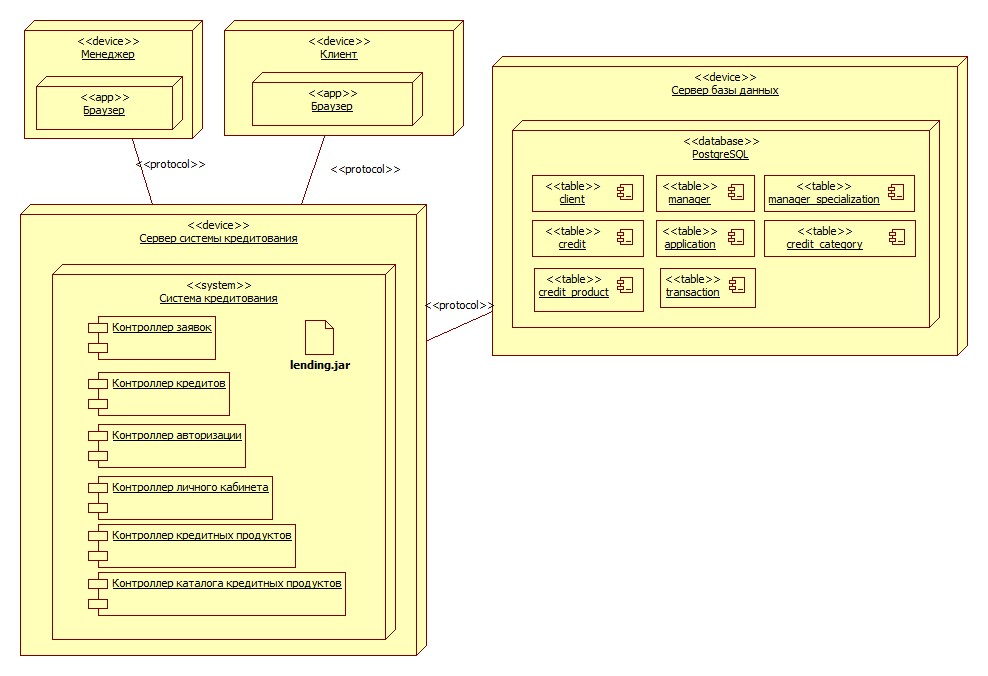

Рисунок 9 – Размещение системы кредитования

1.3.5 Требования к поведению

На рисунках представлена цепочка процесса оформления кредита, которая состоит из вариантов использования Оформление заявки, Подтверждение заявки и Оформления кредита.

На рисунке 10 представлен алгоритм реализации деятельности «Оформление заявки»:

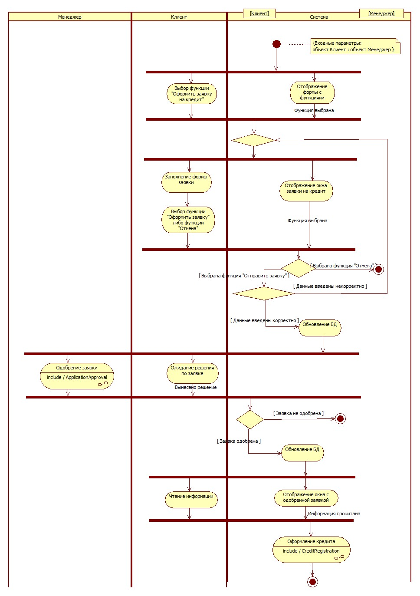

Рисунок 10 – Алгоритм реализации деятельности «Оформление заявки»

Документирование деятельностей представлено в таблице 21.

|   |   |
| --- | --- |
| Таблица 21 – Документирование деятельностей |   |
| **Деятельность** | **Описание** |
| Выбор функции "Оформить заявку на кредит" | Пользователь нажимает кнопку "Оформить заявку на кредит". Деятельность «Выбор функции "Оформить заявку на кредит"» семантически тривиальна, поэтому отдельная диаграмма ее реализации не приводится. |
| Отображение формы с функциями | Система отображает интерфейс с функциями: "Оформить заявку на кредит", "Просмотр каталога кредитных продуктов", "Просмотр информации по кредитам". Деятельность «Отображение формы с функциями» семантически тривиальна, поэтому отдельная диаграмма ее реализации не приводится. |
| Заполнение формы заявки | Пользователь вводит необходимые данные в форму заявки, включая выбор кредитного продукта из списка, ввод желаемой суммы кредита, срок погашения и выбор типа ежемесячных платежей. Деятельность «Заполнение формы заявки» семантически тривиальна, поэтому отдельная диаграмма ее реализации не приводится. |
| Выбор функции "Оформить заявку" либо функции "Отмена" | После заполнения формы пользователь выбирает, отправить ли заявку или отменить операцию. В случае выбора функции "Оформить заявку", заявка проверяется на корректность и передается на обработку. Если выбрана функция "Отмена", заявка не сохраняется, и пользователь возвращается к предыдущей форме. Деятельность семантически тривиальна, поэтому отдельная диаграмма ее реализации не приводится. |
| Отображение окна заявки на кредит | Система отображает окно с формой для заполнения заявки. Деятельность «Отображение окна заявки на кредит» семантически тривиальна, поэтому отдельная диаграмма ее реализации не приводится. |
| Обновление БД | Система обновляет базу данных, сохраняя новую информацию. Обновление включает в себя запись всех данных, введенных пользователем. Деятельность «Обновление БД» семантическая тривиальна, поэтому отдельная диаграмма её реализации не приводится. |
| Ожидание решения по заявке | В период ожидания решения пользователь может следить за статусом своей заявки в личном кабинете. Деятельность «Ожидание решения по заявке» семантически тривиальна, поэтому отдельная диаграмма ее реализации не приводится. |
| Одобрение заявки | Менеджер банка рассматривает заявку и принимает решение об одобрении или отказе. В результате этой деятельности будет вынесено решение по заявке, которое будет отображено в личном кабинете пользователя как изменение статуса заявки. Деятельность «Одобрение заявки» нетривиальна  диаграмма ее реализации приводится далее. |
| Чтение информации | Пользователь читает информацию о решении. Это может быть информация об одобрении или отказе в кредите. Деятельность «Чтение информации» семантически тривиальна, поэтому отдельная диаграмма ее реализации не приводится. |
| Отображение окна с одобренной заявкой | Если заявка одобрена, система отображает окно с подробностями кредитного предложения, включая условия и сроки. Деятельность «Отображение окна с одобренной заявкой» семантически тривиальна, поэтому отдельная диаграмма ее реализации не приводится. |
| Оформление кредита | После одобрения пользователь подтверждает согласие с условиями и оформляет кредит. Это включает подписание договора и последующую выплату. Деятельность «Оформление кредита» может включать в себя несколько этапов,  приводится отдельная диаграмма ее реализации. |

Документирование стрелок перехода от деятельностей представлено в таблице 22.

Таблица 22 – Документирование стрелок перехода от деятельностей

|   |   |
| --- | --- |
| **Деятельность** | **Описание стрелки перехода** |
| Выбор функции "Оформить заявку на кредит" | Стрелка перехода от действия «Выбор функции «Оформить заявку на кредит»» к деятельности «Заполнение формы заявки» не содержит надписей, т.к. переход осуществляется по завершению деятельности |
| Отображение формы с функциями | Стрелка перехода от действия «Отображение формы с функциями» к деятельности «Отображение окна заявки на кредит» имеет выход, соответствующий триггерному событию - «Функция выбрана». |
| Заполнение формы заявки | Стрелка перехода от действия «Заполнение формы заявки» к деятельности «Выбор функции «Оформить заявку» либо функции «Отмена»» не содержит надписей, т.к. переход осуществляется по завершению деятельности. |
| Выбор функции "Оформить заявку" либо функции "Отмена" | Стрелка перехода от действия «Выбор функции "Оформить заявку" либо функции "Отмена"» не содержит надписей, т.к. переход осуществляется по завершению деятельности. |
| Отображение окна заявки на кредит | Стрелка перехода от перехода от действия «Отображение окна заявки на кредит» имеет три выхода, соответствующие триггерному событию - «Функция выбрана», так как данный переход происходит только при выполнении этого события, и  условиях – «Выбрана функция «Отправить заявку»» и «Данные введены корректно», «Выбрана функция «Отправить заявку»» и «Данные введены некорректно» или  «Выбрана функция «Отмена»» |
| Обновление БД | Стрелка перехода от действия «Обновление БД» к следующей деятельности не содержит надписей, т.к. переход осуществляется по завершению деятельности. |
| Ожидание решения по заявке | Стрелка перехода от действия «Ожидание решения по заявке» к следующей деятельности имеет выход, соответствующий триггерному событию - «Вынесено решение» и  условиях – «Заявка одобрена» или  «Заявка не одобрена» |
| Одобрение заявки | Стрелка перехода от действия «Одобрение заявки» к следующей деятельности не содержит надписей, т.к. переход осуществляется по завершению деятельности. |
| Чтение информации | Стрелка перехода от действия «Чтение информации» к следующей деятельности не содержит надписей, т.к. переход осуществляется по завершению деятельности |
| Отображение окна с одобренной заявкой | Стрелка перехода от действия «Отображение окна с одобренной заявкой» к следующей деятельности имеет выход, соответствующий триггерному событию - «Информация прочитана». |
| Оформление кредита | Стрелка перехода от действия «Оформление кредита» к завершению деятельности не содержит надписей, т.к. переход осуществляется по завершению деятельности. |

На рисунке 11 представлен алгоритм реализации деятельности «Одобрение заявки»:

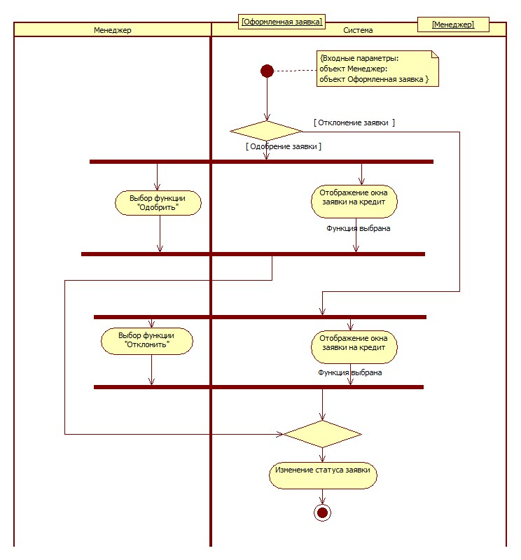

Рисунок 11 – Алгоритм реализации деятельности «Одобрение заявки»

Документирование деятельностей представлено в таблице 23.

|   |   |
| --- | --- |
| Таблица 23 – Документирование деятельностей |   |
| **Деятельность** | **Описание** |
| Отображение окна заявки на кредит | Система отображает интерфейс с подробной информацией о заявке на кредит, включая данные заемщика, сумму кредита, срок, текущий статус заявки, кнопки «Одобрить», «Отклонить». Деятельность «Отображение окна заявки на кредит» семантически тривиальна, поэтому отдельная диаграмма её реализации не приводится. |
| Выбор функции "Одобрить" | Менеджер нажимает кнопку "Одобрить" в интерфейсе заявки на кредит. Деятельность «Выбор функции "Одобрить"» семантически тривиальна, поэтому отдельная диаграмма её реализации не приводится. |
| Выбор функции "Отклонить" | Менеджер нажимает кнопку "Отклонить" в интерфейсе заявки на кредит. Деятельность «Выбор функции "Отклонить"» семантически тривиальна, поэтому отдельная диаграмма её реализации не приводится. |
| Изменение статуса заявки | Система обновляет статус заявки в базе данных в зависимости от выбранного действия (одобрение или отклонение) и отображает это в окне заявки. Деятельность «Изменение статуса заявки» семантически тривиальна, поэтому отдельная диаграмма её реализации не приводится. |

Документирование стрелок перехода от деятельностей представлено в таблице 24.

Таблица 24 – Документирование стрелок перехода от деятельностей

|   |   |
| --- | --- |
| **Деятельность** | **Описание стрелки перехода** |
| Отображение окна заявки на кредит | Стрелка перехода от действия «Отображение окна заявки на кредит» к следующей деятельности имеет выход, соответствующий триггерному событию - «Функция выбрана». |
| Выбор функции "Одобрить" | Стрелка перехода от действия «Выбор функции «Одобрить»» к  следующей деятельности не содержит надписей, т.к. переход осуществляется по завершению деятельности |
| Выбор функции "Отклонить" | Стрелка перехода от действия «Выбор функции «Отклонить»» к  следующей деятельности не содержит надписей, т.к. переход осуществляется по завершению деятельности |
| Изменение статуса заявки | Стрелка перехода от действия «Изменение статуса заявки» к  следующей деятельности не содержит надписей, т.к. переход осуществляется по завершению деятельности |

На рисунке 12 представлен алгоритм реализации деятельности «Оформление кредита»:

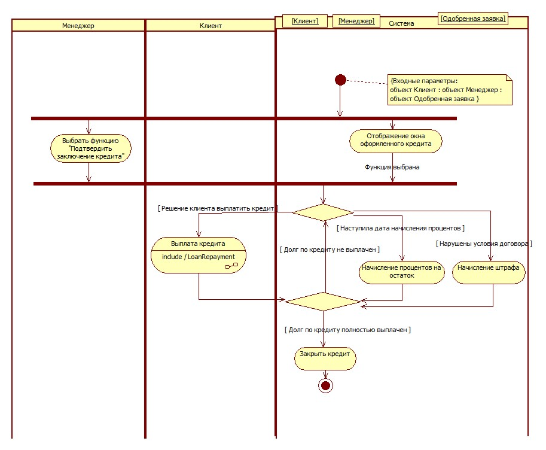

Рисунок 12 – Алгоритм реализации деятельности «Оформление кредита»

Документирование деятельностей представлено в таблице 25.

|   |   |
| --- | --- |
| Таблица 25 – Документирование деятельностей |   |
| **Деятельность** | **Описание** |
| Выбрать функцию "Подтвердить заключение кредита" | Менеджер нажимает кнопку "Подтвердить заключение кредита" после подписания кредитного договора. Деятельность «Выбрать функцию "Подтвердить заключение кредита"» семантически тривиальна, поэтому отдельная диаграмма её реализации не приводится. |
| Отображение окна оформленного кредита | Система отображает интерфейс с подтверждением всех деталей оформленного кредита, включая сумму, срок, процентные ставки и график платежей. Деятельность «Отображение окна оформленного кредита» семантически тривиальна, поэтому отдельная диаграмма её реализации не приводится. |
| Выплата кредита | Клиент с помощью внешней системы платежей осуществляет перевод средств на указанный счет согласно условиям оформленного кредита. Система фиксирует перевод в базе данных. Деятельность «Выплата кредита» включает в себя проверку счета заемщика, проведение транзакции, обновление записи в базе данных. Деятельность «Выплата кредита» может включать в себя несколько этапов,  приводится отдельная диаграмма ее реализации. |
| Начисление процентов на остаток | Система по расписанию определяет перечень активных кредитов, получает актуальный остаток основного долга. Выполняется расчет суммы процентов за период. Система формирует транзакцию «Начисление процентов», добавляет к основному долгу. Деятельность «Начисление процентов на остаток» семантически тривиальна, поэтому отдельная диаграмма её реализации не приводится. |
| Начисление штрафа | При наступлении просрочки, система рассчитывает штраф как процент от суммы основного долга и начисляет его ежедневно до следующего платежа. Затем формируется транзакция «Начисление штрафа», обновляется задолженность по основному долгу. Деятельность «Начисление штрафа» семантически тривиальна, поэтому отдельная диаграмма её реализации не приводится. |
| Закрыть кредит | После полной выплаты кредита система обновляет статус кредита на "Закрыт" в базе данных, прекращает начисление процентов и уведомляет заемщика о закрытии кредита. Деятельность «Закрыть кредит» семантически тривиальна, поэтому отдельная диаграмма её реализации не приводится. |

Документирование стрелок перехода от деятельностей представлено в таблице 26.

Таблица 26 – Документирование стрелок перехода от деятельностей

|   |   |
| --- | --- |
| **Деятельность** | **Описание стрелки перехода** |
| Выбрать функцию "Подтвердить заключение кредита" | Стрелка перехода от действия «Выбрать функцию "Подтвердить заключение кредита"» к  следующей деятельности не содержит надписей, т.к. переход осуществляется по завершению деятельности |
| Отображение окна оформленного кредита | Стрелка перехода от действия «Отображение окна оформленного кредита» к следующей деятельности имеет выход, соответствующий триггерному событию - «Функция выбрана». |
| Выплата кредита | Стрелка перехода от действия «Выплата кредита» к  следующей деятельности не содержит надписей, т.к. переход осуществляется по завершению деятельности |
| Начисление процентов на остаток | Стрелка перехода от действия «Начисление процентов на остаток» к  следующей деятельности не содержит надписей, т.к. переход осуществляется по завершению деятельности |
| Начисление штрафа | Стрелка перехода от действия «Начисление штрафа» к  следующей деятельности не содержит надписей, т.к. переход осуществляется по завершению деятельности |
| Закрыть кредит | Стрелка перехода от деятельности «Выплата кредита» к завершению деятельности не содержит надписей, т.к. переход осуществляется по завершению деятельности |

На рисунке 13 представлен алгоритм реализации деятельности «Выплата кредита»:

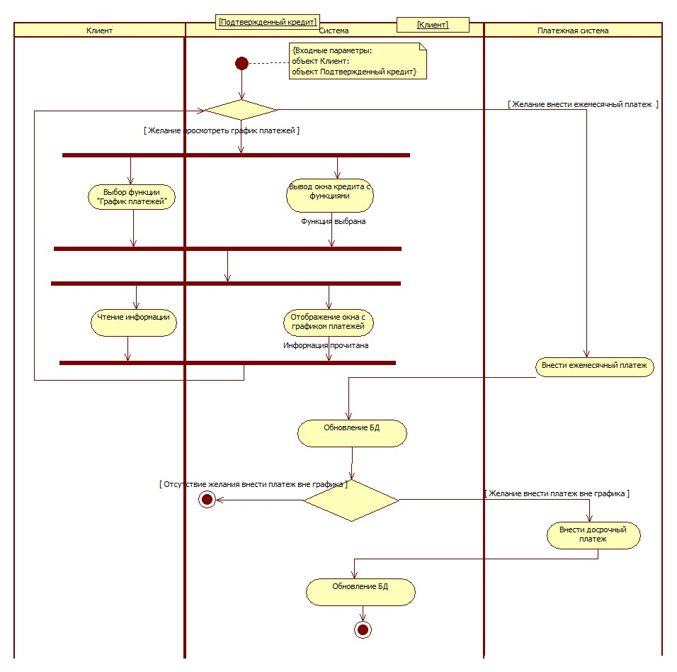

Рисунок 13 – Алгоритм реализации деятельности «Выплата кредита»

Документирование деятельностей представлено в таблице 27.

|   |   |
| --- | --- |
| Таблица 27 – Документирование деятельностей |   |
| **Деятельность** | **Описание** |
| Вывод окна кредита с функциями | Система отображает интерфейс с доступными функциями для управления кредитом, такими как "График платежей", "Выписка по кредиту". Деятельность «Вывод окна кредита с функциями» семантически тривиальна, поэтому отдельная диаграмма её реализации не приводится. |
| Выбор функции "График платежей" | Пользователь нажимает кнопку "График платежей" в интерфейсе окна кредита. Деятельность «Выбор функции "График платежей"» семантически тривиальна, поэтому отдельная диаграмма её реализации не приводится. |
| Отображение окна с графиком платежей | Система отображает график платежей, включая даты, суммы и статус каждого платежа. Деятельность «Отображение окна с графиком платежей» семантически тривиальна, поэтому отдельная диаграмма её реализации не приводится. |
| Чтение информации | Пользователь просматривает информацию о графике платежей.  Деятельность «Чтение информации» семантически тривиальна, так как предполагает пассивное действие пользователя. |
| Внести ежемесячный платеж | Пользователь вносит платеж, предусмотренный графиком платежей, с помощью стороннего платежного сервиса. Деятельность «Внести ежемесячный платеж» семантически тривиальна, поэтому отдельная диаграмма её реализации не приводится. |
| Внести досрочный платеж | Пользователь вносит платеж с помощью стороннего платежного сервиса на кредитный счет. Деятельность «Досрочное погашение» семантически тривиальна, поэтому отдельная диаграмма её реализации не приводится. |
| Обновление БД | Система обновляет базу данных, отражая изменения суммы кредита и графика платежей.  Деятельность «Обновление БД» семантически тривиальна, поэтому отдельная диаграмма её реализации не приводится. |

Документирование стрелок перехода от деятельностей представлено в таблице 28.

Таблица 28 – Документирование стрелок перехода от деятельностей

|   |   |
| --- | --- |
| **Деятельность** | **Описание стрелки перехода** |
| Вывод окна кредита с функциями | Стрелка перехода от действия «Вывод окна кредита с функциями» к следующей деятельности имеет выход, соответствующий триггерному событию - «Функция выбрана». |
| Выбор функции "График платежей" | Стрелка перехода от действия «Выбор функции "График платежей"» к  следующей деятельности не содержит надписей, т.к. переход осуществляется по завершению деятельности |
| Отображение окна с графиком платежей | Стрелка перехода от действия «Отображение окна с графиком платежей» к следующей деятельности имеет выход, соответствующий триггерному событию - «Информация прочитана». |
| Чтение информации | Стрелка перехода от действия «Чтение информации» к  следующей деятельности не содержит надписей, т.к. переход осуществляется по завершению деятельности |
| Внести ежемесячный платеж | Стрелка перехода от действия «Внести ежемесячный платеж» к  следующей деятельности не содержит надписей, т.к. переход осуществляется по завершению деятельности |
| Внести досрочный платеж | Стрелка перехода от действия «Внести досрочный платеж» к  следующей деятельности не содержит надписей, т.к. переход осуществляется по завершению деятельности |
| Обновление БД | Стрелка перехода от действия «Обновление БД» к следующей деятельности не содержит надписей, т.к. переход осуществляется по завершению деятельности |

На рисунке 14 представлен алгоритм реализации прецедента «Войти в систему»:

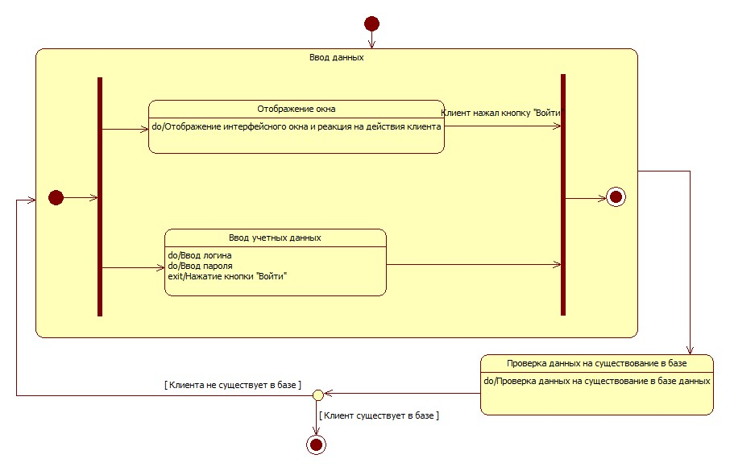

Рисунок  14 – Алгоритм реализации прецедента «Войти в систему»

В таблице 29 представлено описание состояний автомата реализации прецедента «Войти в систему».

|   |   |   |   |   |
| --- | --- | --- | --- | --- |
| Таблица 29 – Описание состояний |   |   |   |   |
| **Состояние** | **Описание** | **entry/** | **do/** | **exit/** |
| Ввод данных | Состояние, включающее в себя состояния «Отображение окна» и «Ввод учетных данных» | **-** | - | **-** |
| Отображение окна | Состояние, реализуемое программой для отображения интерфейсного окна авторизации | **-** | Отображение интерфейсного окна и реакция на действия клиента | **-** |
| Ввод учетных данных | Состояние, реализуемое клиентом для ввода учетных данных в поля авторизации | **-** | Ввод логина  Ввод пароля | Нажатие кнопки "Войти" |
| Проверка данных на существование в базе | Состояние, реализуемое программой для проверки данных на существование в базе данных | **-** | Проверка данных на существование в базе данных | - |

    В таблице 30 представлено описание переходов автомата реализации прецедента «Войти в систему»

|   |   |
| --- | --- |
| Таблица 30 – Описание переходов |   |
| **Переход** | **Описание** |
| Отображение окна – Конечное состояние | Переход из состояния «Отображение окна» в состояние «Конечное состояние» имеет событие перехода «Клиент нажал кнопку «Войти»» |
| Ввод учетных данных – Конечное состояние | Переход из состояния «Ввод учетных данных» в состояние «Конечное состояние» выполняется по завершению деятельности «Ввод учетных данных» |
| Ввод данных – Проверка данных на существование в базе данных | Переход из состояния «Ввод данных» в состояние «Проверка данных на существование в базе данных» выполняется по завершению деятельности «Ввод данных» |
| Проверка данных на существование в базе данных – Конечное состояние | Переход из состояния «Проверка данных на существование в базе данных» в состояние «Конечное состояние» имеет условие перехода «Клиент существует в базе» |
| Проверка данных на существование в базе данных – Ввод данных | Переход из состояния «Проверка данных на существование в базе данных» в состояние «Ввод данных» имеет условие перехода «Клиента не существует в базе» |

На рисунке 15 представлен алгоритм реализации прецедента «Просмотр информации по кредитам»:

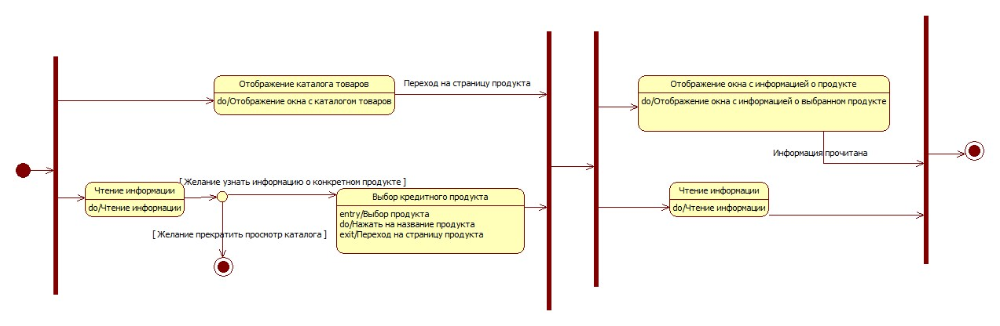

Рисунок  15 – Алгоритм реализации прецедента «Просмотр информации по кредитам»

В таблице 31 представлено описание состояний автомата реализации прецедента «Просмотр информации по кредитам».

|   |   |   |   |   |
| --- | --- | --- | --- | --- |
| Таблица 31  – Описание состояний |   |   |   |   |
| **Состояние** | **Описание** | **entry/** | **do/** | **exit/** |
| Отображение каталога товаров | Состояние, реализуемое системой для отображения страницы каталога товаров. | **-** | Отображение окна с каталогом товаров | **-** |
| Чтение информации | Состояние, реализуемое клиентом для чтения и обработки информации | - | Чтение информации | **-** |
| Выбор кредитного продукта | Состояние, реализуемое клиентом для выбора кредитного продукта.  | Выбор продукта | Нажать на кнопку "Открыть" у продукта | Переход на страницу продукта |
| Отображение окна с информацией о продукте | Состояние, реализуемое системой для отображения окна с информацией о продукте. | - | Отображение окна с информацией о выбранном продукте | - |

    В таблице 32 представлено описание переходов автомата реализации прецедента «Просмотр информации по кредитам»

|   |   |
| --- | --- |
| Таблица 32 – Описание переходов |   |
| **Переход** | **Описание** |
| Отображение каталога товаров – Отображение окна с информацией о продукте | Переход из состояния «Отображение каталога товаров» в состояние «Отображение окна с информацией о продукте» имеет событие перехода «Переход на страницу продукта» |
| Чтение информации – Конечное состояние | Переход из состояния «Чтение информации» в состояние «Конечное состояние» имеет условие перехода «Желание прекратить просмотр каталога» |
| Чтение информации – Выбор кредитного продукта | Переход из состояния «Чтение информации» в состояние «Выбор кредитного продукта» имеет условие перехода «Желание узнать информацию о конкретном продукте» |
| Выбор кредитного продукта – Чтение информации | Переход из состояния «Выбор кредитного продукта» в состояние «Чтение информации» выполняется по завершению деятельности «Выбор кредитного продукта» |
| Чтение информации – Конечное состояние | Переход из состояния «Чтение информации» в состояние «Конечное состояние» выполняется по завершению деятельности «Чтение информации» |
| Отображение окна с информацией о продукте – Конечное состояние | Переход из состояния «Отображение каталога товаров» в состояние «Отображение окна с информацией о продукте» имеет событие перехода «Информация прочитана» |

\2. ПРОЕКТИРОВАНИЕ СИСТЕМЫ

2.1    Архитектура данных и процессов

Для представления архитектуры данных и процессов воспользуемся и построим диаграмму классов.  Диаграмму разделим на пакеты по типам классов: классы-сущности, граничные классы и управляющие классы. 

Выделим следующие классы-сущности: Пользователь (User), Клиент (Client),  Менеджер (Manager), Кредитный продукт (CreditProduct), Кредитная заявка (CreditApplication), Кредитная категория (CreditCategory), Кредит(Credit), Транзакция (Transaction).

Диаграмма классов для пакета Entity представлена на рисунке 16. 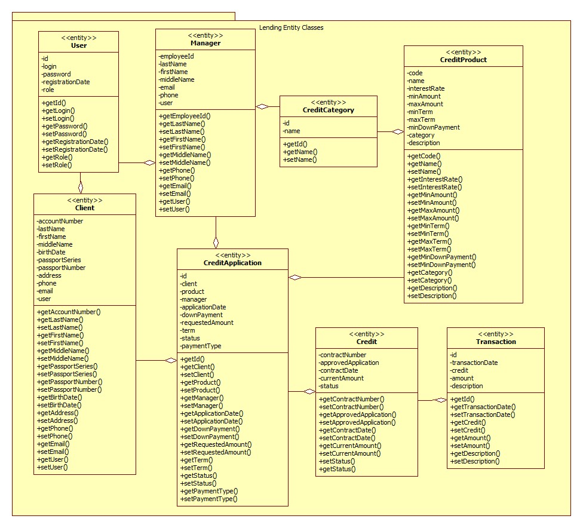

Рисунок 16 – Классы-сущности

Подробно рассмотрим каждый из классов.

**Класс User**

Поля:

- id: уникальный идентификатор пользователя в системе, режим доступа private, тип – Long.

- login: логин для входа в аккаунт пользователя, режим доступа private, тип – String

- password: пароль для входа в аккаунт пользователя, режим доступа private, тип – String

- registrationDate: дата регистрации аккаунта, режим доступа private, тип – LocalDateTime

- role: роль пользователя, для определения прав доступа, режим доступа private, тип – String

Все методы, начинающиеся с get и заканчивающиеся названием поля, не имеют параметров и возвращают значение этого поля с тем же типом, что и у этого поля.

Все методы, начинающиеся с set и заканчивающиеся названием поля, имеет один параметр типа соответствующего поля, ничего не возвращает, заменяет текущее значение на переданное в параметре.

Все методы имеют режим доступа public.

**Класс** **Client**

Поля: 

- accountNumber: уникальный идентификатор клиента, режим доступа private, тип – Long.

- lastName: фамилия клиента, режим доступа private, тип – String.

- firstName: имя клиента, режим доступа private, тип – String.

- middleName: отчество клиента, режим доступа private, тип – String.

- birthDate: дата рождения клиента, режим доступа private, тип – LocalDate.

- passportSeries: серия паспорта клиента, режим доступа private, тип – String.

- passportNumber: номер паспорта клиента, режим доступа private, тип – String.

- address: полный адрес клиента, режим доступа private, тип – String.

- phone: номер телефона клиента, режим доступа private, тип – String.

- email: электронная почта клиента, режим доступа private, тип – String.

- user: пользователь, содержащий учетные данные клиента, режим доступа private, тип – User.

Все методы, начинающиеся с get и заканчивающиеся названием поля, не имеют параметров и возвращают значение этого поля с тем же типом, что и у этого поля.

Все методы, начинающиеся с set и заканчивающиеся названием поля, имеет один параметр типа соответствующего поля, ничего не возвращает, заменяет текущее значение на переданное в параметре.

Все методы имеют режим доступа public.

**Класс CreditCategory**

Поля:

- id: уникальный идентификатор кредитной категории, режим доступа private, тип – Long.

- name: название кредитной категории, режим доступа private, тип – String.

Все методы, начинающиеся с get и заканчивающиеся названием поля, не имеют параметров и возвращают значение этого поля с тем же типом, что и у этого поля.

Все методы, начинающиеся с set и заканчивающиеся названием поля, имеет один параметр типа соответствующего поля, ничего не возвращает, заменяет текущее значение на переданное в параметре.

Все методы имеют режим доступа public.

**Класс** **Manager**

Поля:

- employeeId: табельный номер менеджера, режим доступа private, тип – Long.

- lastName: фамилия менеджера, режим доступа private, тип – String.

- firstName: имя менеджера, режим доступа private, тип – String.

- middleName: отчество менеджера, режим доступа private, тип – String.

- phone: номер телефона менеджера, режим доступа private, тип – String.

- email: электронная почта менеджера, режим доступа private, тип – String.

- specializations: набор кредитных категорий, на которых специализируется менеджер, режим доступа private, тип – List\<CreditCategory\>.

- user: пользователь, содержащий учетные данные менеджера, режим доступа private, тип – User.

Все методы, начинающиеся с get и заканчивающиеся названием поля, не имеют параметров и возвращают значение этого поля с тем же типом, что и у этого поля.

Все методы, начинающиеся с set и заканчивающиеся названием поля, имеет один параметр типа соответствующего поля, ничего не возвращает, заменяет текущее значение на переданное в параметре.

Все методы имеют режим доступа public.

**Класс CreditProduct**

Поля:

- code: уникальный код кредитного продукта, режим доступа private, тип – Long.

- name: название кредитного продукта, режим доступа private, тип – String.

- interestRate: процентная ставка по кредитному продукту, режим доступа private, тип – BigDecimal.

- minAmount: минимально допустимая сумма кредита, режим доступа private, тип – BigDecimal.

- maxAmount: максимально допустимая сумма кредита, режим доступа private, тип – BigDecimal.

- minTerm: минимальный срок кредита, режим доступа private, тип – Integer.

- maxTerm: максимальный срок кредита, режим доступа private, тип – Integer.

- minDownPayment: минимальный первоначальный взнос, режим доступа private, тип – BigDecimal.

- category: категория, к которой относится кредитный продукт, режим доступа private, тип – CreditCategory.

- description: описание кредитного продукта, режим доступа private, тип – String.

Все методы, начинающиеся с get и заканчивающиеся названием поля, не имеют параметров и возвращают значение этого поля с тем же типом, что и у этого поля.

Все методы, начинающиеся с set и заканчивающиеся названием поля, имеет один параметр типа соответствующего поля, ничего не возвращает, заменяет текущее значение на переданное в параметре.

Все методы имеют режим доступа public.

**Класс CreditApplication**

Поля:

- id: уникальный идентификатор заявки на кредит, режим доступа private, тип – Long.

- client: клиент, подавший заявку на кредит, режим доступа private, тип – Client.

- product: кредитный продукт, по которому подана заявка, режим доступа private, тип – CreditProduct.

- manager: менеджер, обрабатывающий заявку, режим доступа private, тип – Manager.

- applicationDate: дата и время подачи заявки, режим доступа private, тип – LocalDateTime.

- downPayment: первоначальный взнос по заявке, режим доступа private, тип – BigDecimal.

- requestedAmount: запрошенная сумма кредита, режим доступа private, тип – BigDecimal.

- term: запрошенный срок кредита, режим доступа private, тип – Integer.

- status: статус заявки, режим доступа private, тип – String.

- paymentType: тип платежей (тип графика/платежа) по заявке, режим доступа private, тип – String.

Все методы, начинающиеся с get и заканчивающиеся названием поля, не имеют параметров и возвращают значение этого поля с тем же типом, что и у этого поля.

Все методы, начинающиеся с set и заканчивающиеся названием поля, имеет один параметр типа соответствующего поля, ничего не возвращает, заменяет текущее значение на переданное в параметре.

Все методы имеют режим доступа public.

**Класс Credit**

Поля:

- contractNumber: номер кредитного договора, режим доступа private, тип – Long.

- approvedApplication: одобренная заявка, на основании которой оформлен кредит, режим доступа private, тип – CreditApplication.

- contractDate: дата заключения договора, режим доступа private, тип – LocalDate.

- currentAmount: текущая сумма задолженности (текущий остаток), режим доступа private, тип – BigDecimal.

- status: статус кредита, режим доступа private, тип – String.

Все методы, начинающиеся с get и заканчивающиеся названием поля, не имеют параметров и возвращают значение этого поля с тем же типом, что и у этого поля.

Все методы, начинающиеся с set и заканчивающиеся названием поля, имеет один параметр типа соответствующего поля, ничего не возвращает, заменяет текущее значение на переданное в параметре.

Все методы имеют режим доступа public.

**Класс Transaction**

Поля:

- id: уникальный идентификатор транзакции, режим доступа private, тип – Long.

- transactionDate: дата и время транзакции, режим доступа private, тип – LocalDateTime.

- credit: кредит, по которому выполнена транзакция, режим доступа private, тип – Credit.

- amount: сумма транзакции, режим доступа private, тип – BigDecimal.

- type: тип транзакции, режим доступа private, тип – String.

- description: описание транзакции, режим доступа private, тип – String.

Все методы, начинающиеся с get и заканчивающиеся названием поля, не имеют параметров и возвращают значение этого поля с тем же типом, что и у этого поля.

Все методы, начинающиеся с set и заканчивающиеся названием поля, имеет один параметр типа соответствующего поля, ничего не возвращает, заменяет текущее значение на переданное в параметре.

Все методы имеют режим доступа public.

Управляющие классы представлены на рисунке 17.

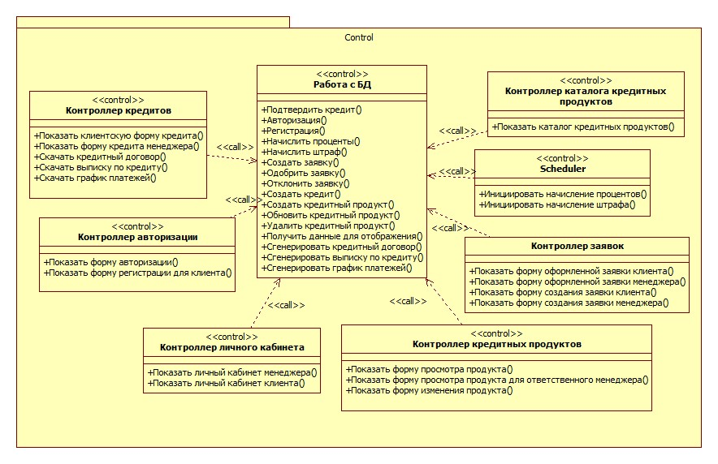

Рисунок 17 – Управляющие классы

**Класс Контроллер кредитов**

Методы:

- Показать клиентскую форму кредита() - возвращает форму просмотра кредита для клиента: основные параметры кредита, статус, остаток, ближайшие платежи, документы. Запрашивает данные из базы.

- Показать форму кредита менеджера() - возвращает форму кредита для менеджера: информация, доступ к действиям управления (подтверждение). Запрашивает данные из базы.

- Скачать кредитный договор() - инициирует генерацию документа через Сгенерировать кредитный договор() и возвращает файл пользователю.

- Скачать выписку по кредиту() - инициирует генерацию документа через Сгенерировать выписку по кредиту() и возвращает файл пользователю. 

- Скачать график платежей() - инициирует генерацию документа через Сгенерировать график платежей() и возвращает файл пользователю.

**Класс** **Контроллер авторизации**

Методы:

- Показать форму авторизации() - отображает форму входа.

- Показать форму регистрации для клиента() - отображает форму регистрации клиента.

**Класс** **Контроллер личного кабинета**

Методы:

- Показать личный кабинет менеджера() - открывает личный кабинет менеджера: личная информация, список заявок в работе, кредиты клиентов. Запрашивает данные из базы.

- Показать личный кабинет клиента() - открывает личный кабинет клиента: личные данные список его кредитов и заявок. Запрашивает данные из базы.

**Класс Контроллер каталога кредитных продуктов**

Методы:

- Показать каталог кредитных продуктов() - отображает список доступных кредитных продуктов. Запрашивает данные из базы.

**Класс Scheduler**

Методы:

- Инициировать начисление процентов() - планировщик запускает процесс начисления процентов: вызывает метод БД Начислить проценты() по расписанию ежемесячно.

- Инициировать начисление штрафа() - планировщик запускает процедуру начисления штрафов: вызывает Начислить штраф() по расписанию ежедневно.

**Класс** **Контроллер заявок**

Методы:

- Показать форму оформленной заявки клиента() - показывает клиенту уже поданную заявку.

- Показать форму оформленной заявки менеджера() - показывает менеджеру оформленную заявку с возможностью одобрить или отклонить заявку.

- Показать форму создания заявки клиента() - отображает клиенту форму подачи заявки.

- Показать форму создания заявки менеджера() - отображает менеджеру форму создания заявки от имени клиента (дополнительное поле выбора клиента).

**Класс** **Контроллер кредитных продуктов**

Методы:

- Показать форму просмотра продукта() - показывает карточку кредитного продукта для обычного просмотра.

- Показать форму просмотра продукта для ответственного менеджера() - Показывает карточку продукта менеджеру с возможностью редактирования/удаления.

- Показать форму изменения продукта() - открывает форму редактирования продукта (изменение параметров, сохранение через Обновить кредитный продукт()), с проверкой прав.

**Класс** **Работа с БД** 

Методы:

- Подтвердить кредит() - фиксирует в БД факт подтверждения кредита (клиент подписал договор), меняет статус.

- Авторизация() - проверяет учетные данные пользователя: ищет пользователя в БД, сверяет пароль, возвращает результат (успех/ошибка).

- Регистрация() - создаёт нового клиента в БД: сохраняет профиль, логин, хэш пароля, стартовые статусы; проверяет уникальность.

- Начислить проценты() - выполняет начисление процентов по активным кредитам: рассчитывает сумму за период, добавляет транзакцию, обновляет задолженность.

- Начислить штраф() - Начисляет штрафы по просрочкам: находит просроченные платежи, считает сумму штрафа, записывает транзакцию и обновляет состояние кредита.

- Создать заявку() - создаёт заявку на кредит в БД: сохраняет параметры, устанавливает начальный статус.

- Одобрить заявку() - переводит заявку в статус «одобрено», инициирует создание кредита Создать кредит().

- Отклонить заявку() - переводит заявку в статус «отклонено».

- Создать кредит() - создаёт сущность кредита на основе одобренной заявки.

- Создать кредитный продукт() - добавляет в БД новый кредитный продукт.

- Обновить кредитный продукт() - изменяет параметры существующего продукта.

- Удалить кредитный продукт() - удаляет кредитный продукт.

- Получить данные для отображения() – обобшение всех методов, которые выдают набор данных, требуемых для отображения форм.

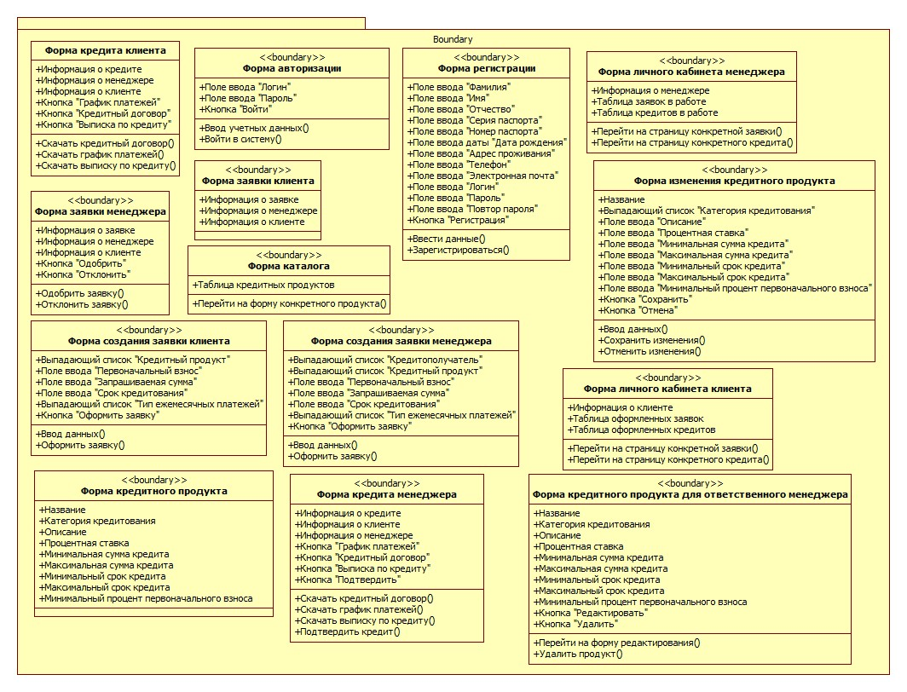

Рисунок 18 – Граничные классы

[2.2 Модель поведения](<#_heading=h.1x0gk37>)

Алгоритмы поведения представлены в пункте 1.3.5

2.3 Модель реализации

### 2.3.1 Модель исходного кода

На рисунке 19 приведены компоненты исходного кода для клиентской части пользователя с ролью «Клиент».

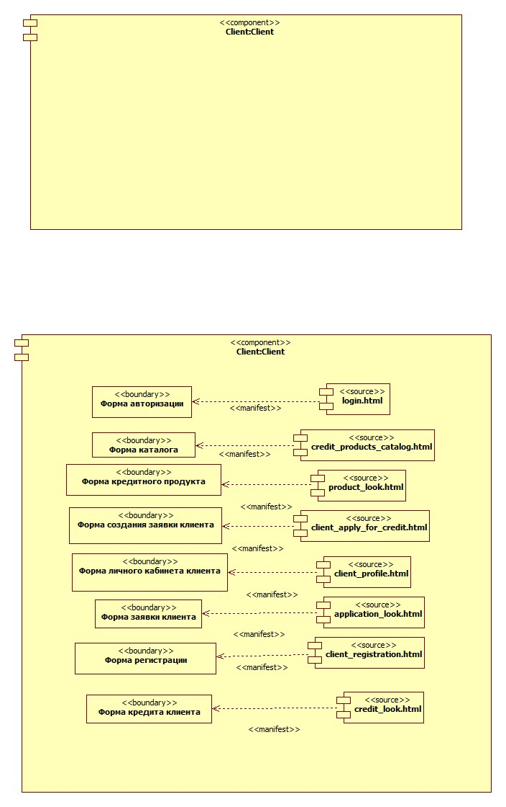

Рисунок  19 - Модель исходного кода для клиентской части пользователя с ролью «Клиент»

Функциональность данного компонента реализуется в виде набора веб-форм:

- Форма авторизации: исходный программный код должен быть размещён в файле с именем login.html.

- Форма каталога: исходный программный код должен быть размещён в файле с именем credit\_products\_catalog.html.

- Форма кредитного продукта: исходный программный код должен быть размещён в файле с именем product\_look.html.

- Форма создания заявки клиента: исходный программный код должен быть размещён в файле с именем client\_apply\_for\_credit.html.

- Форма личного кабинета клиента: исходный программный код должен быть размещён в файле с именем client\_profile.html.

- Форма заявки клиента: исходный программный код должен быть размещён в файле с именем application\_look.html.

- Форма регистрации: исходный программный код должен быть размещён в файле с именем client\_registration.html.

- Форма кредита клиента: исходный программный код должен быть размещён в файле с именем credit\_look.html.

На рисунке 20 приведены компоненты исходного кода серверной части пользователя с ролью «Клиент».

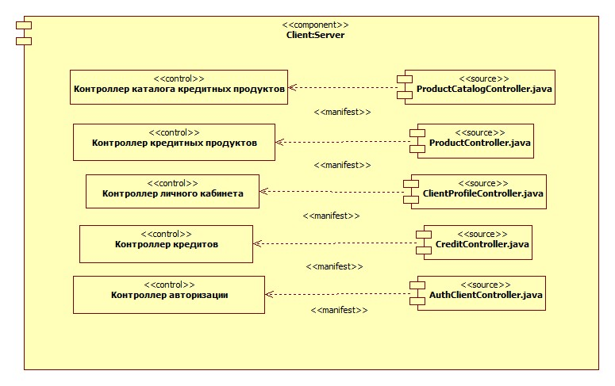

Рисунок  20 - Модель исходного кода для серверной части пользователя с ролью «Клиент»

- Функциональность данного компонента реализуется в виде набора контроллеров, при этом исходный программный код каждого контроллера должен быть размещён в соответствующем Java-файле:

- Контроллер каталога кредитных продуктов: исходный программный код должен быть размещён в файле с именем ProductCatalogController.java.

- Контроллер кредитных продуктов: исходный программный код должен быть размещён в файле с именем ProductController.java.

- Контроллер личного кабинета: исходный программный код должен быть размещён в файле с именем ClientProfileController.java.

- Контроллер кредитов: исходный программный код должен быть размещён в файле с именем CreditController.java.

- Контроллер авторизации: исходный программный код должен быть размещён в файле с именем AuthClientController.java. 

На рисунке 21 приведены компоненты исходного кода для клиентской части пользователя с ролью «Менеджер».

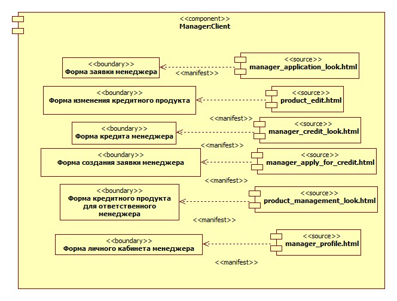

Рисунок  21- Модель исходного кода для клиентской части пользователя с ролью «Менеджер»

Функциональность данного компонента реализуется в виде набора веб-форм:

- Форма заявки менеджера: исходный программный код должен быть размещён в файле с именем manager\_application\_look.html.

- Форма изменения кредитного продукта: исходный программный код должен быть размещён в файле с именем product\_edit.html.

- Форма кредита менеджера: исходный программный код должен быть размещён в файле с именем manager\_credit\_look.html.

- Форма создания заявки менеджера: исходный программный код должен быть размещён в файле с именем manager\_apply\_for\_credit.html.

- Форма кредитного продукта для ответственного менеджера: исходный программный код должен быть размещён в файле с именем product\_management\_look.html.

- Форма личного кабинета менеджера: исходный программный код должен быть размещён в файле с именем manager\_profile.html.

На рисунке 22 приведены компоненты исходного кода серверной части пользователя с ролью «Менеджер».

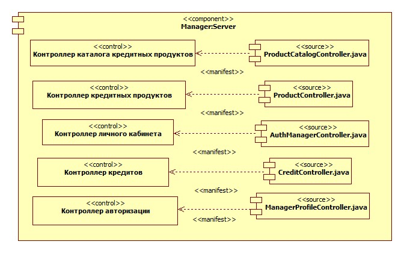

Рисунок  22 - Модель исходного кода для серверной части пользователя с ролью «Менеджер»

Функциональность данного компонента реализуется в виде набора контроллеров, при этом исходный программный код каждого контроллера должен быть размещён в соответствующем Java-файле:

- Контроллер каталога кредитных продуктов: исходный программный код должен быть размещён в файле с именем ProductCatalogController.java.

- Контроллер кредитных продуктов: исходный программный код должен быть размещён в файле с именем ProductController.java.

- Контроллер личного кабинета: исходный программный код должен быть размещён в файле с именем AuthManagerController.java.

- Контроллер кредитов: исходный программный код должен быть размещён в файле с именем CreditController.java.

- Контроллер авторизации: исходный программный код должен быть размещён в файле с именем ManagerProfileController.java.

На рисунке 23 приведены компоненты исходного кода серверной части служюы планировщика 

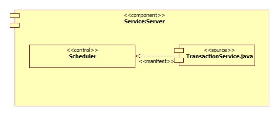

Рисунок  23 - Модель исходного кода для серверной части пользователя с ролью «Менеджер»

Исходный программный код управляющего класса должен быть размещён в файле с именем TransactionService.java.

### 2.3.2 Модель исполняемого кода

Компоненты исполняемого кода представлены на рисунке 24.

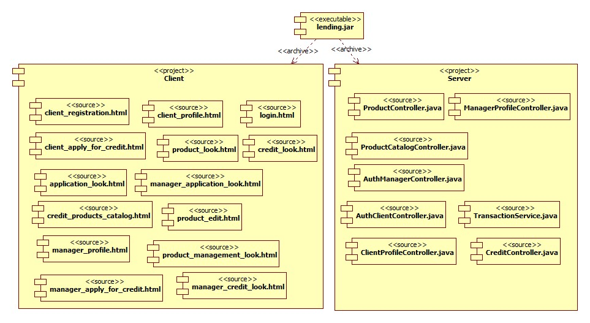

Рисунок 24 – Модель исполняемого кода при использовании проектов систем программирования 

1) Файлы исходных кодов: ProductController.java, ManagerProfileController.java, ProductCatalogController.java, AuthManagerController.java, AuthClientController.java, TransactionService.java, ClientProfileController.java, CreditController.java реализуют основную функциональность (основные задачи) проектируемой системы.

2) Файлы исходных кодов форм: client\_registration.html, client\_profile.html, login.html, client\_apply\_for\_credit.html, product\_look.html, credit\_look.html, application\_look.html, manager\_application\_look.html, credit\_products\_catalog.html, product\_edit.html, manager\_profile.html, product\_management\_look.html, manager\_apply\_for\_credit.html, manager\_credit\_look.html реализуют пользовательский интерфейс системы во время решения задач.

### 2.3.4 Модель поставляемых артефактов

Компоненты поставляемых артефактов представлены на рисунке 25.

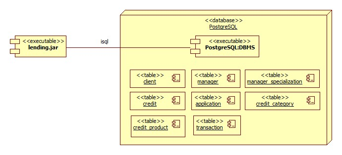

Рисунок  25 - Модель поставляемых артефактов

Файл lending.jar — основной исполняемый артефакт прикладного уровня, обеспечивающий работу системы и доступ к данным. Данный файл представляет собой Java‑приложение и включает в себя прикладную часть и интеграционный слой.

Прикладная часть: скомпилированные Java‑классы, реализующие бизнес‑логику, обработку операций и взаимодействие с хранилищем данных.

Интеграционный слой: компоненты доступа к данным (драйвер/клиент), обеспечивающие подключение к СУБД и выполнение запросов к базе данных по интерфейсу isql.

Артефакты, функционирующие в рамках базы данных PostgreSQL (Database server), включают в себя исполняемое программное обеспечение DBMS PostgreSQL, структуру базы данных, представленную таблицами: client, manager, manager\_specialization, credit, credit\_category, credit\_product, application, transaction

### 2.3.4 Модель размещения артефактов

Модель размещения артефактов системы представлена на рисунке 26.

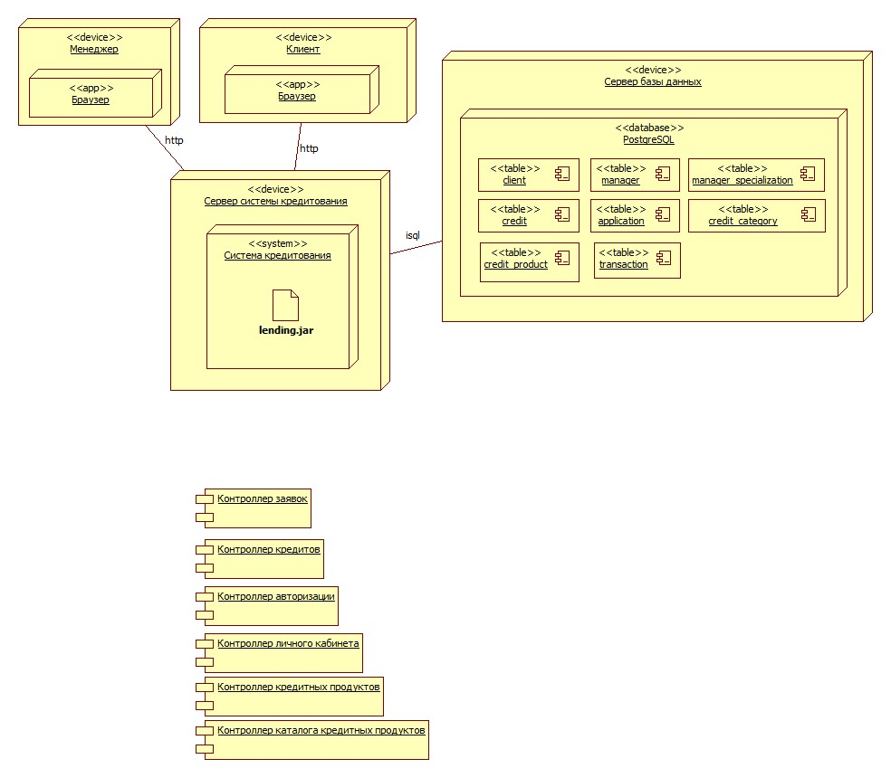

Рисунок  26 - Модель размещения артефактов проектируемой системы

Проектируемая программно информационная система развертывается в виде нескольких устройств: 

- Менеджер — рабочая станция сотрудника (оператора), работающего с системой.

- Клиент — рабочая станция конечного пользователя (заемщика), взаимодействующего с системой.

- Сервер кредитования / сервер приложения — сервер, на котором исполняется основная логика системы.

- Сервер базы данных — выделенный сервер для хранения и управления данными.

На каждом узле размещаются артефакты соответствующего назначения: 

На устройствах Менеджер и Клиент размещается артефакт «Браузер», выступающий в роли тонкого клиента.

На сервере кредитования размещена система «Система кредитования» в виде исполняемого артефакта lending.jar, который реализует прикладную логику 

На сервере базы данных размещено ПО типа СУБД — PostgreSQL, в рамках которого функционирует база данных со структурой таблиц, отражающих предметную область кредитования.

Узлы находятся в сети и обмениваются данными по специализированным протоколам: 

Взаимодействие между рабочими станциями (Менеджер/Клиент) и сервером кредитования осуществляется по протоколу HTTP, что позволяет пользователям работать с системой через веб-интерфейс в браузере.

Взаимодействие между сервером кредитования и сервером базы данных (PostgreSQL) осуществляется по интерфейсу isql (SQL доступ), обеспечивая выполнение запросов и обмен данными между приложением и таблицами базы данных.

### 2. 3.5 Интерфейс пользователя

Дерево форм и алгоритм переключения между ними представлен на рисунке 27.

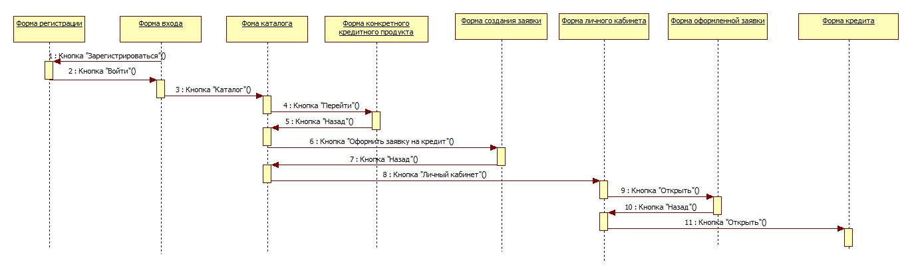

Рисунок 27 – Дерево форм

3 РЕАЛИЗАЦИЯ ПРИС

3.1 Реализация бизнес-логики

На данном этапе была окончательно сформирована совокупность классов программно-информационной системы, реализующих бизнес-логику и пользовательский интерфейс. В соответствии с принятыми проектными решениями выполнена реализация основных компонентов приложения, а также детализированы и запрограммированы коды методов, обеспечивающих выполнение всех сценариев работы системы. 

Архитектура приложения была организована по принципу разделения ответственности на слои:

- Классы контроллеров отвечают за обработку пользовательских действий и выступают точкой входа в функциональность системы.

- Классы сервисов содержат основную бизнес-логику: алгоритмы обработки предметных данных, проверки ограничений, вычисления и правила принятия решений. В сервисы были вынесены все ключевые операции, чтобы исключить дублирование логики в контроллерах и обеспечить её повторное использование.

- Классы репозиториев реализуют доступ к данным и инкапсулируют операции чтения/записи, тем самым отделяя бизнес-логику от конкретного способа хранения информации.

Для повышения связности между слоями и упрощения обмена данными в код были добавлены технические компоненты:

DTO (Data Transfer Objects) - классы передачи данных, предназначенные для безопасного и удобного обмена информацией между слоями системы, а также для исключения прямой зависимости интерфейсного слоя от сущностей предметной области.

Компоненты-мапперы - средства преобразования объектов предметной области (Entity) в объекты передачи данных (DTO) и обратно. Это позволило централизовать правила преобразования, сократить объём повторяющегося кода и обеспечить единый формат данных на границах слоёв.

3.2 Реализация пользовательского интерфейса

Реализация формы авторизации на рисунке 28.

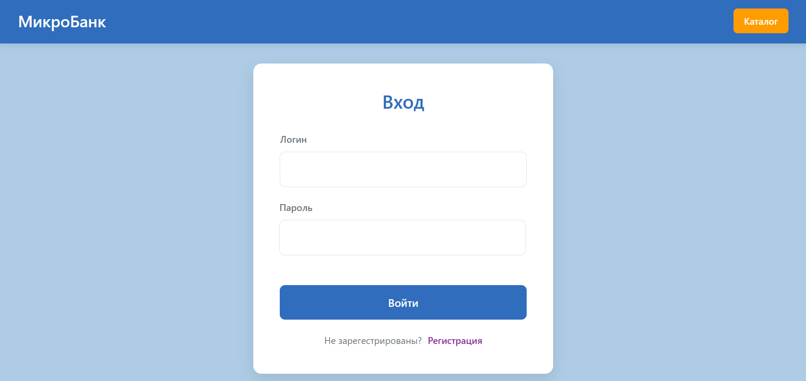

Рисунок 28 – Форма авторизации

Список компонентов формы авторизации представлен в таблице 33.

Таблица 33 – Компоненты формы авторизации

|   |   |   |   |
| --- | --- | --- | --- |
| **Компонент** | **Назначение** | **Свойство** | **Значение** |
| authForm | Форма авторизации | Form | Вход в систему |
| labelLogin | Текст над полем логина | Text | Текст с информацией о салоне |
| labelPassword | Текст над полем пароля | Text | Текст с информацией о местоположение |
| TextBoxLogin | Поле ввода логина | TextBox | Ввод логина пользователя; обязательное поле |
| TextBoxPassword | Поле ввода пароля | TextBox | Ввод пароля пользователя; обязательное поле |
| buttonAuth | Кнопка авторизации | Button | Отправка формы авторизации |
| linkRegister | Кнопка перехода на страницу регистрации | Link | Переход на страницу регистрации |
| textNoAccount | Текст «Не зарегистрированы?» | Text | Информационный текст перед ссылкой регистрации |

Реализация формы регистрации на рисунке 29-30.

 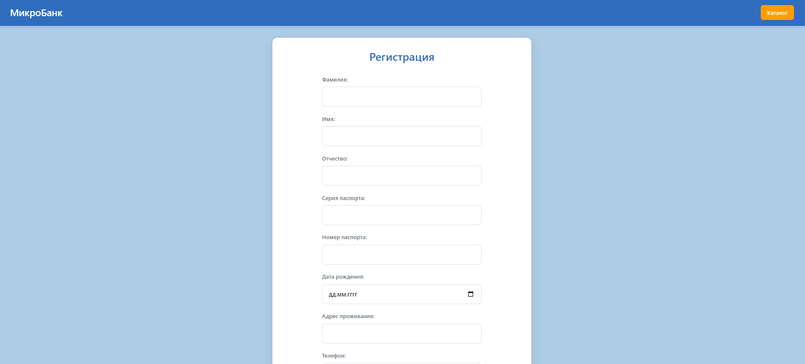

Рисунок  29 – Форма регистрации (верх)

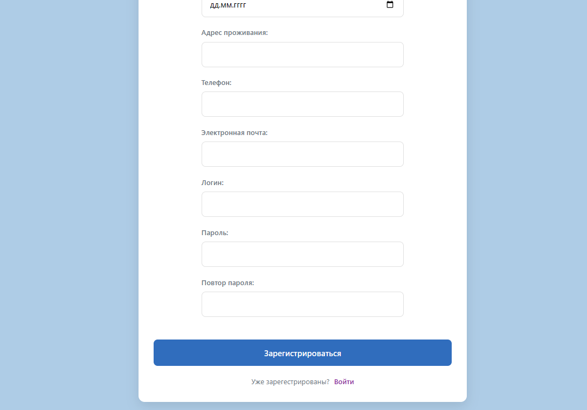

Рисунок  30 – Форма регистрации (низ)

Список компонентов формы регистрации представлен в таблице 34.

Таблица 34 – Компоненты формы регистрации

|   |   |   |   |
| --- | --- | --- | --- |
| **Компонент** | **Назначение** | **Свойство** | **Значение** |
| registrationForm | Форма регистрации родителя | Form | Создание учетной записи родителя в системе |
| buttonCatalog | Кнопка «Каталог» | Button | Переход в каталог |
| titleRegistration | Заголовок формы | Text | Отображение «Регистрация» |
| labelLastName  | Подпись фамилии | Text | Текст «Фамилия:» |
| inputLastName  | Ввод фамилии | TextBox | Ввод фамилии пользователя |
| labelFirstName  | Подпись имени | Text | Текст «Имя:» |
| inputFirstName  | Ввод имени | TextBox | Ввод имени пользователя |
| labelMiddleName  | Подпись отчества | Text | Текст «Отчество:» |
| inputMiddleName  | Ввод отчества | TextBox | Ввод отчества пользователя |
| labelPassportSeries | Подпись серии паспорта | Text | Текст «Серия паспорта:» |
| inputPassportSeries  | Ввод серии паспорта | TextBox | Ввод серии паспорта пользователя |
| labelPassportNumber  | Подпись номера паспорта | Text | Текст «Номер паспорта:» |
| inputPassportNumber  | Ввод номера паспорта | TextBox | Ввод номера паспорта пользователя |
| labelBirthDate | Подпись даты рождения | Text | Текст «Дата рождения:» |
| inputBirthDate | Ввод даты рождения | DatePicker | Ввод даты рождения пользователя |
| labelAddress | Подпись адреса | Text | Текст «Адрес проживания:» |
| inputAddress  | Ввод адреса | TextBox | Ввод адреса пользователя |
| labelPhone  | Подпись телефона | Text | Текст «Телефон:» |
| inputPhone  | Ввод телефона | TextBox | Ввод телефона пользователя |
| labelEmail | Подпись email | Text | Текст «Электронная почта:» |
| inputEmail  | Ввод email | TextBox | Ввод электронной почты пользователя |
| labelLogin  | Подпись логина | Text | Текст «Логин:» |
| inputLogin  | Ввод логина | TextBox | Ввод логина пользователя |
| labelPassword  | Подпись пароля | Text | Текст «Пароль:» |
| inputPassword | Ввод пароля | PasswordBox | Ввод паспорта пользователя |
| labelPasswordRepeat  | Подпись повтора пароля | Text | Текст «Повтор пароля:» |
| inputPasswordRepeat  | Повторный ввод пароля | PasswordBox | Повторный ввод пароля пользователя |
| passwordMismatchMessage  | Сообщение об ошибке | Text | Текст «Пароли не совпадают», по умолчанию скрыто |
| buttonRegistration | Кнопка «Зарегистрироваться» | Button | Отправка формы  |
| linkSignIn | Ссылка на авторизацию | Link | Переход на страницу входа |

Реализация формы каталога продуктов на рисунке 31.

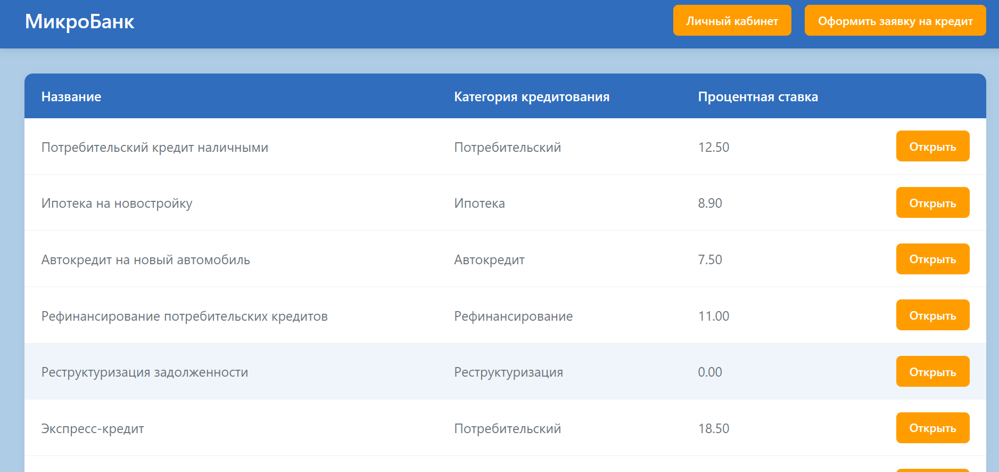

Рисунок 31 – Форма каталога продуктов

Список компонентов формы каталога продуктов представлен в таблице 35.

Таблица 35 – Компоненты формы каталога продуктов

|   |   |   |   |
| --- | --- | --- | --- |
| **Компонент** | **Назначение** | **Свойство** | **Значение** |
| CatalogForm | Форма каталога кредитных продуктов | Form | Перечень кредитных продуктов |
| buttonProfile | Кнопка «Личный кабинет» | Button | Переход на страницу личного кабинета |
| buttonApplication | Кнопка «Оформить заявку на кредит» | Button | Переход на страницу оформления заявки |
| productsTable | Таблица продуктов | Table | Таблица кредитных продуктов |
| tableHeader | Заголовок таблицы | TableHead | Шапка таблицы: «Название», «Категория кредитования», «Процентная ставка», колонка действий |
| productsListRow | Строка продукта | TableRow  | Кредитный продукт |
| buttonOpenProduct | Кнопка «Открыть» продукт | Button | Переход на конкретный кредитный продукт |

Реализация формы авторизации на рисунке 32.

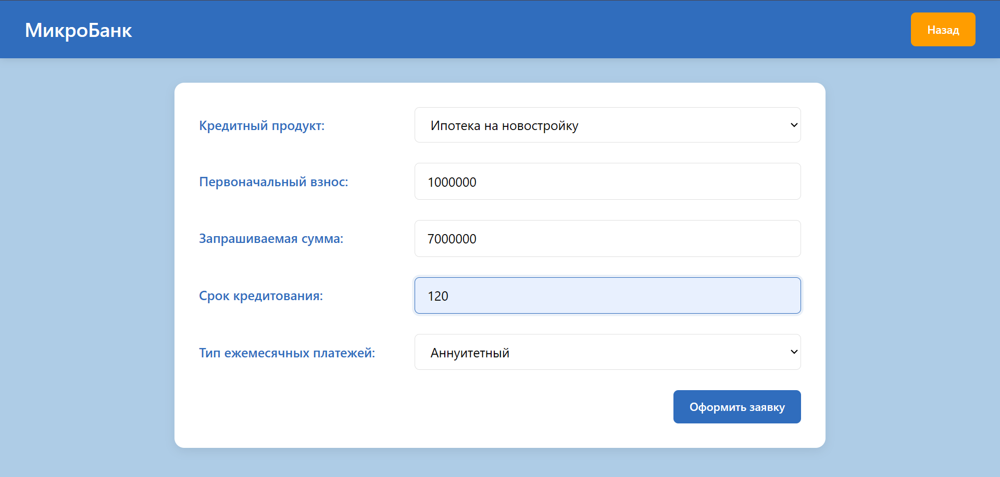

Рисунок 32 – Форма авторизации

Список компонентов формы авторизации представлен в таблице 36.

Таблица 36 – Компоненты формы авторизации

|   |   |   |   |
| --- | --- | --- | --- |
| **Компонент** | **Назначение** | **Свойство** | **Значение** |
| creditApplicationForm | Форма оформления заявки | Form | Поля для заполнения заявки на кредит |
| buttonBack | Кнопка «Назад» | Button | Возврат на предыдущую страницу  |
| labelProduct | Подпись кредитного продукта | Text | Текст «Кредитный продукт:» |
| selectProduct  | Выбор кредитного продукта | Select | Выбор из выпадающего списка |
| labelDownPayment | Подпись первоначального взноса | Text | Текст «Первоначальный взнос:» |
| inputDownPayment  | Поле «Первоначальный взнос» | TextBox | Ввод первоначального взноса  |
| labelRequestedAmount | Подпись суммы | Text | Текст «Запрашиваемая сумма:» |
| inputRequestedAmount | Поле «Запрашиваемая сумма» | TextBox | Ввод запрашиваемой суммы   |
| labelTerm | Подпись срока | Text | Текст «Срок кредитования:» |
| inputTerm  | Поле «Срок кредитования» | TextBox | Ввод срока |
| selectPaymentType  | Выбор типа ежемесячных платежей | Select | Выбор из выпадающего списка |
| buttonApply | Кнопка «Оформить заявку» | Button | Выбор из выпадающего списка |

Реализация формы личного кабинета клиента на рисунке 33.

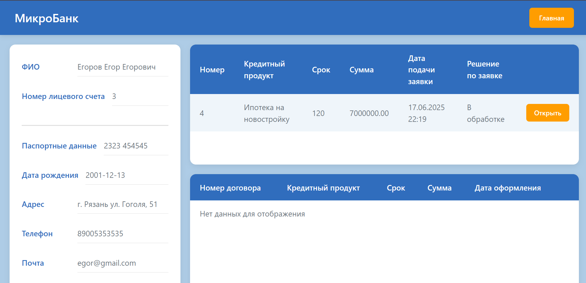

Рисунок 33 – Форма личного кабинета клиента

Список компонентов формы личного кабинета клиента представлен в таблице 37.

Таблица 37 – Компоненты формы личного кабинета клиента

|   |   |   |   |
| --- | --- | --- | --- |
| **Компонент** | **Назначение** | **Свойство** | **Значение** |
| buttonHome | Переход на главную страницу клиента | Button | Кнопка «Главная» |
| mainInfoBlock | Блок основной информации о клиенте (левая колонка) | InfoBlock | Содержит персональные данные клиента |
| infoFullName | Отображение ФИО клиента | Text | Фамилия + Имя + Отчество |
| infoAccountNumber | Отображение номера лицевого счёта | Text | Номер лицевого счёта клиента |
| infoPassport | Отображение паспортных данных | Text | Серия + номер паспорта |
| infoBirthDate | Отображение даты рождения | Text | Дата рождения клиента |
| infoAddress | Отображение адреса проживания | Text | Адрес клиента |
| infoPhone | Отображение телефона | Text | Номер телефона клиента |
| infoEmail | Отображение электронной почты | Text | Email клиента |
| applicationsTable | Таблица заявок клиента | Table | Список кредитных заявок (если есть) |
| applicationsColNumber | Колонка номера заявки | Column | «Номер» |
| applicationsColProduct | Колонка кредитного продукта | Column | «Кредитный продукт» |
| applicationsColTerm | Колонка срока | Column | «Срок» |
| applicationsColAmount | Колонка суммы | Column | «Сумма» |
| applicationsColDate | Колонка даты подачи | Column | «Дата подачи заявки» |
| applicationsColDecision | Колонка решения | Column | «Решение по заявке» |
| buttonOpenApplication | Открытие выбранной заявки | Button | Перейти на страницу заявки |
| applicationsEmptyMessage | Сообщение при отсутствии заявок | Text | «Нет данных для отображения» |
| creditsTable | Таблица кредитов/договоров клиента | Table | Список оформленных кредитов (если есть) |
| creditsColContractNumber | Колонка номера договора | Column | «Номер договора» |
| creditsColProduct | Колонка кредитного продукта | Column | «Кредитный продукт» |
| creditsColTerm | Колонка срока | Column | «Срок» |
| creditsColAmount | Колонка суммы | Column | «Сумма» |
| creditsColContractDate | Колонка даты оформления | Column | «Дата оформления» |
| buttonOpenCredit | Открытие выбранного кредита/договора | Button | Перейти на страницу кредита |
| creditsEmptyMessage | Сообщение при отсутствии кредитов | Text | «Нет данных для отображения» |

Реализация формы заявки на рисунке 34.

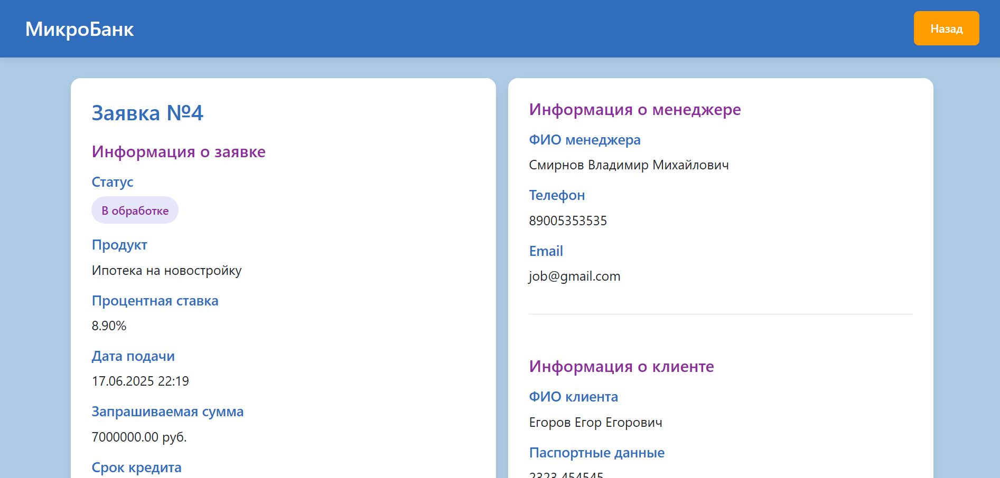

Рисунок 34 – Форма заявки клиента

Список компонентов формы заявки клиента представлен в таблице 38.

Таблица 38 – Компоненты формы заявки клиента

|   |   |   |   |
| --- | --- | --- | --- |
| **Компонент** | **Назначение** | **Свойство** | **Значение** |
| buttonBack | Возврат на предыдущую страницу | Button | Кнопка «Назад» |
| applicationTitle | Заголовок страницы заявки | Text | «Заявка №» |
| applicationInfoSection | Секция данных о заявке | Section | Группирует поля статуса, продукта, суммы и т.д. |
| applicationSectionTitle | Заголовок секции заявки | Text | «Информация о заявке» |
| applicationStatusLabel | Подпись к статусу | Text | «Статус» |
| applicationStatusBadge | Отображение статуса заявки | Text | Значение статуса  |
| applicationProductLabel | Подпись к продукту | Text | «Продукт» |
| applicationProductValue | Значение продукта | Text | Название кредитного продукта  |
| applicationRateLabel | Подпись к процентной ставке | Text | «Процентная ставка» |
| applicationRateValue | Процентная ставка | Text | Значение ставки |
| applicationDateLabel | Подпись к дате подачи | Text | «Дата подачи» |
| applicationDateValue | Дата и время подачи | Text | Формат dd.MM.yyyy HH:mm |
| applicationAmountLabel | Подпись к сумме | Text | «Запрашиваемая сумма» |
| applicationAmountValue | Запрашиваемая сумма | Text | Значение суммы |
| applicationTermLabel | Подпись к сроку кредита | Text | «Срок кредита» |
| applicationTermValue | Срок кредита | Text | Значение срока |
| applicationDownPaymentLabel | Подпись к первоначальному взносу | Text | «Первоначальный взнос» |
| applicationDownPaymentValue | Первоначальный взнос | Text | Значение Первоначального взноса |
| applicationPaymentTypeLabel | Подпись к типу платежей | Text | «Тип платежей» |
| applicationPaymentTypeValue | Тип платежей | Text | Значение типа платежей |
| managerInfoSection | Секция данных менеджера | Section | Группирует ФИО, телефон, email менеджера |
| managerSectionTitle | Заголовок секции менеджера | Text | «Информация о менеджере» |
| managerNameLabel | Подпись к ФИО менеджера | Text | «ФИО менеджера» |
| managerNameValue | ФИО менеджера | Text | Имя менеджера |
| managerPhoneLabel | Подпись к телефону менеджера | Text | «Телефон» |
| managerPhoneValue | Телефон менеджера | Text | Телефон менеджера |
| managerEmailLabel | Подпись к email менеджера | Text | «Email» |
| managerEmailValue | Email менеджера | Text | Электронная почта менеджера |
| clientInfoSection | Секция данных клиента | Section | Группирует персональные данные клиента |
| clientSectionTitle | Заголовок секции клиента | Text | «Информация о клиенте» |
| clientNameLabel | Подпись к ФИО клиента | Text | «ФИО клиента» |
| clientNameValue | ФИО клиента | Text | Имя клиента |
| clientPassportLabel | Подпись к паспортным данным | Text | «Паспортные данные» |
| clientPassportValue | Паспортные данные | Text | Серия и номер паспорта |
| clientBirthDateLabel | Подпись к дате рождения | Text | «Дата рождения» |
| clientBirthDateValue | Дата рождения | Text | Формат dd.MM.yyyy |
| clientAddressLabel | Подпись к адресу | Text | «Адрес» |
| clientAddressValue | Адрес клиента | Text | Адрес клиента |
| clientPhoneLabel | Подпись к телефону клиента | Text | «Телефон» |
| clientPhoneValue | Телефон клиента | Text | Телефон клиента |
| clientEmailLabel | Подпись к email клиента | Text | «Email» |
| clientEmailValue | Email клиента | Text | Электронная почта клиента |

Реализация формы заявки на рисунке 35.

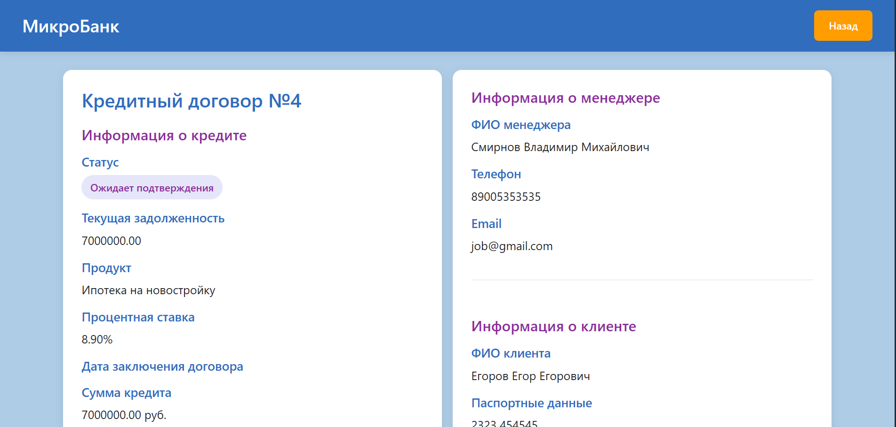

Рисунок 35 – Форма заявки клиента

Список компонентов формы заявки клиента представлен в таблице 39.

Таблица 39 – Компоненты формы заявки клиента

|   |   |   |   |
| --- | --- | --- | --- |
| **Компонент** | **Назначение** | **Свойство** | **Значение** |
| buttonBack | Возврат на предыдущую страницу | Button | «Назад» (возврат назад) |
| creditTitle | Заголовок кредитного договора | Text | «Кредитный договор №\{номер договора\}» |
| creditInfoSection | Секция «Информация о кредите» | Text | Содержит статус, задолженность, параметры кредита |
| creditInfoSectionTitle | Заголовок секции кредита | Text | «Информация о кредите» |
| creditStatusLabel | Подпись к статусу | Text | «Статус» |
| creditStatusBadge | Отображение статуса кредита | Text | Статус кредита (текстовое значение из списка статусов) |
| creditCurrentAmountLabel | Подпись к текущей задолженности | Text | «Текущая задолженность» |
| creditCurrentAmountValue | Текущая задолженность | Text | Текущая сумма задолженности |
| creditProductLabel | Подпись к продукту | Text | «Продукт» |
| creditProductValue | Название кредитного продукта | Text | Наименование продукта |
| creditRateLabel | Подпись к процентной ставке | Text | «Процентная ставка» |
| creditRateValue | Процентная ставка | Text | Значение ставки в процентах |
| creditContractDateLabel | Подпись к дате заключения договора | Text | «Дата заключения договора» |
| creditContractDateValue | Дата заключения договора | Text | Дата в формате дд.мм.гггг |
| creditAmountLabel | Подпись к сумме кредита | Text | «Сумма кредита» |
| creditAmountValue | Сумма кредита | Text | Сумма кредита в рублях |
| creditTermLabel | Подпись к сроку кредита | Text | «Срок кредита» |
| creditTermValue | Срок кредита | Text | Срок в месяцах |
| creditDownPaymentLabel | Подпись к первоначальному взносу | Text | «Первоначальный взнос» |
| creditDownPaymentValue | Первоначальный взнос | Text | Сумма первоначального взноса в рублях |
| creditPaymentTypeLabel | Подпись к типу платежей | Text | «Тип платежей» |
| creditPaymentTypeValue | Тип платежей | Text | Тип платежей (текстовое значение из списка типов платежей) |
| downloadButtonsBlock | Блок кнопок скачивания документов (условный) | ButtonsBlock | Показывается, если статус кредита не «ожидает подтверждения» |
| buttonDownloadTransactions | Скачивание выписки по кредиту | Button | «Скачать выписку по кредиту» |
| buttonDownloadContract | Скачивание кредитного договора | Button | «Скачать кредитный договор» |
| buttonDownloadSchedule | Скачивание графика платежей | Button | «Скачать график платежей» |
| managerInfoSection | Секция «Информация о менеджере» | Section | ФИО, телефон и электронная почта менеджера |
| managerSectionTitle | Заголовок секции менеджера | Text | «Информация о менеджере» |
| managerNameLabel | Подпись к ФИО менеджера | Text | «ФИО менеджера» |
| managerNameValue | ФИО менеджера | Text | ФИО менеджера |
| managerPhoneLabel | Подпись к телефону менеджера | Text | «Телефон» |
| managerPhoneValue | Телефон менеджера | Text | Номер телефона менеджера |
| managerEmailLabel | Подпись к электронной почте менеджера | Text | «Электронная почта» |
| managerEmailValue | Электронная почта менеджера | Text | Адрес электронной почты менеджера |
| clientInfoSection | Секция «Информация о клиенте» | Section | Персональные данные клиента |
| clientSectionTitle | Заголовок секции клиента | Text | «Информация о клиенте» |
| clientNameLabel | Подпись к ФИО клиента | Text | «ФИО клиента» |
| clientNameValue | ФИО клиента | Text | ФИО клиента |
| clientPassportLabel | Подпись к паспортным данным | Text | «Паспортные данные» |
| clientPassportValue | Паспортные данные | Text | Серия и номер паспорта |
| clientBirthDateLabel | Подпись к дате рождения | Text | «Дата рождения» |
| clientBirthDateValue | Дата рождения | Text | Дата в формате дд.мм.гггг |
| clientAddressLabel | Подпись к адресу | Text | «Адрес» |
| clientAddressValue | Адрес клиента | Text | Адрес клиента |
| clientPhoneLabel | Подпись к телефону клиента | Text | «Телефон» |
| clientPhoneValue | Телефон клиента | Text | Номер телефона клиента |
| clientEmailLabel | Подпись к электронной почте клиента | Text | «Электронная почта» |
| clientEmailValue | Электронная почта клиента | Text | Адрес электронной почты клиента |

3.3 Реализация базы данных

Опишем итоговую схему данных, получившуюся в процессе проектирования (см. таблицы 40 -47).

Таблица 40 – Атрибуты таблицы «clients»

|   |   |   |   |
| --- | --- | --- | --- |
| Имя атрибута | Имя атрибута  в БД | Тип данных | Является ключом |
| Номер лицевого счета  | account\_number | bigint | Первичный ключ |
| Фамилия  | last\_name | varchar(50) |   |
| Имя | first\_name | varchar(30) |   |
| Отчество | middle\_name | varchar(20) |   |
| Дата рождения | birth\_date | date |   |
| Серия паспорта | passport\_series | varchar(4) |   |
| Номер паспорта | passport\_number | varchar(6) |   |
| Адрес  | address | text |   |
| Телефон | phone | varchar(11) |   |
| Электронная почта | email | varchar(320) |   |

|   |   |   |   |   |   |
| --- | --- | --- | --- | --- | --- |
| Таблица 41 – Атрибуты таблицы «managers» |   |   |   |   |   |
| Имя атрибута | Имя атрибута  в БД | Тип данных |   | Является ключом |   |
| Табельный номер  | employee\_number | bigint |   | Первичный ключ |   |
| Фамилия  | last\_name | varchar(50) |   |   |   |
| Имя | first\_name | varchar(30) |   |   |   |
| Отчество | middle\_name | varchar(20) |   |   |   |
| Телефон | phone | varchar(11) |   |   |   |
| Электронная почта | email | varchar(320) |   |   |   |

|   |   |   |   |
| --- | --- | --- | --- |
| Таблица 42 – Атрибуты таблицы «сredit\_products» |   |   |   |
| Имя атрибута | Имя атрибута  в БД | Тип данных | Является ключом |
| Код кредита  | code | bigint | Первичный ключ |
| Название кредита  | name | varchar(200) |   |
| Процентная ставка | interest\_rate | numeric(5, 2) |   |
| Минимальная сумма кредита | min\_amount | numeric(19, 2) |   |
| Максимальная сумма кредита | max\_amount | numeric(19, 2) |   |
| Минимальный срок кредита | min\_term | integer |   |
| Максимальный срок кредита | max\_term | integer |   |
| Минимальный процент первоначального взноса | min\_down\_payment | numeric(5, 2) |   |
| Описание | description | text |   |
| Категория кредитования | category | varchar(100) |   |

|   |   |   |   |
| --- | --- | --- | --- |
| Таблица 43 – Атрибуты таблицы «applications» |   |   |   |
| Имя атрибута | Имя атрибута  в БД | Тип данных | Является ключом |
| Номер заявки  | number | bigint | Первичный ключ |
| Клиент  | client | bigint | Внешний ключ |
| Кредитный продукт | product | bigint | Внешний ключ |
| Менеджер | manager | bigint | Внешний ключ |
| Дата подачи заявки  | application\_date | date |   |
| Сумма первоначального платежа | down\_payment | numeric(19, 2) |   |
| Запрашиваемая сумма | requested\_amount | numeric(19, 2) |   |
| Срок кредитования | term | integer |   |
| Статус заявки | status | varchar(100) |   |
| Тип ежемесячных платежей | payment\_type | varchar(100) |   |

|   |   |   |   |
| --- | --- | --- | --- |
| Таблица 44 – Атрибуты таблицы «credits» |   |   |   |
| Имя атрибута | Имя атрибута  в БД | Тип данных | Является ключом |
| Номер договора  | contract\_number | bigint | Первичный ключ |
| Одобренная заявка | application | bigint | Внешний ключ |
| Дата оформления кредита  | contract\_date  | date |   |
| Текущая задолженность | current\_amount | numeric(19, 2) |   |
| Статус  | status | varchar(100) |   |

|   |   |   |   |
| --- | --- | --- | --- |
| Таблица 45 – Атрибуты таблицы «transactions» |   |   |   |
| Имя атрибута | Имя атрибута  в БД | Тип данных | Является ключом |
| Номер транзакции  | number | bigint | Первичный ключ |
| Дата и время совершения транзакции | transaction\_date | timestamp |   |
| Кредит | credit | bigint | Внешний ключ |
| Сумма транзакции | amount | numeric(19,2) |   |
| Тип транзакции | type | varchar(100) |   |

|   |   |   |   |   |
| --- | --- | --- | --- | --- |
| Таблица 46 – Атрибуты таблицы «manager\_specializations» |   |   |   |   |
| Имя атрибута | Имя атрибута  в БД | Тип данных | Является ключом |   |
| Менеджер | manager | bigint | Часть составного первичного ключа,   Внешний ключ |   |
| Категория кредитования  | specialization | bigint | Часть составного первичного ключа,   Внешний ключ |   |

|   |   |   |   |
| --- | --- | --- | --- |
| Таблица 47 – Атрибуты таблицы «credit\_categories» |   |   |   |
| Имя атрибута | Имя атрибута  в БД | Тип данных | Является ключом |
| Идентификатор категории  | id | bigint | Первичный ключ |
| Название  | text\_name | varchar(100) |   |

Также были разработаны хранимые процедуры, некоторые из них приведены ниже.  

CREATE OR REPLACE PROCEDURE create\_monthly\_payment(

    p\_contract\_number BIGINT,

    p\_payment\_amount DECIMAL(15,2))

    LANGUAGE plpgsql

AS $$

DECLARE

    v\_credit\_status VARCHAR(20);

    v\_current\_amount DECIMAL(15,2);

BEGIN

    -- Получаем текущий статус и сумму кредита

    SELECT status, current\_amount INTO v\_credit\_status, v\_current\_amount

    FROM credits

    WHERE contract\_number = p\_contract\_number;

    -- Проверяем, что кредит активен или просрочен

    IF v\_credit\_status IN ('ACTIVE', 'EXPIRED') THEN

        -- Вставляем запись о платеже

        INSERT INTO transactions (transaction\_date, credit\_id, amount, description)

        VALUES (CURRENT\_DATE, p\_contract\_number, p\_payment\_amount, 'MONTHLY\_PAYMENT');

        -- Обновляем текущую сумму долга

        UPDATE credits

        SET current\_amount = v\_current\_amount - p\_payment\_amount

        WHERE contract\_number = p\_contract\_number

        RETURNING current\_amount INTO v\_current\_amount;

        -- Проверяем, полностью ли погашен кредит

        IF v\_current\_amount \<= 0 THEN

            UPDATE credits

            SET status = 'CLOSED',

                current\_amount = 0

            WHERE contract\_number = p\_contract\_number;

        END IF;

    END IF;

END;

$$;

-- 2. Процедура для начисления штрафа (20% годовых, ежедневное начисление)

CREATE OR REPLACE PROCEDURE charge\_penalty(

    p\_contract\_number BIGINT)

LANGUAGE plpgsql

AS $$

DECLARE

    v\_current\_amount DECIMAL(15,2);

    v\_daily\_penalty DECIMAL(15,2);

BEGIN

    -- Получаем текущую сумму долга

    SELECT current\_amount INTO v\_current\_amount

    FROM credits

    WHERE contract\_number = p\_contract\_number;

    -- Рассчитываем дневной штраф (20% годовых / 365 дней)

    v\_daily\_penalty := v\_current\_amount \* 0.20 / 365;

    -- Вставляем запись о штрафе

    INSERT INTO transactions (transaction\_date, credit\_id, amount, description)

    VALUES (CURRENT\_DATE, p\_contract\_number, v\_daily\_penalty, 'PENALTIES');

    -- Увеличиваем текущую сумму долга на размер штрафа

    UPDATE credits

    SET current\_amount = current\_amount + v\_daily\_penalty

    WHERE contract\_number = p\_contract\_number;

END;

$$;

-- 3. Процедура для начисления процентов (ежемесячное начисление)

CREATE OR REPLACE PROCEDURE charge\_interest(

    p\_contract\_number BIGINT)

LANGUAGE plpgsql

AS $$

DECLARE

    v\_current\_amount DECIMAL(15,2);

    v\_interest\_rate DECIMAL(5,2);

    v\_monthly\_interest DECIMAL(15,2);

    v\_product\_id BIGINT;

BEGIN

    -- Получаем текущую сумму долга и процентную ставку

    SELECT c.current\_amount, cp.interest\_rate INTO v\_current\_amount, v\_interest\_rate

    FROM credits c

    JOIN applications ca ON c.application\_id = ca.id

    JOIN credit\_products cp ON ca.product\_id = cp.code

    WHERE c.contract\_number = p\_contract\_number;

    -- Рассчитываем ежемесячные проценты

    v\_monthly\_interest := v\_current\_amount \* (v\_interest\_rate / 100) / 12;

    -- Вставляем запись о начислении процентов

    INSERT INTO transactions (transaction\_date, credit\_id, amount, description)

    VALUES (CURRENT\_DATE, p\_contract\_number, v\_monthly\_interest, 'COMMISSION');

    -- Увеличиваем текущую сумму долга на размер процентов

    UPDATE credits

    SET current\_amount = current\_amount + v\_monthly\_interest

    WHERE contract\_number = p\_contract\_number;

END;

$$;

-- 4. Процедура для досрочного погашения

CREATE OR REPLACE PROCEDURE early\_repayment(

    p\_contract\_number BIGINT,

    p\_repayment\_amount DECIMAL(15,2))

    LANGUAGE plpgsql

AS $$

DECLARE

    v\_credit\_status VARCHAR(20);

    v\_current\_amount DECIMAL(15,2);

BEGIN

    -- Получаем текущий статус и сумму кредита

    SELECT status, current\_amount INTO v\_credit\_status, v\_current\_amount

    FROM credits

    WHERE contract\_number = p\_contract\_number;

    -- Проверяем, что кредит активен или просрочен

    IF v\_credit\_status IN ('ACTIVE', 'EXPIRED') THEN

        -- Вставляем запись о досрочном погашении

        INSERT INTO transactions (transaction\_date, credit\_id, amount, description)

        VALUES (CURRENT\_DATE, p\_contract\_number, p\_repayment\_amount, 'EARLY\_REPAYMENT');

        -- Обновляем текущую сумму долга

        UPDATE credits

        SET current\_amount = v\_current\_amount - p\_repayment\_amount

        WHERE contract\_number = p\_contract\_number

        RETURNING current\_amount INTO v\_current\_amount;

        -- Проверяем, полностью ли погашен кредит

        IF v\_current\_amount \<= 0 THEN

            UPDATE credits

            SET status = 'CLOSED',

                current\_amount = 0

            WHERE contract\_number = p\_contract\_number;

        END IF;

    END IF;

END;

$$;

3.4 Реализация средств доступа к базе данных

В проектируемой системе взаимодействие с базой данных реализовано с использованием JPA (Java Persistence API) и ORM-фреймворка Hibernate. Управление структурой таблиц и версионирование схемы БД выполняется с помощью Liquibase.

Для доступа к данным реализован слой Repository/DAO, который обеспечивает получение данных для объектов бизнес-логики и поддерживает типовые операции CRUD (Create, Read, Update, Delete), а также операции поиска/фильтрации. 

Пример сущности:

@Data

@NoArgsConstructor

@AllArgsConstructor

@Entity

@Table(name = "credit\_products")

public class CreditProduct \{

    @Id

    @GeneratedValue(strategy = GenerationType.IDENTITY)

    private Long code;

    private String name;

    private BigDecimal interestRate;

    private BigDecimal minAmount;

    private BigDecimal maxAmount;

    private Integer minTerm;

    private Integer maxTerm;

    private BigDecimal minDownPayment;

    private String description;

    @ManyToOne

    @JoinColumn(name = "category\_id")

    private CreditCategory category;

\}

Пример метода сервиса: 

public void updateCreditProductByCreditProductDTO(CreditProductDTO creditProductDTO)\{  
    CreditProduct creditProduct = creditProductRepository.getCreditProductByCode(creditProductDTO.getCode());  
    creditProductRepository.updateCreditProduct(creditProductDTO.getCode(),  
            creditProductDTO.getInterestRate()==null? creditProduct.getInterestRate() :creditProductDTO.getInterestRate(),  
            creditProductDTO.getMinAmount()==null? creditProduct.getMinAmount():creditProductDTO.getMinAmount(),  
            creditProductDTO.getMaxAmount()==null? creditProduct.getMaxAmount():creditProductDTO.getMaxAmount(),  
            creditProductDTO.getMinTerm()==null? creditProduct.getMinTerm():creditProductDTO.getMinTerm(),  
            creditProductDTO.getMaxTerm()==null? creditProduct.getMaxTerm():creditProductDTO.getMaxTerm(),  
            creditProductDTO.getMinDownPayment()==null? creditProduct.getMinDownPayment():creditProductDTO.getMinDownPayment(),  
            creditProductDTO.getDescription()==null? creditProduct.getDescription():creditProductDTO.getDescription());  
\}  
public void deleteCreditProductByProductCode(Long code)\{  
    creditProductRepository.deleteCreditProduct(code);  
\}

Пример репозитория:

@Repository

public interface CreditProductRepository extends JpaRepository\<CreditProduct, Long\> \{

    CreditProduct getCreditProductByCode(Long code);

    List\<CreditProduct\> getCreditProductsByCategoryIn(Set\<CreditCategory\> creditCategories);

    @Procedure(procedureName = "add\_credit\_product")

    void addCreditProduct(

            @Param("p\_name") String name,

            @Param("p\_interest\_rate") BigDecimal interestRate,

            @Param("p\_min\_amount") BigDecimal minAmount,

            @Param("p\_max\_amount") BigDecimal maxAmount,

            @Param("p\_min\_term") Integer minTerm,

            @Param("p\_max\_term") Integer maxTerm,

            @Param("p\_min\_down\_payment") BigDecimal minDownPayment,

            @Param("p\_description") String description,

            @Param("p\_category\_id") Long categoryId

    );

    @Procedure(procedureName = "update\_credit\_product")

    void updateCreditProduct(

            @Param("p\_code") Long code,

            @Param("p\_interest\_rate") BigDecimal interestRate,

            @Param("p\_min\_amount") BigDecimal minAmount,

            @Param("p\_max\_amount") BigDecimal maxAmount,

            @Param("p\_min\_term") Integer minTerm,

            @Param("p\_max\_term") Integer maxTerm,

            @Param("p\_min\_down\_payment") BigDecimal minDownPayment,

            @Param("p\_description") String description

    );

    @Procedure(procedureName = "delete\_credit\_product")

    void deleteCreditProduct(@Param("p\_code") Long code);

\}

\4. ТЕСТИРОВАНИЕ ПРИС

Выполним тестирование различных функций, результат отобразим на рисунках ниже. 

Протестируем панель клиента. 

Заполним поля и нажмем кнопку зарегистрироваться.

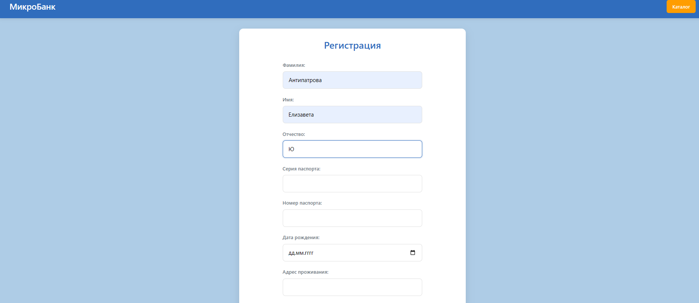

Рисунок 36 – Решистрация

С этими данными войдем в систему

Рисунок 35 – Вход в систему

Переходим на страницу каталога продукта и выбираем нужный нам продукт

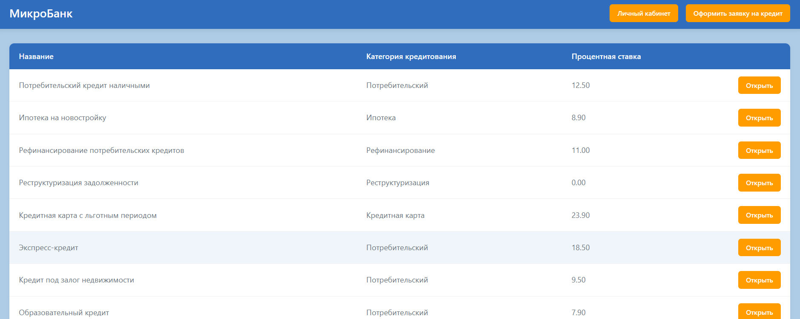

Рисунок 35 – Каталог кредитных продуктов

Нажимаем кнопку «Открыть»

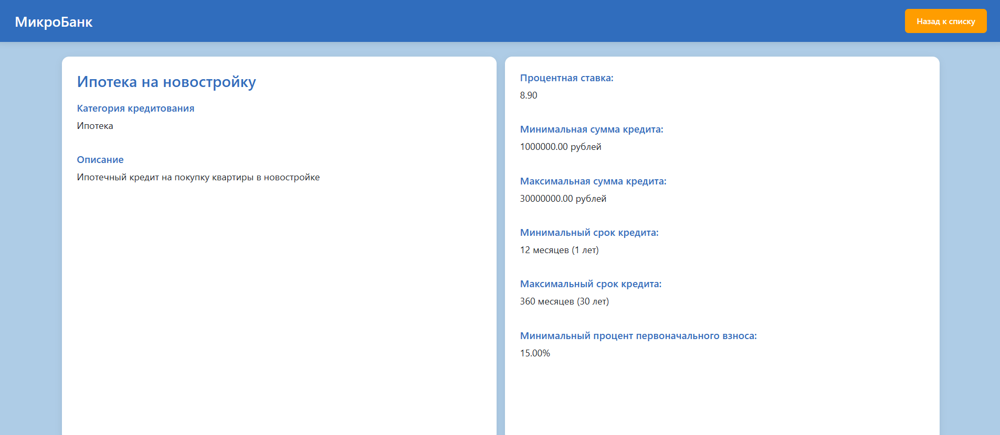

Рисунок 35 – Кредитный продукт

Возвращаемся, нажимаем кнопку «Оформить заявку на кредит» и заполняем заявку

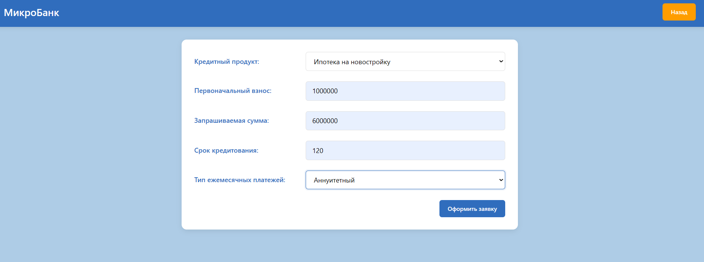

Рисунок 35 – Заполнение заявки

Нажимаем кнопку «Оформить заявку» и переходим проверить в личный кабинет

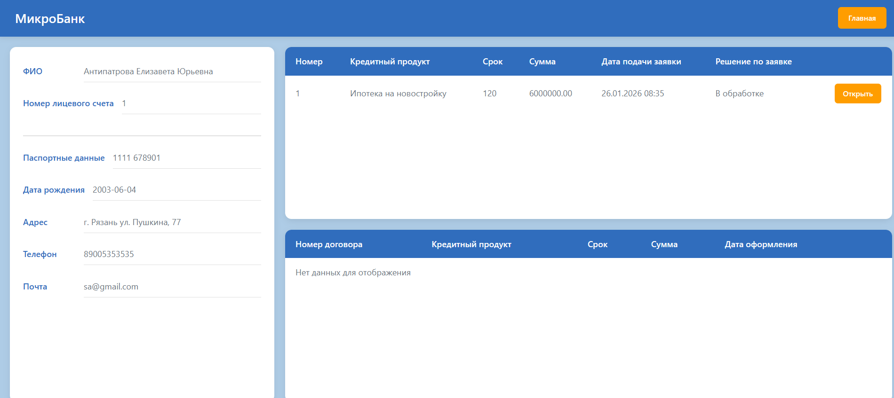

Рисунок 35 – Оформленная заявка

Заявка успешно оформлена

5 СОСТАВ ПРОЕКТА

В состав разработки системы кредитования входят следующие логические части (с соответствующими файлами и каталогами проекта):

- Модель данных (сущности) - Описывает основные объекты: клиент, заявка, кредитный продукт и т.д.

- Слой бизнес-логики (сервисы) -  Правила и процессы

- Веб-слой (Контроллеры) - Приём и обработка запросов, маршрутизация, выдача ответов, интеграция с сервисами.

- Доступ к данным (Репозитории) - Запросы к БД, маппинг сущностей, операции чтения/записи. 

- Клиентская часть - HTML-страницы и CSS

- База данных

6 КОМПИЛЯЦИЯ И СБОРКА СИСТЕМЫ

**6.1. Правила создания системы (приложения)**

В разделе "Компиляция и сборка системы" описывается процесс компиляции и сборки веб-приложения для отладки и инсталляции на вычислительной системе пользователя. Этот раздел также включает в себя описание условий компиляции, включая требования к аппаратному и программному обеспечению.

Для веб-приложения, разработанного на HTML страницах и Java файлах с использованием PostgreSQL в качестве системы управления базами данных, процесс компиляции и сборки включает следующие шаги:

1. Подготовка исходного кода: разработка и поддержка HTML страниц, Java файлов, SQL скриптов для базы данных.

1. Компиляция Java файлов: использование Java компилятора для преобразования исходного кода Java в байт-код Java.

1. Создание и настройка базы данных: выполнение SQL скриптов для создания и настройки базы данных с использованием PostgreSQL.

1. Сборка веб-приложения: интеграция HTML страниц, Java классов и файлов базы данных в рабочее приложение.

1. Тестирование и отладка: проверка функциональности и исправление ошибок в процессе разработки.

Требования к компиляции и сборке системы включают в себя:

- Компьютер с поддержкой Java Development Kit (JDK) для компиляции Java файлов.

- Доступ к PostgreSQL для работы с базой данных.

- Текстовый редактор или интегрированная среда разработки (IDE) для написания и отладки кода.

7 ДОКУМЕНТАЦИЯ

**7.1. Назначение системы и выполняемые функции**

Система предназначена для автоматизации процесса кредитования: от подачи заявки клиентом до рассмотрения и принятия решения сотрудником, с последующим предоставлением клиенту информации о условиях кредита и графике платежей. 

**7.2. Условия применения системы**

Для комфортной работы пользователя требуется:

- ОС: Windows 10/11 или Linux (Ubuntu/Debian)

- CPU: от 1.6 GHz

- RAM: от 4 GB

- Разрешение экрана: не ниже 720p 

**7.3. Правила инсталляции системы**

- Импортировать проект в IDE для Java.

- Подготовить БД: подключить PostgreSQL напрямую или запустить её в Docker.

- Указать параметры подключения к БД в конфигурации проекта.

- Собрать и запустить приложение локально, затем открыть веб-интерфейс в браузере.

ЗАКЛЮЧЕНИЕ

В ходе выполнения курсовой работы была спроектирована и реализована специализированная программно‑информационная система, предназначенная для автоматизации ключевых процессов банковского кредитования в условиях высокой конкуренции, жестких регуляторных требований и ожиданий клиентов получать прозрачные цифровые услуги. 

Исходная цель проекта — измеримое повышение эффективности и качества обработки заявок и ведения кредитов — достигалась за счет формализации бизнес‑правил, автоматизации проверок, маршрутизации заявок и обеспечения сквозного учета событий жизненного цикла кредита.Реализованная система охватывает основные сущности предметной области и их взаимосвязи: кредитные продукты с параметрами и ограничениями, заявки со статусами и историей решений, кредиты с состояниями «неподтвержден», «подтвержден», «просрочен», «закрыт», а также транзакции (процентные начисления, штрафы, платежи, досрочные погашения) и регламентные документы (договор, график платежей, выписка). 

Построенные информационные потоки обеспечивают полную поддержку сценария от регистрации клиента и подачи заявки до подтверждения кредита после очной проверки документов, дальнейших начислений и контроля просрочки, а также закрытия кредита при полном погашении. Ключевыми практическими результатами работы стали: механизм автоматического отклонения заявок при несоответствии параметрам продукта, маршрутизация корректных заявок между менеджерами по специализациям (с учетом сценария оформления в отделении), ролевая модель доступа для клиентов и сотрудников, подсистема расчетов для аннуитетных и дифференцированных схем, а также ведение детальной транзакционной истории без собственного платежного контура. Интеграции с внешними сервисами кадрового учета и поставщиком информации о фактических платежах позволяют поддерживать актуальность данных о менеджерах и корректно отражать финансовые события, не дублируя функции платежной инфраструктуры. 

Выбранный технологический стек и принятые проектные решения обеспечили соответствие нефункциональным требованиям по надежности хранения, доступности и безопасности: серверная часть реализована на Java/Spring Boot с REST API и планировщиком задач, данные хранятся в PostgreSQL с управлением миграциями через Liquibase, пользовательские веб‑интерфейсы реализованы на Thymeleaf, а контейнеризация и сопровождение организованы средствами Docker и Git. Это создало основу для воспроизводимого развертывания, контроля версий и дальнейшего развития. Таким образом, разработанная система решает обозначенную проблему недостаточной автоматизации кредитных процессов в организациях, где использование таблиц и переписки приводит к ошибкам, задержкам и отсутствию единой истории изменений, а внедрение «тяжелых» банковских платформ экономически нецелесообразно. 

В результате внедрения системы ожидается сокращение времени обработки заявок за счет автоматических проверок и организованной маршрутизации, снижение доли формальных отказов и ошибок ввода, рост пропускной способности менеджеров благодаря устранению рутинных операций и повышение прозрачности для клиентов через доступ к договору, графику и выписке по подтвержденным кредитам.
